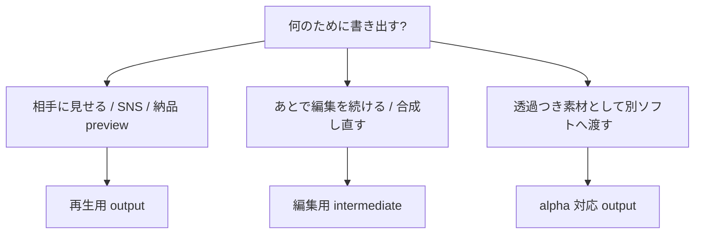
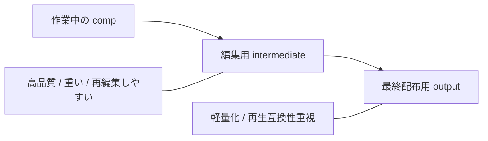
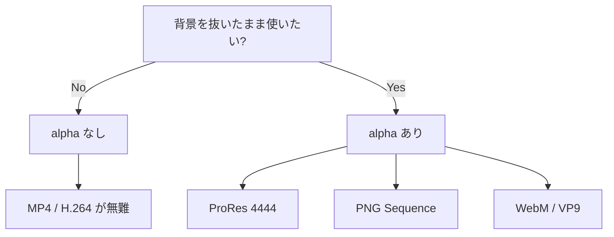
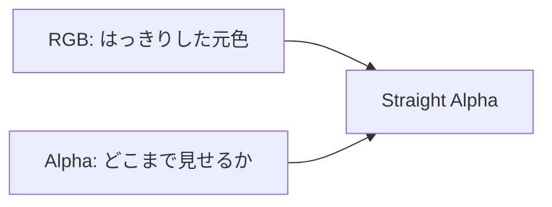
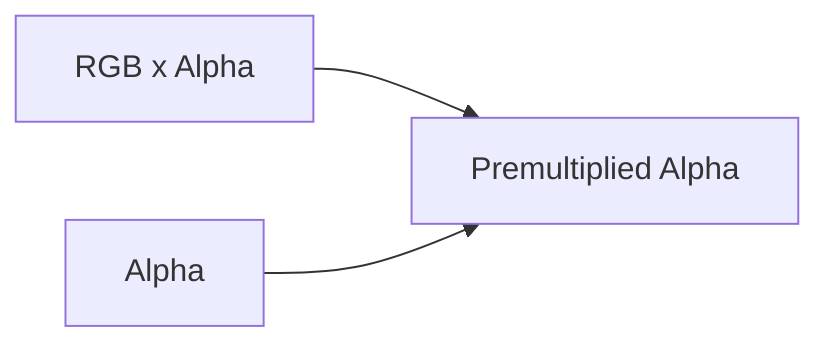

# Render Output Beginner Guide

**Date**: 2026-07-03  
**Audience**: render/export にまだ慣れていないユーザー  
**Related**: `docs/planned/MILESTONE_RENDER_PREFLIGHT_2026-06-02.md`, `docs/drafts/RENDER_CENTER_UI_DRAFT_2026-03-28.md`, `Artifact/src/Widgets/Dialog/ArtifactRenderOutputSettingDialog.cppm`

---

## Purpose

render/export の設定で初心者が迷いやすい点は、主に次の 4 つに集約される。

- これは **再生用** なのか **編集用** なのか
- 途中工程として使う **中間ファイル** なのか
- **透過 (alpha)** が必要なのか
- alpha を使うときに **Straight** と **Premultiplied** のどちらを選ぶべきか

このメモは、それを 1 枚で判断できるようにするための整理である。

---

## First Decision

最初の分岐は難しく考えなくてよい。まずは「どこで使うファイルか」だけ決める。



---

## Simple Rule Table

| 用途 | まずの選択 | 典型例 | 重要ポイント |
|---|---|---|---|
| 再生用 | `MP4 + H.264 + AAC` | 確認動画、配布動画、SNS | 軽い、開きやすい、でも透過は基本なし |
| 編集用中間 | `MOV + ProRes` | 再編集、色調整、受け渡し | 重いが壊れにくく、seek しやすい |
| 透過つき素材 | `MOV + ProRes 4444` または `WebM/VP9`、`PNG Sequence` | lower third、ロゴ、合成素材 | alpha を残せる |
| 1 枚ずつ確実に持ちたい | `PNG Sequence` / `EXR Sequence` | VFX、差し替え、再レンダリング耐性 | 途中破損に強い |

---

## Playback Vs Intermediate

### 1. 再生用 output

再生用は、「軽くて、だいたいどこでも再生できる」が最優先。

```text
完成映像を見せる
  -> MP4
  -> H.264
  -> AAC
  -> alpha は基本オフ
```

向いているもの:

- クライアント確認
- 社内レビュー
- SNS や Web 掲載
- 納品 preview

弱いところ:

- フレーム単位での厳密編集には弱い
- 再圧縮に弱い
- 透過をほぼ前提にしない

### 2. 編集用 intermediate

intermediate は、「あとでまた触る」ことが前提。

```text
あとで編集し直す
  -> MOV
  -> ProRes
  -> 必要なら ProRes 4444
  -> ファイルサイズは大きくなる
```

向いているもの:

- After Effects 的な再合成
- タイムラインでの再編集
- カラー調整
- 別担当への受け渡し

強いところ:

- seek しやすい
- 編集で破綻しにくい
- 再エンコード耐性が高い

---

## Visual Model

感覚的には、次の 3 段で考えると分かりやすい。



要するに:

- **編集中** は intermediate 寄り
- **配布直前** に playback 寄りへ変換

この順番で考えると迷いにくい。

---

## Alpha Decision

次は alpha が必要かどうかを見る。



### alpha なし

背景込みの通常動画。いちばん無難。

### alpha あり

背景を透明のまま持ちたい場合。

例:

- ロゴアニメーション
- lower third
- エフェクト素材
- テロップだけ別渡し

---

## Straight Vs Premultiplied

ここが初心者にいちばん伝わりにくいが、図にすると単純。

### Straight Alpha

```text
色 = そのまま保持
透明度 = 別で保持
```

イメージ:



特徴:

- 元の色をそのまま持ちやすい
- 合成側が正しく処理できるならきれい
- 再合成向き

向いているもの:

- VFX
- 他ソフトでの本格合成
- intermediate 素材

### Premultiplied Alpha

```text
色 = すでに透明度ぶん暗くなっている
透明度 = 別で保持
```

イメージ:



特徴:

- 表示系によっては縁が安定しやすい
- ただし解釈がずれるとフチが黒く見えたり白く見えたりする

向いているもの:

- 受け側が premult 前提と分かっているワークフロー
- 既存パイプラインが明確な現場

---

## Beginner Rule For Alpha

初心者向けには、まずこのルールで十分。

```text
迷ったら:
  alpha 不要 -> MP4 / H.264
  alpha 必要 -> ProRes 4444
  合成の厳密さ最優先 -> Straight Alpha を第一候補
  相手の指定がある -> 相手の指定に合わせる
```

特に「Premultiplied の意味がまだ曖昧」な段階では、**勝手に premult を選ぶより、Straight か PNG/EXR sequence に寄せた方が事故が少ない**。

---

## Typical Cases

### Case A: SNS に出す

- 目的: 再生用
- 推奨: `MP4 + H.264 + AAC`
- alpha: なし
- 備考: いちばん標準的

### Case B: あとで別の comp で重ねる

- 目的: 編集用中間
- 推奨: `MOV + ProRes`
- alpha: 必要なら `ProRes 4444`
- 備考: 再編集しやすい

### Case C: 透明背景のロゴを渡す

- 目的: alpha 素材
- 推奨: `ProRes 4444` または `PNG Sequence`
- alpha mode: まずは `Straight` を優先
- 備考: 相手ソフトの前提があればそれに合わせる

### Case D: VFX チームへ渡す

- 目的: 厳密な中間素材
- 推奨: `EXR Sequence` または `PNG Sequence`
- alpha mode: `Straight`
- 備考: 後工程での再利用性が高い

---

## UI Copy Direction

render output dialog や warning/preflight では、専門語だけを並べず、まず「用途」で見せる方がよい。

### 推奨ラベル案

- `再生用 (Playback)`
- `編集用中間 (Intermediate)`
- `透過つき素材 (Alpha Delivery)`
- `フレーム連番 (Image Sequence)`

### 補助文言案

- `迷ったらこれ: MP4 / H.264 / AAC`
- `再編集するなら ProRes`
- `透明背景が必要なら ProRes 4444 or PNG Sequence`
- `Premultiplied は受け側が対応を分かっているときだけ`

---

## Warning / Preflight Ideas

初心者向け warning は、単に `format mismatch` と言うより、次のように行動へ直結させた方がよい。

### Example 1

```text
この設定は再生用です。
あとで編集を続けるなら、ProRes などの編集向け形式をおすすめします。
```

### Example 2

```text
この設定では透過は書き出されません。
ロゴやテロップを透明背景で使う場合は、ProRes 4444 か PNG Sequence を選んでください。
```

### Example 3

```text
Premultiplied Alpha は、受け側の解釈が合わないとフチがにじむことがあります。
指定がない場合は Straight Alpha をおすすめします。
```

---

## Suggested Preset Groups

UI 上は codec 名を最初から前面に出すより、preset 群を先に出す方が分かりやすい。

```text
Preset group
  - Playback
    - MP4 / H.264 / AAC
  - Intermediate
    - MOV / ProRes 422
    - MOV / ProRes 4444
  - Alpha
    - ProRes 4444
    - PNG Sequence
    - WebM / VP9
  - VFX / Multi-channel
    - EXR Sequence
```

---

## Recommendation For Artifact UI

Artifact の render output dialog / preflight では、次の順序で見せると初心者が理解しやすい。

1. 用途: `再生用 / 編集用中間 / 透過つき`
2. 透過の有無
3. その用途に合う preset
4. その下に codec / container の詳細
5. alpha mode は必要時だけ展開

この順序なら、ユーザーは最初から `ProRes`, `Premultiplied`, `container` といった単語に押されずに済む。

---

## Short Version

最後に 1 行だけで言うと、こうなる。

```text
見せるだけなら MP4。
あとで触るなら ProRes。
透明が必要なら ProRes 4444 か PNG 連番。
Premult は相手の指定があるときだけ。
```
