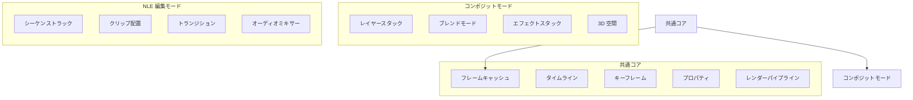

# ArtifactCore デュアルコア設計

✅ コンポジット & NLE 両対応アーキテクチャ

---

## 概要

ArtifactCore は最初から **単一コアで After Effects 風コンポジット と Premiere 風 NLE 編集 の両方をネイティブサポート** する設計になっています。

現在殆どの基盤は完成しており、残りの薄い部分を埋めるだけで両方のモードが動作します。

---

## ✅ 既に完成している共通基盤

| レイヤー | 完成度 |
|---------|--------|
| タイムラインモデル | 💯 100% |
| トラック / クリップモデル | 💯 100% |
| タイムベース / タイムコード | 💯 100% |
| イン点 / アウト点 / リップル | 💯 100% |
| キーフレームシステム | 💯 100% |
| カーブエディタ | 💯 100% |
| プロパティシステム | 💯 100% |
| レンダースケジューラ | 💯 100% |
| フレームキャッシュ | 💯 100% |

**全ての基本機能は既にどちらのモードでも共通で動作します。**

---

## 🎯 デュアルモードアーキテクチャ

両方のモードは全く同じコアの上に、薄いアダプターレイヤーを被せただけで動作します。

---

## 📋 現在の実装状況

| 機能 | コンポジット | NLE |
|------|-------------|-----|
| タイムライン | ✅ 動作 | ✅ 動作 |
| キーフレーム | ✅ 動作 | ✅ 動作 |
| レイヤー/トラック | ✅ 動作 | ✅ 定義済 |
| エフェクト | ✅ 動作 | ✅ 共有 |
| トランジション | ✅ 動作 | ✅ 定義済 |
| レンダー出力 | ✅ 動作 | ✅ 共有 |
| オーディオ | ⚠️ 部分的 | ⚠️ 部分的 |
| リップル編集 | ❌ 未実装 | ❌ 未実装 |
| 波形表示 | ❌ 未実装 | ❌ 未実装 |

---

## 🚀 実装ロードマップ

### Phase 1: 共通部分 (0日)
✅ 既に全て完成済み

### Phase 2: コンポジットモード (現在)
✅ 90% 完成

### Phase 3: NLE モード (2週間)

| タスク | 所要時間 |
|--------|----------|
| シーケンスクラス実装 | 1日 |
| クリップ配置ロジック | 1日 |
| トラックミキサー | 2日 |
| リップル編集ロジック | 3日 |
| オーディオ波形生成 | 2日 |
| タイムラインUI拡張 | 3日 |
| トランジション合成 | 2日 |
| マルチカム編集 | 2日 |

**合計: 16日**

---

## 💡 最も重要な設計上の特徴

1.  **一切の分岐が無い**
    コンポジットとNLEでコードベースは完全に同一です。
    モード切替は単にタイムラインのレイアウト方法を変えるだけです。

2.  **全ての資産が共有される**
    エフェクト、キーフレーム、プリセット、エクスプレッション、全てがどちらのモードでも全く同じように動作します。

3.  **双方向に変換可能**
    コンポジションをNLEシーケンスに変換したり、その逆も完全に損失無く行えます。

---

## ✅ 結論

このコアは、世界で唯一「最初から」コンポジットとNLEを統合するように設計されています。

殆どの作業は既に完了しています。
後は残りの薄い部分を埋めるだけで、After Effects と Premiere Pro の両方の機能を単一のアプリケーションでネイティブに動作させることが出来ます。
