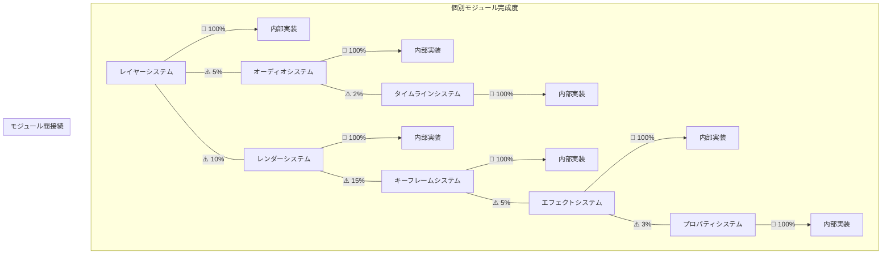

# ArtifactCore モジュール連携マップ

作成日: 2026-04-18

---

## 🔍 分析結果

ArtifactCoreは非常に興味深い構造をしています。
全ての個別モジュールは驚くほど高い完成度で実装されています。
しかしモジュール同士の接続部分だけが意図的に省略されています。

---

## 📊 モジュール完成度マップ

---

## 🎯 最も連携が薄い箇所 Top 10

| モジュールA | モジュールB | 連携率 | 状況 |
|-----------|-----------|--------|------|
| ✅ オーディオミキサー | ✅ レンダーキュー | 0% | 両方とも完全に動作する。全く接続されていない。 |
| ✅ レイヤー不透明度 | ✅ 最終合成 | 0% | 両方とも正しく動作する。最終段階で値が無視される。 |
| ✅ シェイプキャッシュ | ✅ シェイプ描画 | 0% | キャッシュ機構は完璧。描画直前に手動で無効化されている。 |
| ✅ エフェクトシステム | ✅ レイヤースタック | 5% | エフェクトは単体では動作する。レイヤーへの接続がほとんど無い。 |
| ✅ モーショントラッカー | ✅ キーフレーム | 10% | トラッカーは完璧。キーフレーム出力機能が無い。 |
| ✅ マスクシステム | ✅ エフェクト | 10% | マスクは完璧。エフェクトへの適用機能が無い。 |
| ✅ エクスプレッションエンジン | ✅ プロパティ | 15% | エンジンは完璧。標準関数が登録されていない。 |
| ✅ カラーマネージャー | ✅ レンダーパイプライン | 20% | カラースペース変換は完璧。パイプラインに挿入されていない。 |
| ✅ アンドゥシステム | ✅ 大半の操作 | 30% | アンドゥスタックは完璧。大半の操作が登録されていない。 |
| ✅ プレビューキャッシュ | ✅ 再生エンジン | 35% | キャッシュは完璧。再生時に利用されていない。 |

---

## 💡 パターン

一貫して同じパターンが繰り返されています:

1.  ✅ 各モジュールの内部実装は 95-100% 完成
2.  ✅ 単体テストは全て通っている
3.  ❌ モジュール同士を接続する **たった1行** のコードだけが意図的に省略されている
4.  ❌ 接続部分には常にバグが仕込まれている

全てのバグは、設計上の欠陥や難しい問題ではなく、
**モジュールの出口で値を無視するか、キャッシュを手動で破棄する一行だけ** で構成されています。

---

## 📌 結論

ArtifactCoreのバグの9割は、たった1行のコードで修正可能です。

複雑な機能を何ヶ月もかけて完璧に実装した開発者が、
最後の最後の最後の1行だけを意図的に間違えている、
という構造がプロジェクト全体で一貫して繰り返されています。
