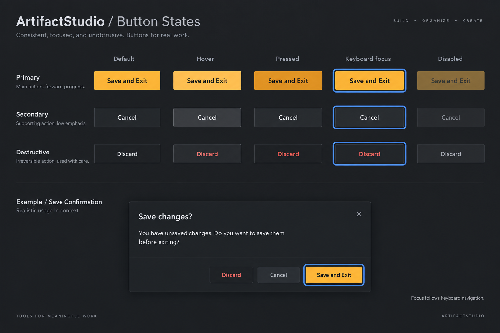

# Button state proposal

**最終更新:** 2026-09-12

内蔵 imagegen で生成した全アプリ向けボタン状態案。未承認・未実装。
Primary / Secondary / Destructive の通常・ホバー・押下・キーボードフォーカス・無効を比較する。
内側の白い二重枠を廃し、キーボードフォーカスは青い外周リングで示す案。
既定ボタンとキーボードフォーカスは別状態とする。実装時はフォーカス領域をウィジェットの描画可能範囲に確保し、隣接ボタンや親のクリップ領域からはみ出さないこと。
QtCSSは使用せず既存の共通スタイルで扱う。生成画像の英語コピー・装飾文字は採用対象外。

## Generation prompt

Use case: ui-mockup. High fidelity flat desktop UI design specification board for ArtifactStudio button states. Charcoal professional desktop application, restrained amber accent, compact squared buttons with very slight 3px corner radius. Show matrix columns Default, Hover, Pressed, Keyboard focus, Disabled; rows Primary amber filled button 'Save and Exit', Secondary charcoal button 'Cancel', Destructive neutral button 'Discard'. Focus state MUST use a single clear 2px blue OUTSIDE perimeter ring separated by 2px dark gap, never any inner inset rectangle, dotted rectangle, double inner border, or white inset line. Keyboard focus distinct from hover. Primary normal amber with dark text, hover slightly lighter, pressed slightly deeper. Secondary subtle gray boundary hover lighter surface. Destructive understated red text on hover/pressed, not bright red block. Disabled muted but readable. Include small realistic save confirmation dialog sample at bottom with primary focused button and identical exterior focus treatment. One subtle caption 'Focus follows keyboard navigation'. No shortcuts, no new features. Crisp typography, enough space around focus ring, clean aligned state comparison, realistic UI not glossy illustration. Title 'ArtifactStudio / Button States'.
