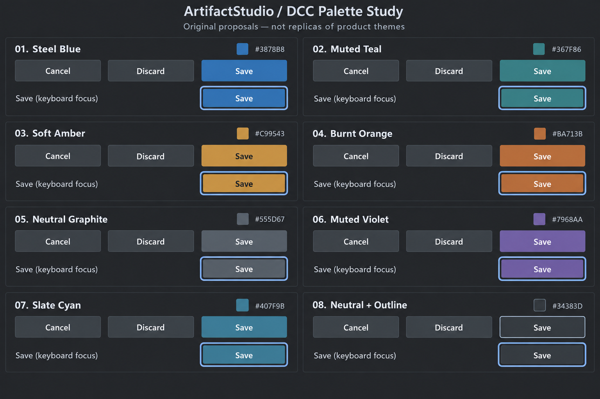

# DCC button color comparison

**最終更新:** 2026-09-12

## Scope and evidence

主要DCCの公式資料を横断した初期調査。全製品・全バージョンの網羅調査ではない。実機のボタン状態・フォーカス挙動や既定色の採色は未実施。
製品ロゴの色、選択色、主操作色、フォーカス色を混同しない。下記モックはArtifact用独自案であり、特定製品の既定テーマ再現ではない。

| 製品 | 公式資料から確認した内容 | Artifactで検討する点（提案） |
|---|---|---|
| Maya | Interface preferencesにHighlight Color、別途Color Settingsがある | 選択色とボタン主操作色を分離 |
| Blender | ThemesでUIの外観・色を変更可能 | 単一色の置換でなく状態別テーマを持つ |
| Houdini | Theme Editorでbase/accent/highlightを編集 | 背景・主操作・選択の役割を別トークンにする |
| Cinema 4D | InterfaceとViewportの色設定が分かれる | ボタンテーマ変更でギズモ色を変えない |
| Modo | Display Preferencesの色変更対象に3D Viewportの制約がある | ビュー色と通常UI色を同一視しない |
| Nuke | Appearanceに複数の面の設定があり、ラベルの自動コントラスト調整がある | 状態の読みやすさを背景と合わせて評価 |
| 3ds Max | Customize User InterfaceのColorsでUI色を変更可能 | 共通スタイルから一貫して適用する |
| ZBrush | UI設定の保存・読み込み経路がある | 配色の試行と復元を容易にする |
| Substance Painter | Interface optionsとツールの有効条件を文書化 | 無効状態と選択状態を区別する |
| Mari | パレット構成、ノードカテゴリ色の設定がある | ノード種別色を主操作色へ流用しない |
| After Effects | 今回の検索では現行ボタン状態の根拠を十分確保できず | 実画面比較対象。AE風という色の断定は保留 |
| Resolve / Fusion | 今回は製品ページ・UI資料の所在確認まで | 色評価時に彩度の強いUIが邪魔にならないか実画面比較 |
| Unreal Editor（隣接分野） | Editor Preferencesが編集環境設定を所有 | テーマ責務の参考。厳密なDCCとは別枠 |

## Artifact palette proposals

01 Steel Blue #3878B8 / 02 Muted Teal #367F86 / 03 Soft Amber #C99543 / 04 Burnt Orange #BA713B / 05 Neutral Graphite #555D67 / 06 Muted Violet #7968AA / 07 Slate Cyan #407F9B / 08 Neutral #34383D + Outline #91A4B8。
生成画像は概念比較。正確な色値・文字コントラストは実装段階で検証する。8案とも未採用・未実装。
第一候補は01（主操作の識別）、05（低彩度）、03（既存アンバーの継承）。通常ボタン全体をアクセント色で塗る運用は避ける。

評価は通常・ホバー・押下・キーボードフォーカス・無効・既定ボタン・トグルONを分ける。特に「Enterで実行される既定ボタン」と「現在キーボード操作が届くボタン」を混同しない。
保存確認だけでなく、密なツールバー、Inspector、小型アイコンボタンで比較してから採用する。

## 既存UI変更システムとの統合方針

既存の `UI Theme` を基底テーマとして維持し、アクセントとフォントを独立したユーザー上書きにする。

適用順は `組み込みテーマ -> 外部JSONテーマ -> ユーザー上書き -> アクセシビリティ補正` とする。
ユーザー上書きの `System / Theme default` は値を固定せず、下位レイヤーの値をそのまま使う。

- Accent: `Theme default` / `Soft Amber (#C99543)` / `Muted Violet (#7968AA)` / Custom
- UI font family: `System / Theme default` またはインストール済みフォント
- UI font size: 基準point size。既存のAccessibility font scaleは最後に倍率として適用
- Monospace font: タイムコード・数値・コード用途としてUIフォントと分離
- Menu bar scale / Dock tab size: 既存設定を維持し、最終フォントから派生

アクセント上書きは `DccStyleTheme::accentColor` と、それから派生するフォーカス・選択表現だけに適用する。
Warning / Danger / Success、XYZ軸、チャンネル色、コンテンツ色には適用しない。
背景・文字・ボタン面を変えるのは既存テーマまたは外部JSONテーマの責務とする。

フォントは `ArtifactAppSettings::defaultFontFamily()` の既存保存先を正規経路として再利用する。
作品内テキスト、字幕、インポート素材のフォントには影響させない。
ハードコードされた表示用フォントは段階的に共通フォントresolverへ寄せ、記号アイコン用フォントは対象外とする。

設定変更時は既存のテーマ再polish経路と `ArtifactMainWindow::applyApplicationSettings()` を再利用する。
新しいグローバルsignal/slot経路は追加しない。プレビュー中の変更をキャンセルした場合は、ダイアログを開いた時点のテーマとフォントへ戻す。

## 2026-09-12 初回実装

Application Settings > User InterfaceへAccent、UI font、UI font sizeを追加した。
AccentはTheme defaultと比較モックの7色を選択可能。組み込み／外部JSONテーマを解決した後にaccentとselectionを派生上書きする。
UI fontは既存の`General/DefaultFontFamily`を再利用し、font sizeは`UI/FontPointSize`へ保存する。Accessibility font scaleは基準サイズへ毎回掛け直すため、設定再適用で文字が累積拡大しない。

共通ボタン描画ではDefaultButtonを主操作色、keyboard focusを固定の淡青外周リングとして描く。保存終了確認の固定アンバーと固定背景もテーマトークン参照へ変更した。
作品内テキスト、Warning / Danger / Success、XYZ軸、チャンネル色には影響しない。
Monospace fontと任意色pickerは今回未実装。外部JSONテーマによる任意色指定は従来どおり利用できる。ビルド・実画面確認は未実施。

## Sources

- Maya: https://help.autodesk.com/cloudhelp/2024/ENU/Maya-Customizing/files/GUID-FE5518DA-2177-44C9-8BC9-F0676EFEEDF9.htm
- Blender: https://docs.blender.org/manual/en/latest/editors/preferences/themes.html
- Houdini: https://www.sidefx.com/docs/houdini/ref/windows/theme_editor.html
- Cinema 4D: https://help.maxon.net/c4d/2026/en-us/Content/html/PREFSTHEME-PREF_THEME_MAIN_GROUP.html
- Modo: https://modosdk.foundry.com/modo/17.1/content/help/pages/preferences/pref_display.html
- Nuke: https://learn.foundry.com/nuke/current/content/misc/available_preferences_studio.html
- 3ds Max: https://help.autodesk.com/view/3DSMAX/2024/ENU/?guid=GUID-71DEAF46-80B6-47D8-8F58-F103CECEE1F5
- ZBrush: https://help.maxon.net/zbr/en-us/Content/html/reference-guide/preferences/config/config.html
- Substance Painter: https://experienceleague.adobe.com/en/docs/substance-3d-painter/using/interface/settings/general-preferences
- Mari: https://learn.foundry.com/mari/content/reference_guide/mari_preferences_dialog.html
- Resolve: https://www.blackmagicdesign.com/products/davinciresolve/panels
- Unreal: https://dev.epicgames.com/documentation/unreal-engine/unreal-editor-preferences

## Generation prompt (built-in imagegen)

Use case: ui-mockup. Create a precise comparison board of EIGHT alternative color palettes for ArtifactStudio desktop DCC buttons. Header 'ArtifactStudio / DCC Palette Study'. Subtitle 'Original proposals — not replicas of product themes'. 2 columns by 4 rows equal sized panels, all exact same charcoal background #242629 and same compact UI layout. Each panel has numbered title then 3 buttons 'Cancel', 'Discard', 'Save', then another row showing same Save button with keyboard focus. No logo references to other products. Names and accent colors: 01 Steel Blue #3878B8 with white text; 02 Muted Teal #367F86 with white text; 03 Soft Amber #C99543 with near-black text; 04 Burnt Orange #BA713B with white text; 05 Neutral Graphite #555D67 with white text; 06 Muted Violet #7968AA with white text; 07 Slate Cyan #407F9B with white text; 08 Neutral + Outline with neutral #34383D Save button and thin #91A4B8 outer border. Cancel and Discard always neutral, so only primary color changes. Each panel keyboard focus uses a single pale blue outside perimeter ring #8FBAFF separated by a narrow dark gap, no inset white borders, no dashed inner rectangles. Default primary save has no focus ring. Small hex chip or hex text for each palette. All panels exactly equal geometry, typography, visual hierarchy and sizes. Crisp flat professional DCC UI, very slight 3px corners, no gradients, no gloss, no dramatic lights, no decorative illustrations, generous readable layout. Large landscape comparison image.
