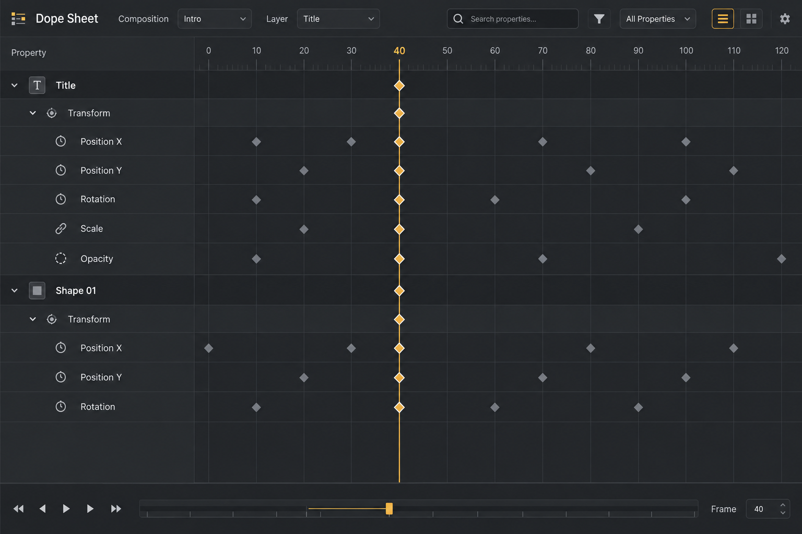

# dope-sheet image mockup

**最終更新:** 2026-09-08

**状態:** 初期実装へ反映済み。ランタイム確認は未実施。

生成方法: built-in image_gen。
2026-09-08 に文字列一覧をフレームグリッドへ更新し、Transform 行、10
フレーム刻みの目盛り、キーフレームのダイヤ、現在フレーム列を反映した。
レイヤー行と Transform 集約行にもサマリーキーを表示する。
画像内の検索・編集操作は引き続き将来案であり、実装仕様を確定しない。

## Generation prompt

Use case: ui-mockup. Generate ONE polished high fidelity ArtifactStudio desktop DCC widget design image, straight-on flat screenshot, crisp readable English labels, charcoal backgrounds #202124/#282a2d, subtle separators #3b3e42, warm amber #dfa64c only for active states, off-white text, compact professional native desktop controls, solid readable icons, restrained subtle shading, no neon, no marketing captions, no device frame. This is a proposed design, not a screenshot of existing implementation. Landscape 1536x1024 image of a wide Dope Sheet dock filling the image. Title Dope Sheet, composition Intro, layer Title. Compact search/filter toolbar. Main area left property tree 27% width and aligned horizontal frame grid 73%. Tree shows Title > Transform > Position X, Position Y, Rotation, Scale, Opacity; Shape 01 > Transform > Position X, Position Y, Rotation. Only Transform property groups. Timeline ruler 0 10 20 30 40 50 60 70 80 90 100 110 120. Precisely aligned diamond keyframes, summary diamonds on group rows, amber selected keys with thin light outline, muted gray unselected keys. Fine vertical current frame line at 40. No animation curves and no clip bars. Bottom horizontal navigator and compact Frame 40 status. Rich yet uncluttered, no Selected count badge. Excellent dense timing editor.
