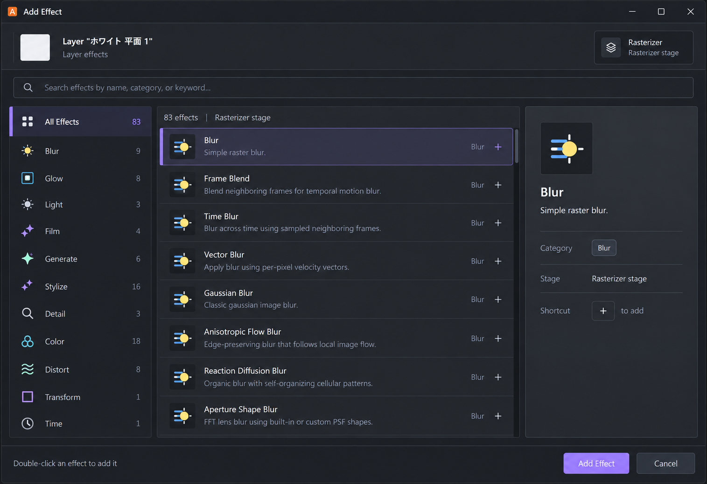
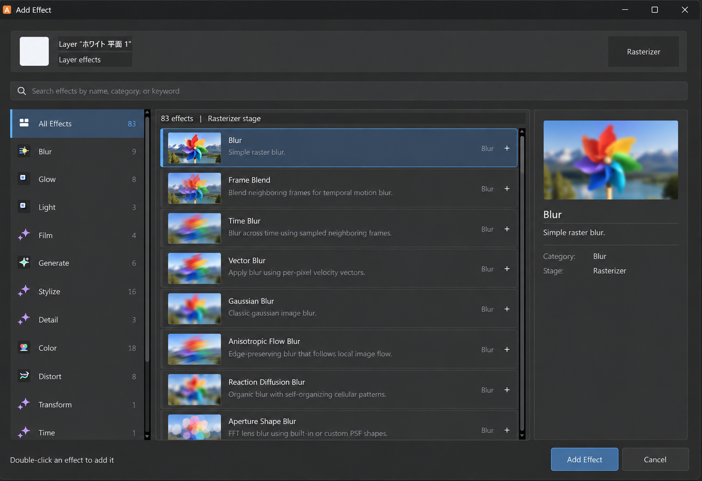
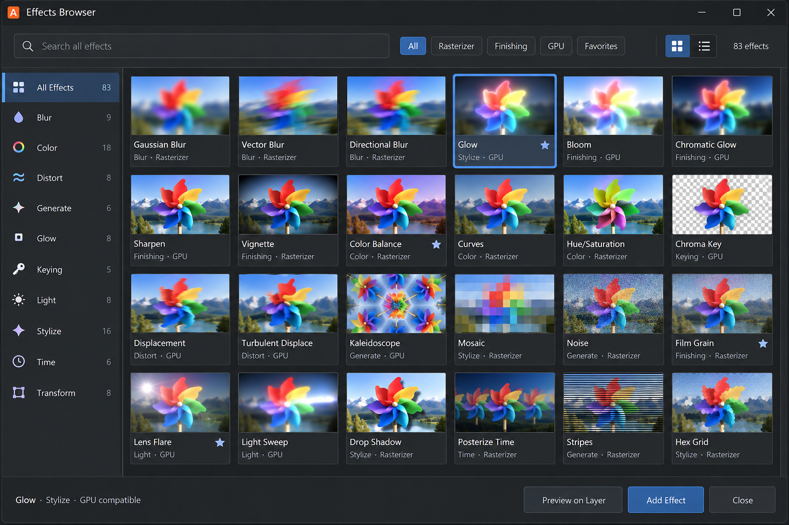

# Add Effect Dialog Concept

**最終更新:** 2026-09-12

## 採用範囲

`ArtifactInspectorEffectPicker` の視覚階層のみを対象にする。効果の検索、カテゴリ絞り込み、選択、ダブルクリック追加、ステージフィルター、確定／キャンセルの挙動は変更しない。

- 一覧は個別カードの連続ではなく、薄い行区切りを基本にする。
- 選択は低彩度の面、細いアクセント線、左レールで示し、広い高彩度塗りを避ける。
- カテゴリ、検索、効果詳細は役割に応じた濃度差で分ける。
- アクセント色は既存テーマの `QPalette::Highlight` を使い、固定色を導入しない。
- 詳細ペインのテキスト背景を透明に保ち、情報の断片ごとの暗い矩形を作らない。

## サムネイル一覧案

- 各効果は同じ基準画像へ適用した `72 × 46 px` 前後の横長プレビューを持つ。
- サムネイルを大型タイルにはせず、効果名・説明・カテゴリと同じ一覧行へ収める。
- 一画面に最低 7 行を維持し、検索結果の走査性を優先する。
- 選択中の効果は右側に大きい比較プレビューと Category／Stage を表示する。
- サムネイル生成は一覧描画中に行わず、事前生成またはキャッシュ済み画像を使う。

## Effects Browser グリッド案

Add Effect の詳細選択ダイアログとは別に、多数の効果を視覚的に走査する独立ブラウザとして扱う。

- 6 列 × 4 行を基準に、一画面で最低 24 効果を比較できる密度にする。
- 通常の各タイルには共通テスト画像から事前生成したサムネイルを使う。
- 実レイヤーによる全タイルの常時再生成は行わない。
- 実レイヤー確認は選択中の一効果だけを対象に、明示的な `Preview on Layer` で実行する。
- 検索、カテゴリ、処理ステージ、GPU 対応、Favorites を同じ上部フィルターから絞り込めるようにする。
- リスト／グリッド切替は同じ検索結果モデルを共有し、別カタログを作らない。

## カテゴリアイコン

Effects Browser グリッド案の左サイドバーを基準に、背景タイルのない太めの
`effect_category_*` SVG を Add Effect ピッカーにも共用する。All、Blur、Color、
Distort、Generate、Glow、Keying、Light、Stylize、Time、Transform、Film、Detail
はそれぞれ固有記号を持ち、未定義カテゴリだけ既存の汎用 Effect 記号へ戻す。
