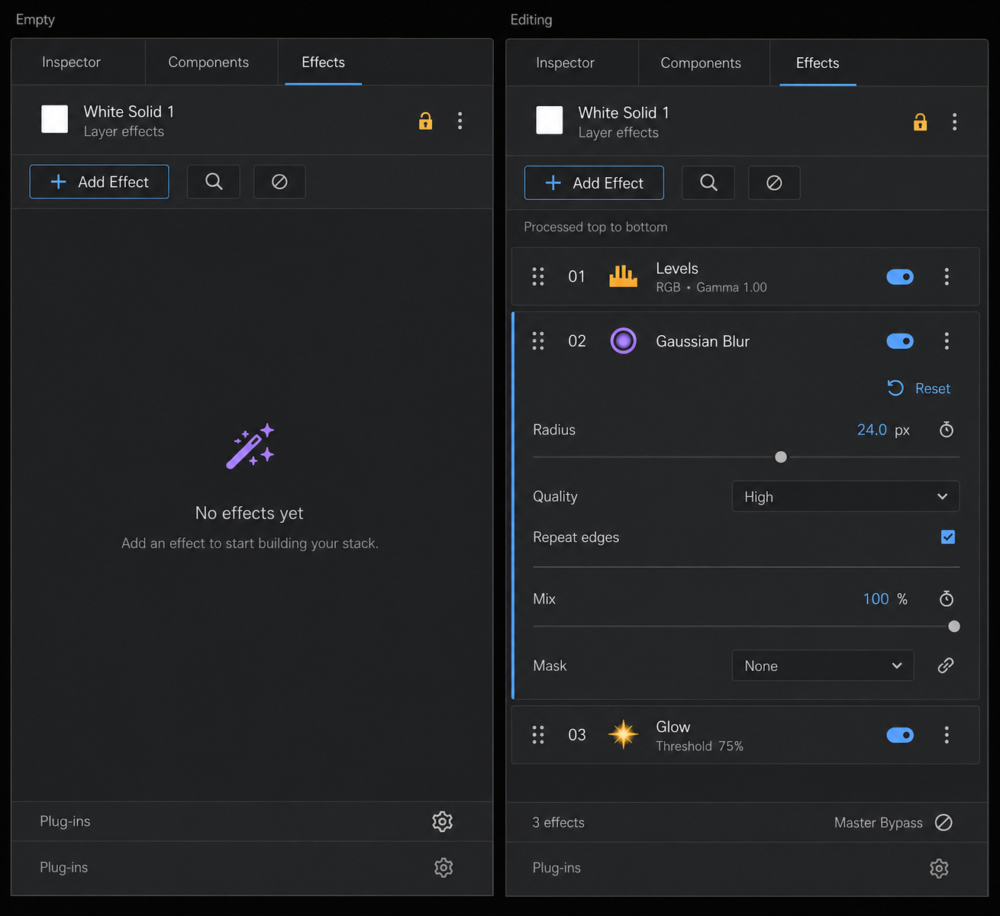

# エフェクトラック採用デザイン

**最終更新:** 2026-09-06

**デザイン承認:** 2026-09-06、ユーザーが本案を採用。
**実装状況:** 採用案に沿ってEffectsウィジェットを再構築。差分の静的確認のみ実施。ビルド・テスト・実画面検証は未実施。

## 対象と採用方針

対象は Effects 専用面のエフェクトラック。画像は生成モックで、左が空の状態、右がエフェクト追加後の例。

- 採用済みタイムライン左ペインと同じチャコール基調、青の選択表示、色付きアイコンを使う。
- 対象レイヤー名を上部に表示し、エフェクト追加の入口は上部の1か所へ統一する。
- エフェクトを処理順に縦に並べ、各エフェクトの直下にパラメーターを展開する。別の大きな詳細領域へ分断しない。
- 各ヘッダーに並べ替えのドラッグハンドル、有効／無効の操作、補助メニューを置く。
- 空状態の説明は1か所とし、重複する未選択メッセージや大きな青い空欄をなくす。
- プラグイン管理は下部へ整理する。

## 画像から採用しない点・実装時の確認

- 左下の Plug-ins が2回表示されているのは画像生成上の重複。実装では1か所だけにする。
- Master Bypass は画像内で上部と下部に重複しているため、操作の配置を整理する。
- Levels / Gaussian Blur / Glow と各設定値は例示であり、既存機能として確認済みという意味ではない。
- 表示順と実際の処理順、既存の処理段階、mask、animation、対象固定の仕様を実装前に照合する。見た目の整理によって処理順や既存機能を変更しない。
- アイコンは16pxで判別できるオリジナルSVGへ整える。画像の切り出しを実装用アイコンとして確定したものではない。

この承認はデザインの採用を記録するもの。実装完了を示すものではない。

## 実装内容（2026-09-06）

- 追加ボタンと検索を上部に統合し、対象レイヤー名を表示。
- 空の処理段階と重複する説明・操作ボタンを非表示化。処理段階の区分と並べ替えコマンドは維持。
- 選択した1件の直下に既存のプロパティ編集部を配置。編集部はリスト項目に所有させず、一覧の再構築でも破棄されない構成。
- エフェクト行に番号、紫のオリジナルSVG、有効切替、操作メニューを配置。既存のドラッグ並べ替えとUndo経路を再利用。
- エフェクトが0件のときは、紫の魔法の杖アイコン、「No effects yet」、補足文をラック中央の専用空状態として表示。
- Spaceで有効切替、Menuキーで操作メニュー。既存のダブルクリック・右クリック操作も維持。
- プラグイン再スキャンを下部へ移動。
- モックの一括バイパス・対象固定・架空のエフェクト設定は追加していない。既存機能を使う再構築の対象外。

### 実機確認待ち

狭幅と高DPI、追加・削除・フィルター変更・対象切替時のインライン編集、長いプロパティのスクロール、SurfaceFX専用編集、複数選択の並べ替え、Undo/Redo、OFX再スキャンを確認する。新規SVGは既存のアイコンリソース収集対象だが、リソースへの反映は次回のユーザー指示によるビルド時に確認する。
