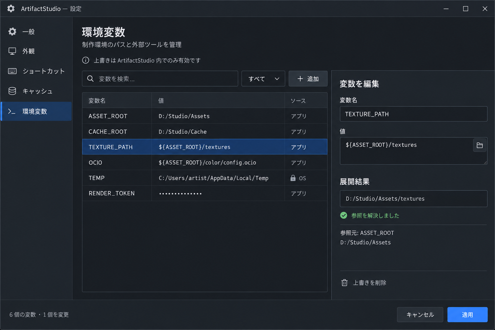

# Environment Variable Editor

**最終更新:** 2026-09-22

`Application Settings > Environment Variables` の参照モック。

- OS の環境変数は参照専用で表示する。
- ArtifactStudio 専用の上書きだけを保存・編集する。
- `${NAME}` / `$NAME` のトークン展開結果を詳細欄に表示する。
- OS 環境そのものは変更しない。
