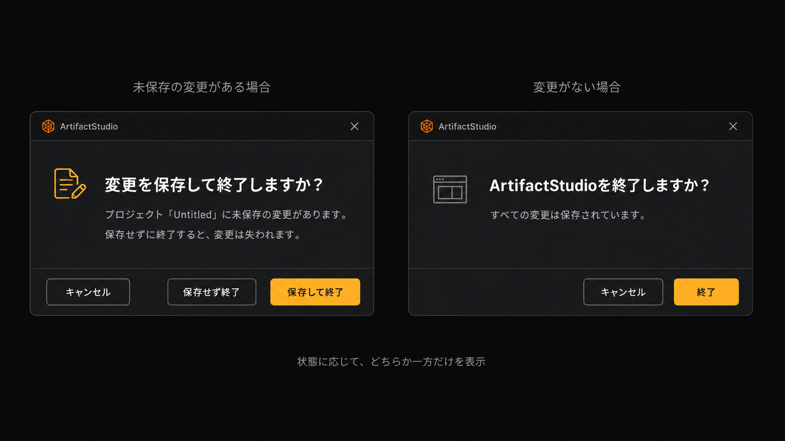

# 保存・終了確認ダイアログ 採用リファレンス

**最終更新:** 2026-09-07

ユーザーの依頼により保存した生成モック。画像と設計方針の記録のみで、実装は未着手。

- チャコール基調にアンバーの主操作を配置する。
- 未保存の変更がある場合は「変更を保存して終了しますか？」と対象プロジェクト名を表示する。
- ボタンは「キャンセル」「保存せず終了」「保存して終了」とし、操作結果を明示する。
- 変更がない場合は「ArtifactStudioを終了しますか？」と「キャンセル」「終了」を表示する案。
- 状態に応じて片方だけを表示し、保存確認の後に終了確認を重ねない。
- 大きな警告・疑問符を控えめな文書／ウィンドウアイコンに置き換える。

画像のプロジェクト名・ロゴは例示。実装では既存の承認済みアイコン体系に合わせる。「すべての変更は保存されています」は実際の保存状態を確認できる場合にのみ表示する。保存失敗・保存先選択のキャンセル時は終了せず編集画面へ戻すことを受入れ条件とする。
