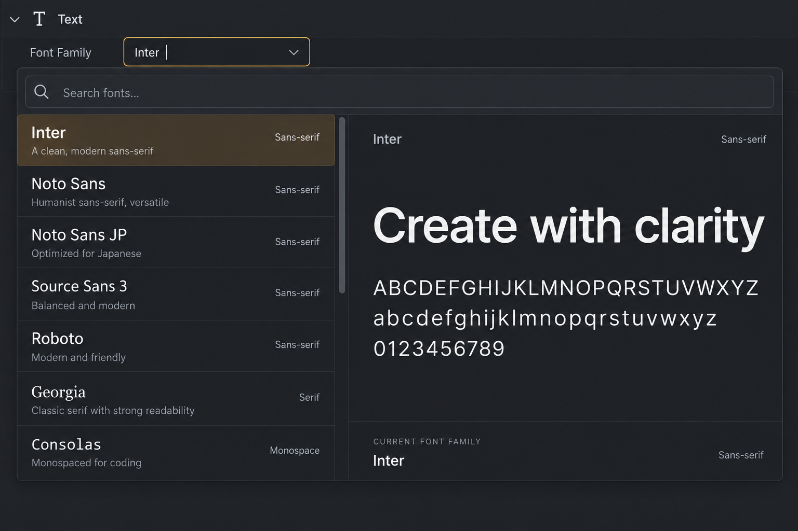

# font-picker image mockup

**最終更新:** 2026-09-08

**状態:** 初期実装へ反映済み。ランタイム確認は未実施。

生成方法: built-in image_gen。
2026-09-08 に編集可能な入力欄と、検索、フォント名自身による一覧表示、
選択・ホバー中の書体による見本文字を備えた左右分割ポップアップを反映した。
フォントサイズや字間など Font Family の責務外の操作は追加しない。

## Generation prompt

Use case: ui-mockup. Generate ONE polished high fidelity ArtifactStudio desktop DCC widget design image, straight-on flat screenshot, crisp readable English labels, charcoal backgrounds #202124/#282a2d, subtle separators #3b3e42, warm amber #dfa64c only for active states, off-white text, compact professional native desktop controls, solid readable icons, restrained subtle shading, no neon, no marketing captions, no device frame. This is a proposed design, not a screenshot of existing implementation. Landscape 1536x1024 image focused on a Font Picker expanded dropdown/popover in a text property editing context. Small surrounding charcoal property surface, Font Family editable input with Inter selected and caret. Large anchored font chooser below, filling most canvas. Search fonts field at top; vertically scrolling family list on left 42% and selected font specimen preview right 58%. Rows Inter, Noto Sans, Noto Sans JP, Source Sans 3, Roboto, Georgia, Consolas shown in subtly different appropriate typeface previews. Inter row softly amber selected. Right shows small Inter heading then large beautiful specimen 'Create with clarity' in clean sans-serif and secondary 'ABCDEFGHIJKLMNOPQRSTUVWXYZ' and 'abcdefghijklmnopqrstuvwxyz' and '0123456789'. Bottom compact current family label. Font family selection remains main responsibility: no size, tracking, color, upload, marketplace, AI or installation controls. Restrained dense professional typographic browser, no giant whitespace, no website styling.
