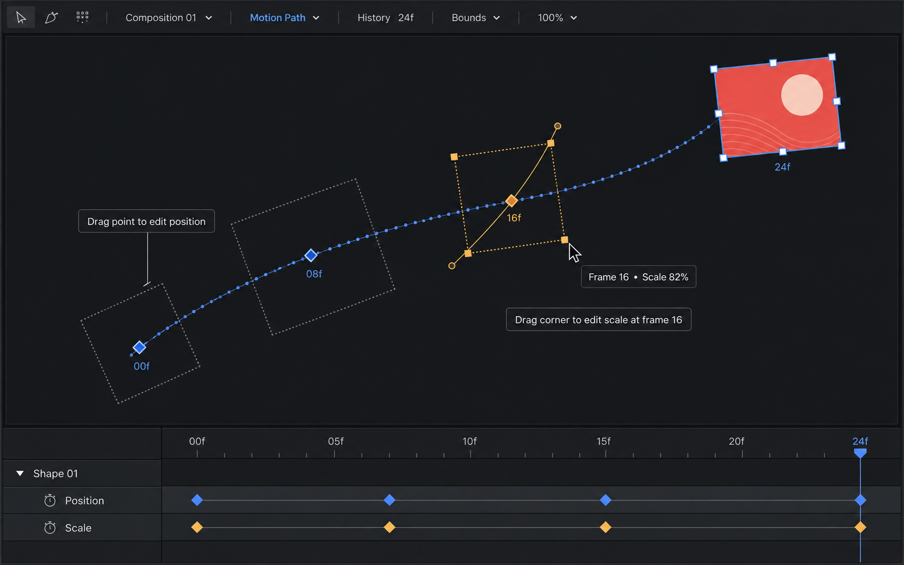

# モーションパス直接編集モックアップ

**最終更新:** 2026-09-07

Adobe系のモーションパス編集を参考にした、ArtifactStudioのViewport案。現在フレームのレイヤーに加えて、過去フレームの位置を小さな点列とキーフレームで表示し、過去フレームのサイズと回転を点線のバウンディングボックスで示す。

- 位置キーフレームの点をドラッグして、その時点の位置を直接編集する。
- 過去フレームの点線枠の角をドラッグして、その時点のスケールを編集する。
- 選択中の過去フレームはアンバーで強調し、Bezier接線も表示する。
- 現在フレームの表示を維持したまま、過去のTransformを編集できる。

これは実装仕様ではなく、Viewport操作の方向性を共有するためのリファレンス画像。
