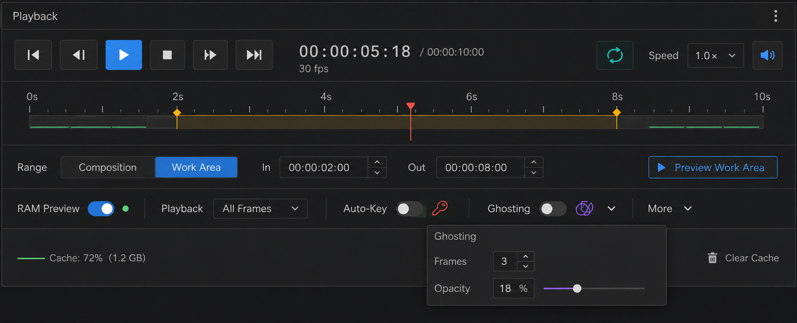

# プレイバックコントロール採用デザイン

**最終更新:** 2026-09-07

**デザイン承認:** 2026-09-07、ユーザーから本案に近づける実装指示。
**実装状況:** コード変更・静的確認。ビルド・テスト・実画面確認は未実施。

## 実装

- `Artifact/src/Widgets/Control/ArtifactPlaybackControlWidget.cppm` の既存部品を再配置。
- 再生／時刻／ループ／速度／ミュートを上段に集約。速度の3ボタンは1つのメニューから既存操作を呼び出す。
- スクラブ欄を118pxから68pxへ縮小。スライダーはFusionスタイルを局所指定し、標準の操作部を表示する。
- In／Outの設定・時刻表示を再生範囲の行に集約。設定ボタンは現在フレームを境界にする既存動作を維持する。
- Auto-Keyのスコープ／Keying SetとGhosting詳細をポップアップへ移動。
- キャッシュクリアは下段に残し、カラーSVGをStudioアイコンへ追加。

## モックとの差・確認待ち

モックのキャッシュ割合／容量・キャッシュ区間・スクラブ上の範囲ハンドルは今回追加していない。時間範囲は既存コンボとIn／Out設定から操作する。架空のキャッシュ数値は表示しない。

再生・停止・ステップ、速度変更、ループ、スクラブ、範囲設定、プレビュー、キャッシュクリア、設定ポップアップ、狭幅と高DPIでの配置を実機確認する。既存の再生サービスとシグナル接続は再利用し、新規接続は追加していない。

## VST reference styling trial — 2026-09-07

Pro-Q の表示優先度、Seventh Heaven の操作部の薄い立体感を参考に、プレイバック専用のボタン描画を追加。
再生ボタンを大きくし、ミント色のアクセント、押下時の沈み、選択中の下線、キーボードフォーカスを表示する。
現在時刻は等幅数字と同系色で強調し、表示面に浅い陰影を付ける。既存の再生処理・通知接続・ショートカットは維持。

試用用の実装。差分の空白チェックのみ実施。ビルド・テスト・実画面確認は未実施。

## 承認済み A / Amber — 2026-09-07

[配色比較モック](approved-amber-variants-2026-09-07.png) の最上段 A を採用。以前のミント色・厚い陰影の試案を置き換える。
現在時刻・In/Out・速度はアンバー、再生ボタンは青、通常アイコンはニュートラル色。ドック再表示時も数値アクセントを維持する。
Studio/playback_*.svg をモックの形に合わせたオリジナルSVGとして作成・更新。workarea / trash を追加し実際のボタンに適用。アイコン横のボタン文字も描画する。
SVGのXML構造と差分の空白を確認。ビルド・実画面は未確認。モックのキャッシュ帯や範囲ハンドルは未実装。
