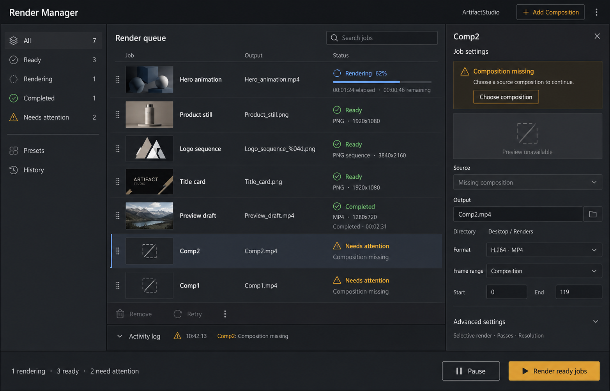

# Render Manager redesign

**最終更新:** 2026-09-07

## 採用リファレンス（2026-09-07）

ユーザーが採用した生成モック。大きなジョブカードをコンパクトな行へ整理し、一覧性とエラー対処を優先する。2026-09-09 に一覧密度、3 ペイン比率、履歴・操作帯の初期反映を行った。

- 左: 状態フィルタ、Presets、History。
- 中央: 小さなサムネイル、ジョブ名、出力、状態を並べた一覧。進捗は実行中の行に表示。
- 右: 選択ジョブの設定とエラー原因・対処を集約。
- Activity logとAdvanced settingsは折りたたみ、開始操作は右下に集約。
- 「Choose composition」「Render ready jobs」は提案機能。実装時に既存サービスとの対応を確認する。
- 画像内のジョブ名・件数・時間・設定値は例示。画像中のCompletedフィルタアイコンなどの細部は、そのまま実装仕様として確定しない。

以下は従来の構成・実装記録として維持する。

**ステータス:** In Progress

## 目的

レンダーキューを、単なるジョブ一覧ではなく「現在何が起きているか」「選択ジョブがどこへ何の設定で出力されるか」「失敗時に何を直せばよいか」を一画面で判断できる管理画面にする。

## 画面構成

- ヘッダー: `RENDER MANAGER`、実行中ジョブ数、検索、キュー追加操作
- 左ペイン: ジョブカード一覧。状態、出力、進捗、エンコーダー、レンダーバックエンドを同じカードに表示
- 右ペイン: 選択ジョブのプレビュー、プリフライト状態、出力・範囲・オーバーレイ設定
- 下部: 履歴ログとキュー全体の進捗、`Start Queue`

## 実装済み

- `RenderQueueJobCard` によるカード型ジョブ表示
- 最新の `previewFrameReady` をジョブカードのサムネイルへ反映
- `Pause` / `Stop` を既存の queue service API へ接続
- 完了済みジョブだけを整理する `Clear Completed`
- ジョブカードのドラッグ＆ドロップ並び替え
- 失敗ジョブの `Retry Job` と一括 `Retry Failed`
- 進捗イベントからカード内プログレスバーを更新
- ジョブ名・出力・状態・バックエンドを対象にした検索
- Escape キーによる検索解除
- 選択カードの面色・枠による編集対象の強調
- 失敗ジョブのエラー原因をカード上に表示
- 選択ジョブ名を設定ペインに表示
- プリフライトを `READY / WARNINGS / ERRORS` の色付き状態として表示
- 出力設定サマリーの複数行表示
- 出力パス欄の直接編集（Enter で反映）
- 出力パスの `Browse` 選択と即時反映
- フレーム範囲・オーバーレイ値の直接編集とジョブ反映
- `QPalette` と既存 DCC テーマトークンによる配色
- 既存の `ArtifactRenderQueueService` とイベント経路の維持
- コンパクトなジョブ行、縮小サムネイル、モックに沿った 3 ペイン比率
- 履歴帯と下部キュー操作帯の省スペース化

## 次の実装候補

1. ジョブカードのサムネイル領域と、最新プレビュー frame の関連付け
2. 選択ジョブへの一括設定適用とプリセット操作
3. キュー全体の Pause / Stop / Retry 操作の既存サービス API への接続
4. レンダー履歴の状態別フィルタと失敗詳細の展開

## 参照モック

[render-manager-redesign-2026-07-11.png](render-manager-redesign-2026-07-11.png)
