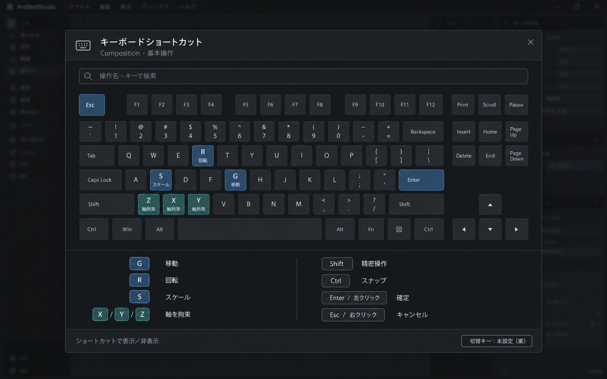

# Keyboard Overlay モックアップ

**最終更新:** 2026-10-08

ユーザー依頼により画像生成した、ショートカット参照オーバーレイの外観案。実装済み画面ではない。

## 実装に反映する範囲

- タイトル、検索欄、大きなキーボード図、操作一覧、フッターの順に配置する。
- チャコール系の背景、細い境界、控えめな青・青緑のキーハイライト、コンパクトな文字密度を参考にする。
- 現在の割り当てと検索結果を表示元とし、画像内の操作名・キーを実装上の定義としてハードコードしない。
- 画像の下段には Y が重複し C が欠ける生成上の誤りがある。実装では正しい配列を使う。
- 背景のアプリ画面は採用対象外。表示切替キーや入力経路は画像から新設・変更しない。

## 現状と変更候補

実体は `ArtifactWidgets/src/Dialog/KeyboardOverlayDialog.cppm`。現在のプレビューはキーボード図ではなく件数とカテゴリのテキストであり、5列の一覧と検索を備える。

外観変更は同ファイル内の既存実装を優先し、公開モジュールや CMake の変更、新規 signal/slot、QtCSS を追加しない。描画は通常の UI 部品の owner-draw と QPalette を用い、画像合成経路には介入しない。

呼び出し元は `Artifact/src/Widgets/Menu/ArtifactHelpMenu.cppm`。既存メニューには Ctrl+/ と HelpContents が登録されるが、呼び出しは表示のみでトグルではない。閉じる側の切替実装は既存バインド経路を確認して行う。

ArtifactWidgets の変更はユーザーの「続けて」により承認済み。既存実装にヘッダー、閉じるボタン、ANSI キー図、検索結果からのキー強調と割り当てツールチップ、件数フッターを追加した。5列の実割り当て一覧は維持し、モックの固定操作一覧は転記していない。呼び出し元の既存 QAction は表示／非表示を切り替え、同じ QAction をダイアログにも追加してフォーカス中の切替に使用する。

キーボード図はテンキーレス風の ANSI 参照配置（ナビゲーションキーは下段に集約）であり、JIS 配列の再現や OS 配列検出は未対応。ビルド・テスト・実機確認・コミット・push は未実施。

## 生成記録

built-in image_gen 使用。生成指示：ArtifactStudio の暗色ネイティブ UI 上に、日本語タイトルと検索、テンキーレスのキー配置、変換・軸拘束の控えめな強調、操作一覧、表示切替のフッターを持つ単一のオーバーレイ案を生成する。切替キーは未設定の案とし、背景にキャンバス内容やギズモを描かない。
