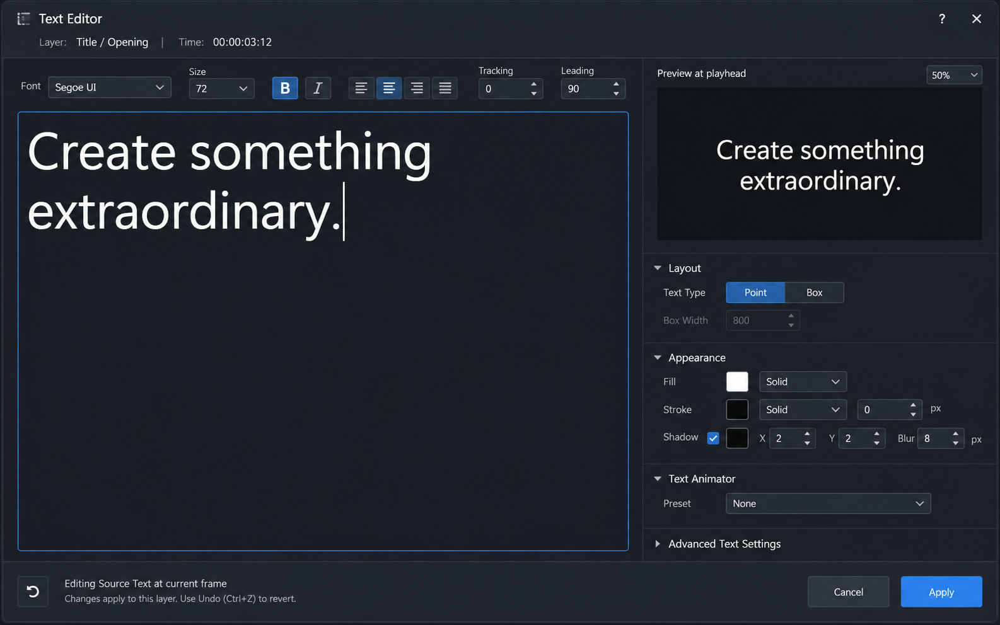

# Text Editor 集中編集モック

**最終更新:** 2026-09-24

**状態:** 検討用。UI 構成・追加機能とも未採用。

## 目的と参照範囲

`ArtifactTextEditorDialog` の本文編集を主役にし、書式・レイアウト・プレビューを一画面で追える配置案。既存の Text Layer 編集ダイアログ、`CompositionTextEditor.cppm`、および現行の Qt/DCC テーマを参照した。画像は機能や操作仕様の承認を意味しない。

- 左: 本文入力。広い編集領域と、よく使う文字書式のツールバー。
- 右上: 現在フレームでのプレビュー。画像中の文字と背景は説明用のダミー。
- 右下: Layout、Appearance、Text Animator。詳細度の低い項目は Advanced Text Settings へ畳む案。
- 下部: 編集対象と確定状態、Cancel、Apply。

## 現行実装との対応

既存のダイアログには本文編集、フォント・サイズ・字間・行送り・ストレッチ、整列、装飾、Point/Box/Path、折り返し、縦配置、縦書き、Text Animator 数とプリセット、プレビュー、確定・取消がある。文字列とスタイルの確定処理、Undo、現在フレームの Source Text keyframe 更新経路は再利用する。モックのツールバーと左右ペインは配置変更案であり、選択文字単位の書式変更を保証するものではない。

## 機能拡充の順序案

1. **編集の安全性:** ダイアログの編集中状態、Apply/Cancel、フォーカス移動時の扱いを明確化する。現行の自動確定挙動を実装前に確認する。
2. **入力とプレビュー:** 本文・書式変更からのプレビュー更新、現在フレームの表示、リッチテキストと IME の扱いを整理する。
3. **文字組み:** Point/Box/Path、折り返し、幅・高さ、行送りを文脈に応じて表示する。
4. **アニメーション:** Text Animator の数とプリセット選択から、既存スタックの一覧・選択・編集導線へ進める。モデルと Undo の責務を先に確認する。

実装時は既存のイベント経路を使い、QtCSS・新規 signal/slot 接続を追加しない。Composition Viewport のキャンバス内表示やギズモ変更には、このモックを根拠として使わない。

## 生成記録

- 方法: built-in ImageGen（`ui-mockup`）
- 出力: 1440 × 900 を意図した、ArtifactStudio のモデルレス Text Editor ダイアログ単体
- プロンプト: 「Windows Qt 製 DCC/コンポジットアプリ ArtifactStudio の Text Layer Editor。暗い DCC テーマ、青い選択色、Segoe UI 系の文字。`Title / Opening` の現在フレームを表示し、左に大きな複数行テキスト編集領域、上にフォント・サイズ・太字・斜体・整列・Tracking・Leading、右に同じ文字を表示するライブプレビュー、Layout・Appearance・Text Animator の簡潔な設定、下部に編集状態と Cancel/Apply を置く。ブラウザ枠、装飾カード、キャンバス内ギズモ、架空の描画内容は加えない。」
