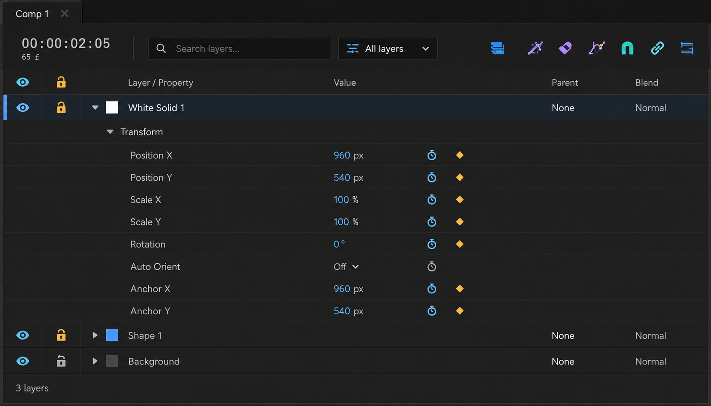

# タイムライン左ペイン採用デザイン

**最終更新:** 2026-09-06

**デザイン承認:** 2026-09-06、ユーザーがカラーアイコン版を採用。
**実装状況:** 採用案に沿って左ペインのコードを変更。静的確認のみ実施し、ビルド・テスト・実画面検証は未実施。

## 対象と方針

対象は `ArtifactLayerPanelWidget`（タイムライン左ペイン）。画像生成によるデザイン原案であり、実アプリのスクリーンショットではない。

- チャコール基調、控えめな青の選択背景、読みやすい文字と整列した列を採用する。
- 表示は青、ロックは黄、アニメーション関連は紫など、意味のある色付きアイコンを採用する。有効・無効は実際の状態に対応させる。
- アイコンは太めのソリッドな形を基本とし、実装用には16pxでも判別できるオリジナルSVGへ整える。配置先は既存方針の `Artifact/App/Icon/Studio/`。
- レイヤー名、プロパティ名、編集値、キーフレーム操作の整列を優先する。Parent / Blend はレイヤー行の列として扱う。
- Transform の各プロパティは個別行を維持し、右側タイムラインとの行位置・行高を揃える。
- Layer / Child / A / Grp などの常時バッジを整理し、選択数の常時バッジは追加しない。

画像内の数値・レイヤー・アイコンの状態は例示。個々の操作の意味、必要な既存機能、最終的な行高・列幅は実装時に照合する。画像をそのまま切り出したラスターアイコンとして組み込むことを確定したものではない。

## 実装内容（2026-09-06）

- 状態列を24pxに整理。表示・ロック・ソロ・音声・シャイ・アニメーション・操作メニューにオリジナルのカラーSVGを使用。
- Value列を追加し、現在時刻のプロパティ値、アニメーション状態、現在フレームのキーを近接表示。値の単位やスケールは推測で変換しない。
- 数値・真偽値は値欄のダブルクリックで編集。静的値は既存のプロパティUndo、既存キーは接線・anchorを維持したキースナップショットUndo、キー間の編集は既存モデルによる現在フレームへのキー追加を利用。ロック中は編集しない。
- 親・ブレンド列は狭幅時に畳む。ヘッダーと描画・ヒット領域の幾何計算を共通化し、状態列の表示切替・幅変更をヘッダーにも反映。
- Layer / Child / Grp の常時バッジを整理。Variantは複数ある場合のみチップ表示し、既存のメニュー経路は維持。
- 選択背景と罫線を抑え、右ペインとの行数・行高は維持。右ペイン、カーブエディタ、上部タイムコード／検索ツールバーは今回変更していない。

### 実機確認待ち

標準幅・狭幅・高DPIでの列整列、列幅変更・列非表示、長い名前、Variant・マット表示、値編集とUndo/Redo、キー間編集、ロック状態、スクロール時のヒット位置、右ペインとの行同期を確認する。値編集はモックのインライン操作ではなく、既存Qt入力ダイアログを使う。新規SVGのリソース反映は次回のユーザー指示によるビルド時に確認する。
