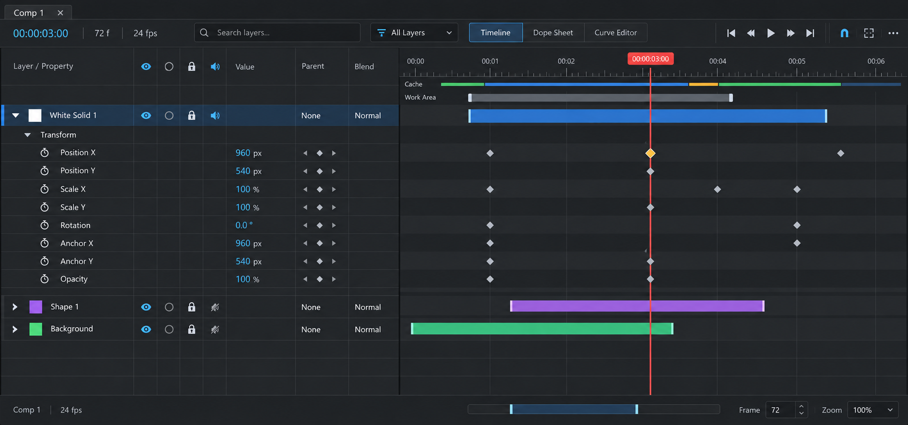
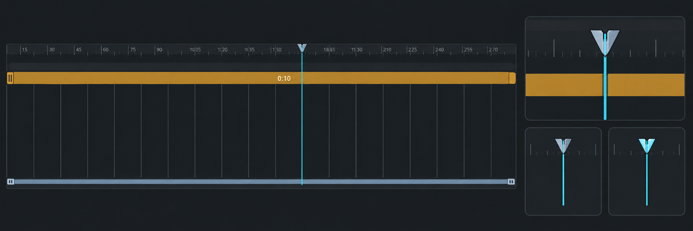

# 通常タイムライン採用デザイン

**最終更新:** 2026-09-25

**承認:** 2026-09-13、ユーザーが通常タイムライン案2の改訂版を「すっきりしたねこれ採用で」と承認。
**プレイヘッド承認:** 2026-09-15、ユーザーが非赤色の「Precision Blade」案を採用。
**状態:** デザイン採用・画像保存済み。Diligent表示面を既定表示へ切り替え、実装を開始した。今回の保存は実装完了を意味しない。

## 採用範囲

通常のレイヤーバーモードの全体構成を実装基準とする。対象はタイムライン左ペイン、右の時間領域、上部操作、ルーラー、キャッシュ状態、ワークエリア、下部ナビゲーター。

- チャコール基調、控えめな青の選択背景、細い区切り、読みやすい列配置。
- Layer / Property を先頭にし、レイヤーの状態スイッチ、Value、Parent、Blendを整列させる。
- レイヤー専用スイッチとParent／Blendはレイヤー行に表示し、プロパティ行に不要な状態欄を反復しない。
- 標準プロパティグループはTransformのみ。Scale X／Yなど個別行と左右の行高・位置を一致させる。
- 値の近くに前後キー移動・キー操作を置く。レイヤー行は期間バー、プロパティ行はキーフレームで時間を示す。
- 時間ルーラー、細いキャッシュ状態表示、両端ハンドル付きワークエリアを維持する。時間軸の座標は共通化する。
- 選択キーはアンバーと細い明色輪郭、現在時刻はアイスシアンの連続線と銀色の低いヘッドで識別する。
- 下部に時間ナビゲーター、フレーム、ズームをまとめる。

## プレイヘッド採用仕様（2026-09-15）

- ヘッドはクールシルバー／グラファイトの低いブレード形状とし、中央にアイスシアンの芯を通す。実寸では約14px幅を上限の目安とする。
- ステムは最大2pxのアイスシアンとし、ルーラー、ワークエリア、トラック、下部ナビゲーターで同じ現在時刻座標へ連続させる。
- プレイヘッドには赤、コーラル、オレンジ、マゼンタを使わない。ワークエリアは通常時を控えめなスレートとし、オーカーはホバー／ドラッグ中の操作フィードバックに限定する。選択キーのアンバーは既存の意味を維持する。
- モックはプレイヘッドの形状、色、視認性のみの参照であり、新しい操作、ボタン、ショートカット、タイムライン構造を追加する根拠にはしない。
- QWidget/QPainter面とGPU面では、同じ形状・色・座標の意味を共有する。

## 実装時の解釈

画像は生成モックであり、機能の実装状況やデータの正確性を保証しない。キャッシュの色・区間は実際のキャッシュ種別と状態に対応させ、存在しないDiskキャッシュなどを表示だけ追加しない。表示値、時刻、FPS、選択、ロックは実モデルと一致させる。

2026-09-16のDiligent表示調整では、主グリッドを疎にして副グリッドと行区切りのコントラストを下げ、クリップの厚み・端部・ラベル余白を採用モックへ寄せる。RAM Previewの詳細診断列は通常ツールチップへ露出せず、再生可能数、進捗、構築中数、失敗数だけを短く示す。

生成画像ではキー操作がParent列の位置に入っている。キー操作はプロパティの編集責務として配置・ヒット領域を明確にし、親変更として扱わない。列幅の具体値は実画面で調整する。画像を理由に新しいキー操作契約やショートカットを導入しない。

今回は通常タイムラインの採用であり、Curve Editor／Dope Sheetの統合案は採用対象外。既存の専用面と切替責務を尊重する。DockタブとComp1等の編集コンテキストタブも既存の責務分離に従う。

## 2026-09-21 スクリーンショット差分の修正（実機確認待ち）

- 左ペインの名前列を先頭へ移動。状態列、名前編集、展開、親リンク、列幅変更の座標を同じ配置へ更新。
- 左右の背景をチャコールへ統一し、選択行を控えめな青へ調整。Solo は輪郭の円、Lock はシルバー、Audio はシアン、Shy は低彩度へ変更。
- Timeline / Curve Editor の選択状態を専用描画で明示。ルーラーを読みやすい時刻表記へ変更し、GPU面・従来面の主グリッド間隔を120px以上へ調整。
- ヘッダー高さを整理し、左の列ヘッダーと右のルーラー／キャッシュ／Work Areaの合計高さを一致させる。
- ソース差分のみ確認。ビルド、空状態／レイヤーあり／Transform展開時の画像比較、DPI変更、列幅変更、名前編集、選択／スクラブの実機確認は未実施。採用モックとの一致完了とは扱わない。

## 関連資料・優先順位

### 2026-09-25 スクリーンショット差分への追加調整（実機確認待ち）

- 左列ヘッダーの各ボタンをフラットな共通面に揃え、状態別の背景パレットを統一。
- 右上の追加スイッチ群を `Timeline options` に収め、再生ボタン周辺の密度を採用モックへ近づけた。既存のスイッチ操作はメニュー内で維持する。
- 再生中のプレイヘッド追従は、表示領域の約70%ではなく右端付近で開始する。表示可能な範囲にあるレイヤーバーが早く画面外へ流れ、短く見える症状を抑える。
- ソース差分のみ確認。ビルド・実機画像比較と、再生／スクラブ中のバー長の確認は未実施。

### 2026-09-21 追加のトーン／可読性調整

- 列ヘッダーの個別ボタン背景塗りを解除し、共通のチャコール面へ統一。
- ヘッダー文字を最低10pt、状態アイコンを18pxに調整。
  上部ツール文字は13pxを基準にAccessibility倍率を適用し、再生アイコンも倍率に対応。
- Work Areaの通常時の塗りとNavigatorの範囲色／輪郭を暗くし、ハンドルを識別点として維持。
- 左上の高さ調整領域もヘッダーと同色へ統一。左右行の座標一致を維持するため、
  spacer高さやルーラー／ワークエリアの構造は変更していない。
- 静的差分確認のみ。ビルド・実機比較は未実施。

通常タイムライン全体の外観は本画像を優先する。以前の画像は履歴・部分参照として保持する。

- [旧左ペイン採用案](../timeline-layer-panel/README.md)
- [右ペイン比較案](../timeline-right-panel/)
- [カーブエディター参考画像（別対象）](../timeline-curve-editor/README.md)
- [Dope Sheet（別対象）](../dope-sheet/README.md)
- [Precision Blade プレイヘッド採用モック](playhead-precision-blade-mockup-2026-09-15.png)

生成元: `exec-fa901aec-ad3f-478c-95e0-fa2ebb24180d.png`。通常タイムライン案2を基にした単一改訂版。元画像は削除せず保持する。

GPU確認中はDiligent timeline surfaceを既定表示とする。`ARTIFACT_GPU_TIMELINE_PREVIEW=0`を設定すると従来のQWidget/QPainter面へ戻せる。GPU初期化に失敗した場合も自動的に従来面へ復帰する。
