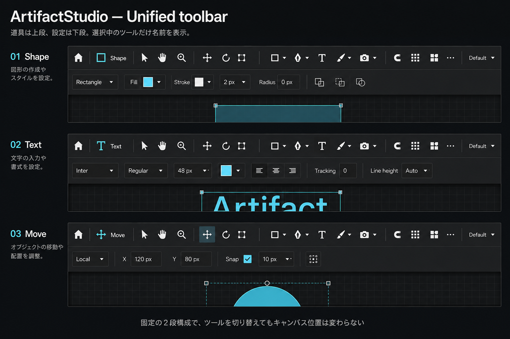

# Unified toolbar

**最終更新:** 2026-09-07

ユーザー承認済みの D（選択ツール名）・F（コンパクトなツール列）・E（コンテキスト設定段）の統合案。

## 実装

- `Artifact/src/Widgets/ArtifactToolBar.cppm`: 固定高44pxの上段。左に固定幅148pxの選択ツール表示、中央に操作・作成ツール、右に表示操作とワークスペース。アクセシビリティ倍率を適用。
- シェイプ・ブラシ・カメラの派生ツールは既存QActionのドロップダウン。派生ツール選択後はそのグループの既定ボタンを更新。その他の道具は追加ツールメニュー。既存ショートカットと実行経路を維持。
- Full表示は高さを変えない横ラベル方式。Compactが初期表示。
- `Artifact/src/Widgets/ArtifactToolOptionsBar.cppm` と `ArtifactMainWindow.cppm`: 既存オプションを固定高の下段に配置。設定本体40px、ホスト60pxで横スクロール分も確保し、切替時のキャンバス移動を防ぐ。
- `Artifact/App/Icon/Studio/toolbar_*.svg`: 28点を24px viewBoxの太い白基調SVGに更新。選択背景・現在のツール名はシアン。File Menuアイコンは対象外。
- 新規signal/slot接続、QtCSS、CMake変更なし。既存の別作業差分を維持。

## デザイン画像との差と未確認事項

- 下段の内容は既存の編集機能に合わせている。画像中の塗り・線の色スウォッチ、移動X/Y入力などを新しい編集機能として追加していない。
- 項目が多いブラシ等を省略せず扱うため、下段は画像より高く横スクロール可能。
- ビルド・テスト・アプリ起動確認は未実施。確認対象は起動、ツール切替、派生ツールと追加メニュー、既存ショートカット、設定編集、狭いウィンドウと拡大表示、終了時の所有権。
