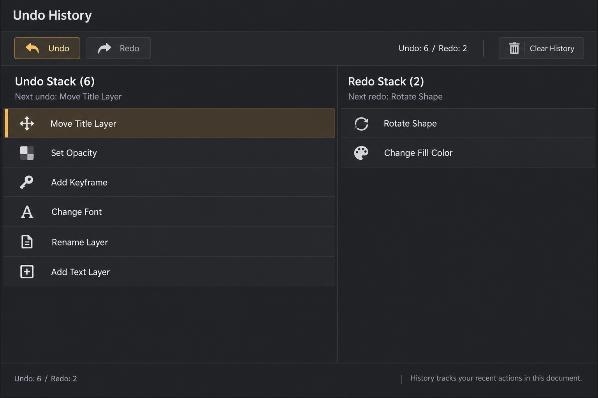

# undo-history image mockup

**最終更新:** 2026-09-08

**状態:** 初期実装へ反映済み。ランタイム確認は未実施。

生成方法: built-in image_gen。
2026-09-08 に Undo / Redo / Clear History を上部へ集約し、Undo 3 : Redo 2
の履歴列、次に実行される項目の表示、Undo 先頭行の強調を反映した。
履歴ラベルに応じた既存 Qt 標準アイコンも表示する。

## Generation prompt

Use case: ui-mockup. Generate ONE polished high fidelity ArtifactStudio desktop DCC widget design image, straight-on flat screenshot, crisp readable English labels, charcoal backgrounds #202124/#282a2d, subtle separators #3b3e42, warm amber #dfa64c only for active states, off-white text, compact professional native desktop controls, solid readable icons, restrained subtle shading, no neon, no marketing captions, no device frame. This is a proposed design, not a screenshot of existing implementation. Landscape 1536x1024 image showing a medium-width Undo History dock filling canvas with balanced compact native UI proportions. Title Undo History. Toolbar Undo and Redo buttons with solid curved-arrow icons; subdued Clear History at far right. Summary Undo: 6 / Redo: 2. Two side-by-side well structured columns, Undo Stack about 60%, Redo Stack about 40%. Undo rows newest at top: Move Title Layer, Set Opacity, Add Keyframe, Change Font, Rename Layer, Add Text Layer. Highlight top Undo row soft amber tint, subtle left amber edge. Redo rows top first: Rotate Shape, Change Fill Color. Each row clean solid category icon and crisp label, light separators. Small column sublabels Next undo and Next redo clarify top entries. Comfortable empty space below rows, understated footer. No invented timestamps, thumbnails, branching, cloud history or restore snapshots. Precise practical history UI.
