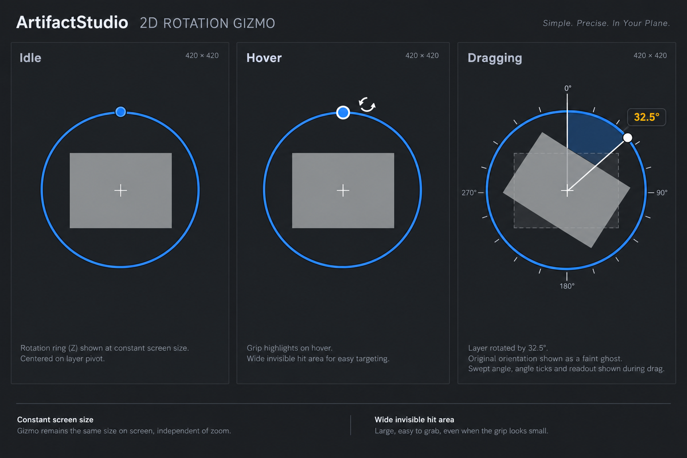

# 2D rotation gizmo proposal

**最終更新:** 2026-09-12

ユーザー依頼による内蔵 imagegen 生成モック。2026-09-12 ユーザー採用、初回実装済み・実画面未検証。
画面上で一定サイズのZ回転リング、明暗背景で読める輪郭、広めの不可視ヒット領域、ホバー強調、回転中の角度表示を提案する。
画像の寸法注記や角度の見た目は生成イメージであり、正確な測定仕様ではない。実装時は実際の回転差分と表示を一致させる。
3Dギズモや既存Move/Scaleの変更根拠にはしない。

## 初回実装

`Artifact/src/Widgets/Render/Artifact3DGizmo.cppm` の専用2D回転モードに限定。
投影から半径85 viewport px相当を算出し、表示と当たり判定で共有する。
青リング3px、暗い輪郭5px、不可視ヒット幅は半径方向±10px。ホバー強調・グリップ・中心十字・ドラッグ位置マーカーを追加。
既存の角度差分・扇形・15度目盛り・Undoを再利用。新規キー・接続は追加していない。
生成モックの矩形ゴーストは今回追加していない。
既存Diligent quad経路を使用し、スタック上の固定個数の頂点を送る。新規画像・GPUリソース・コンテナ確保なし。
ビルド・テストはユーザー指示待ち。実機でズーム、DPI、2Dレイヤーの回転、リング全周でのドラッグ、キャンセル・Undoを確認する必要がある。

## Generation prompt

Use case: ui-mockup. Create a high fidelity flat front-facing design board for ArtifactStudio 2D ROTATION GIZMO. Three adjacent viewport panels titled Idle, Hover, Dragging. Dark neutral charcoal canvas. Each contains one simple muted light gray 2D rectangular layer, centered visible pivot cross. Only a planar Z rotation ring, absolutely no 3D sphere, XYZ hoops, perspective, translation arrows or scale handles. Ring about 170 pixels diameter relative to each 420px panel, continuous crisp medium blue stroke with dark contrast outline, visually 3px thick, easy to see on both gray layer and dark background. A modest circular grip on ring clearly invites dragging; on hover brighter blue with white border and curved rotation cursor nearby. Dragging panel layer rotated 32.5 degrees, faint original orientation ghost, restrained translucent blue swept sector, small white radial start/end lines and round white drag marker, compact adjacent charcoal badge with amber '32.5°'. Fine sparse angle ticks shown only during drag. Compact professional desktop DCC aesthetic, accessible clarity, restrained blue and amber, no glow, no fancy illustration. Small footer annotations 'Constant screen size' and 'Wide invisible hit area'. No shortcut labels, no new buttons, no elaborate app chrome. This is a proposal only. Sharp readable English labels.
