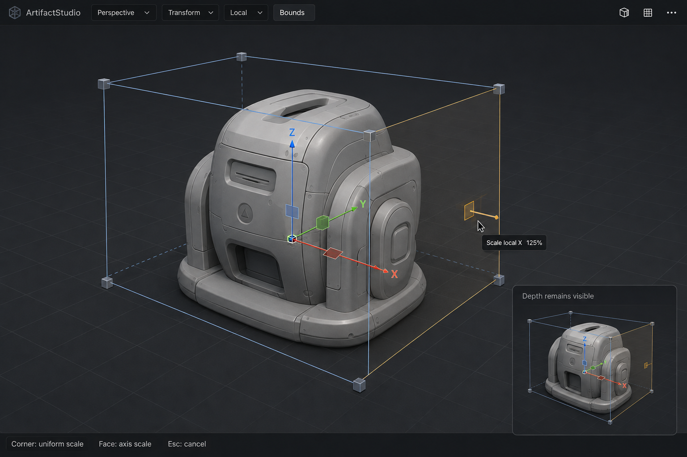

# 立体モデル用バウンディングボックス・ギズモ

**最終更新:** 2026-09-07

ユーザー指定により保存した生成デザインリファレンス。Z方向にも厚みのあるモデルを立体枠で囲み、角で等比スケール、面中央で軸スケールを操作する案。移動はXYZ軸、回転は既存モードを使用する。

## 実装ログ

- 2026-09-07: `Artifact3DGizmo.cppm` の既存立体枠・角・辺・面ハンドルを確認。通常Scaleモードでは枠描画がある一方、枠のヒット判定がFull関連状態だけに限定されていた。
- 通常Scaleモードでも枠ハンドルをヒット判定し、既存のboundingBoxDrag経路へ接続。
- 枠の辺を淡青色へ変更。ビュー空間で中心より奥にある辺の中点を基準に、奥側を低コントラストの破線にする。モデルの実際の遮蔽判定ではない。
- 角は既定で等比スケール。面は単軸、辺は既存の2軸スケールを維持。既存ドラッグ・Undo経路を再利用。
- モックとの残差: Fullモードのコンパクト表示、角のカメラ向き四角形、既存辺ハンドルは維持。モック全体の完全再現ではない。
- 静的差分確認のみ。ビルド・テスト・CMake・実画面検証は未実施。Perspective/Local/World、負スケール、親変換、角・辺・面の競合、Undo/キャンセルは実操作受入れ待ち。
- GPU描画は既存Diligent経由のGizmo APIを使用。バックエンド固有処理やリソース所有権の変更なし。
