# ArtifactCore カラーシステム分析レポート
**作成日**: 2026-04-17  
**対象**: ArtifactCore の Color モジュール（FloatColor, ColorManager, ColorLUT, 関連クラス）

---

## 📋 目次

1. [ColorManager（カラーマネージャ）](#1-colormanager)
2. [FloatColor（HDR対応浮動小数点色）](#2-floatcolor)
3. [FloatRGBA（RGBA浮動小数点色）](#3-floatrgba)
4. [ColorLUT（3Dルックアップテーブル）](#4-colorlut)
5. [関連クラス群](#5-関連クラス群)
   - [XYZColor（CIE XYZ色空間）](#xyzcolor)
   - [Sarturation（彩度調整）](#sarturation)
   - [LabColor（CIE Lab色空間）](#labcolor)
   - [ColorBlendMode（ブレンドモード）](#colorblendmode)
   - [ColorHarmonizer（色彩調和）](#colorharmonizer)
   - [AutoColorMatcher（自動色補正）](#autocolormatcher)
   - [ColorLuminance（輝度計算）](#colorluminance)
6. [依存関係図](#6-依存関係図)
7. [責務表（IN/OUT）](#7-責務表inout)
8. [発見・課題](#8-発見課題)

---

## 1. ColorManager

### 📍 所在ファイル
| 役割 | ファイルパス |
|------|-------------|
| 宣言（インターフェース） | `ArtifactCore/include/Color/ColorSpace.ixx` |
| 実装（ソース） | `Artifact/src/Color/ArtifactColorManagement.cppm` |
| 補助クラス | `ArtifactCore/src/Color/ColorSpace.cppm`（`ColorSpaceConverter`） |

### 🏷️ 名前空間
- 宣言: `namespace ArtifactCore`（`ColorSpace.ixx`）
- 実装: `namespace Artifact`（`ArtifactColorManagement.cppm`）
- **⚠️ 重要**: 名前空間不一致あり。実際のシングルトン実装は `Artifact::ColorManager`

### 📋 主要メソッド一覧

| メソッド | 戻り値 | 概要 |
|---------|--------|------|
| `static ColorManager& instance()` | 参照 | シングルトンインスタンス取得 |
| `ColorSettings* settings()` | ポインタ | グローバルカラー設定取得 |
| `const ColorSettings* settings() const` | Constポインタ | グローバルカラー設定取得（const） |
| `QMatrix4x4 getConversionMatrix(ColorSpace from, ColorSpace to) const` | 行列 | 色空間変換行列取得（簡易実装） |
| `float applyGamma(float value, GammaFunction gamma) const` | float | ガンマ補正適用 |
| `float removeGamma(float value, GammaFunction gamma) const` | float | ガンマ補正除去 |
| `void setHDRMetadata(float maxCll, float maxFall, float avgBrightness)` | void | HDRメタデータ設定 |
| `float maxContentLightLevel() const` | float | 最大内容輝度取得 |
| `float maxFrameAverageLightLevel() const` | float | フレーム平均輝度取得 |
| `float averageBrightness() const` | float | 平均輝度取得 |
| `void setWorkingSpace(ColorSpace space)` | void | 作業色空間設定 |
| `ColorSpace workingSpace() const` | ColorSpace | 作業色空間取得 |

### 🔔 シグナル
- `void colorSpaceChanged(ColorSpace space)`
- `void hdrModeChanged(HDRMode mode)`

### 📦 依存クラス
- `ColorSettings` - カラー設定保持
- `ColorSpace` - 色空間列挙
- `GammaFunction` - ガンマ関数列挙  
- `HDRMode` - HDRモード列挙
- `HDRMetadata` - HDRメタデータ構造体
- `QObject` - QObject基底

### ⚠️ 未実装・不足メソッド
ユーザー要求仕様との乖離：
- `setDisplayProfile()` → **未実装**
- `getDisplayProfile()` → **未実装**
- `colorSpaceTransform()` → 同等機能は `getConversionMatrix()` で部分的に提供
- `getWorkingSpace()` → `workingSpace()` として実装済み

### 🎯 責務
**IN**: カラー設定値、HDRメタデータ、ガンマ補正パラメータ  
**OUT**: 色空間変換行列、ガンマ補正済み値、HDRメタデータ

---

## 2. FloatColor

### 📍 所在ファイル
| 役割 | ファイルパス |
|------|-------------|
| 宣言（インターフェース） | `ArtifactCore/include/Color/FloatColor.ixx` |
| 実装（ソース） | `ArtifactCore/src/Color/FloatColor.cppm` |

### 🏷️ 名前空間
`namespace ArtifactCore`

### 📋 プロパティ

| プロパティ | 型 | 取得 | 設定 |
|-----------|-----|------|------|
| 赤 (Red) | `float` | `red()`, `r()` | `setRed()` |
| 緑 (Green) | `float` | `green()`, `g()` | `setGreen()` |
| 青 (Blue) | `float` | `blue()`, `b()` | `setBlue()` |
| 阿尔法 (Alpha) | `float` | `alpha()`, `a()` | `setAlpha()` |

### 📋 主要メソッド一覧

| カテゴリ | メソッド | 概要 |
|---------|---------|------|
| **構築** | `FloatColor()` | デフォルト（0,0,0,1） |
| | `FloatColor(float r, float g, float b, float a)` | RGBa指定構築 |
| | `FloatColor(const FloatColor& other)` | コピー構築 |
| | `FloatColor(FloatColor&& other)` | ムーブ構築 |
| | `~FloatColor()` | デストラクタ |
| **アクセサ** | `setColor(float r, float g, float b)` | RGB設定 |
| | `setColor(float r, float g, float b, float a)` | RGBA設定 |
| | `clamp()` | 値を [0,1] に制限 |
| **統計** | `float sumRGB() const` | R+G+B 合計 |
| | `float sumRGBA() const` | R+G+B+A 合計 |
| | `float averageRGB() const` | RGB平均 |
| | `float averageRGBA() const` | RGBA平均 |
| **演算子** | `operator=`（コピー） | 代入演算子 |
| | `operator=`（ムーブ） | ムーブ代入 |
| | `operator+` | ベクトル加算 |
| | `operator-` | ベクトル減算 |
| | `operator*`（スカラー） | スカラー乗算 |
| | `operator+=` | 加算代入 |
| | `operator-=` | 減算代入 |
| | `operator*=` | 乗算代入 |

### 🔍 実装詳細（`FloatColor::Impl`）
Pimpl イディオムにより実装隠蔽。
- メンバ: `r_`, `g_`, `b_`, `a_`（`float`）
- 内部関数: `sumRGB()`, `sumRGBA()`, `averageRGB()`, `averageRGBA()`, `clamp()`

### ⚠️ 未実装・不足メソッド
ユーザー要求仕様との乖離：
- `fromLinear()` → **未実装**（線形色空間からの変換）
- `toLinear()` → **未実装**（線形色空間への変換）
- **代替案**: `ColorTransferFunction` モジュール（`linearToSRGB()`, `srgbToLinear()` 等）を直接使用するか、`ColorManager` 経由で変換行列を適用

### 🎯 責務
**IN**: RGB 浮動小数点値（0.0-1.0）  
**OUT**: 加算/減算/乗算結果、クランプ後色値、平均・合計値

---

## 3. FloatRGBA

### 📍 所在ファイル
| 役割 | ファイルパス |
|------|-------------|
| 宣言（インターフェース） | `ArtifactCore/include/Color/FloatRGBA.ixx` |
| 実装（スタブ） | `ArtifactCore/src/Color/FloatRGBA.cppm` |

### 🏷️ 名前空間
`namespace ArtifactCore`

### 📋 主要メソッド一覧

| メソッド | 型 | 概要 |
|---------|-----|------|
| `FloatRGBA()` | コンストラクタ | デフォルト (0,0,0,0) |
| `FloatRGBA(float r, float g, float b, float a = 1.0f)` | コンストラクタ | RGBA指定 |
| `r() const` | `float` | 赤成分取得 |
| `g() const` | `float` | 緑成分取得 |
| `b() const` | `float` | 青成分取得 |
| `a() const` | `float` | アルファ取得 |
| `setRed(float r)` | void | 赤設定 |
| `setGreen(float g)` | void | 緑設定 |
| `setBlue(float b)` | void | 青設定 |
| `setAlpha(float a)` | void | アルファ設定 |
| `setRGBA(float r, float g, float b, float a)` | void | 一括設定 |
| `operator[](int index)` | `float&` | インデックスアクセス（0=r,1=g,2=b,3=a） |
| `operator FloatColor() const` | 変換演算子 | `FloatColor` への暗黙変換 |
| `setFromFloatColor(const FloatColor&)` | void | `FloatColor` から設定 |
| `setFromRandom()` | void | ランダム色設定 |
| `operator==` / `operator!=` | 比較 | 等価比較 |
| `swap(FloatRGBA&)` | void | swap |

### 📦 依存クラス
- `FloatColor` - 相互変換対象

### 🎯 責務
**IN**: RGBA 浮動小数点値  
**OUT**: 構造化された RGBA アクセス、`FloatColor` との相互変換

---

## 4. ColorLUT

### 📍 所在ファイル
| 役割 | ファイルパス |
|------|-------------|
| 宣言（インターフェース） | `ArtifactCore/include/Color/ColorLUT.ixx` |
| 実装（ソース） | `ArtifactCore/src/Color/ColorLUT.cppm` |

### 🏷️ 名前空間
`namespace ArtifactCore`

### 📋 構造体・列挙

| 型 | 定義 |
|----|-----|
| `struct LUTSize` | `dimX`, `dimY`, `dimZ`（格子点数） |
| `enum class LUTFormat` | `Cube`, `Csp`, `_3dl`, `Mga`, `Look`, `PNG`, `Unknown` |
| `enum class LUTType` | `IDT`, `ADT`, `ACESLook`, `Cube1D`, `Cube3D`, `CDL` |

### 📋 ColorLUT 主要メソッド

| カテゴリ | メソッド | 戻り値 | 概要 |
|---------|---------|--------|------|
| **構築** | `ColorLUT()` | - | デフォルト（単位LUT 33x33x33） |
| | `ColorLUT(const QString& filePath)` | - | ファイルから読み込み |
| | `ColorLUT(const ColorLUT&)` | - | コピー |
| | `ColorLUT(ColorLUT&&)` | - | ムーブ |
| | `~ColorLUT()` | - | デストラクタ |
| **読み込み** | `bool load(const QString&)` | 成功可否 | 拡張子判定で形式自動選択 |
| | `bool loadFromCube(const QString&)` | 成功可否 | Adobe IRIDAS CUBE形式 |
| | `bool loadFromCsp(const QString&)` | 成功可否 | Cinespace形式（簡易） |
| | `bool loadFrom3dl(const QString&)` | 成功可否 | Autodesk 3DL形式 |
| | `bool loadFromHaldCLUT(const QString&)` | 成功可否 | HaldCLUT画像形式 |
| | `bool loadFromImage(const QImage&, int lutSize=33)` | 成功可否 | QImageから抽出 |
| **保存** | `bool saveToCube(const QString&) const` | 成功可否 | CUBE形式で保存 |
| **プロパティ** | `QString name() const` | 名前 | LUT名称 |
| | `void setName(const QString&)` | void | 名称設定 |
| | `QString filePath() const` | ファイルパス | 元ファイルパス |
| | `LUTFormat format() const` | 形式 | 読み込み形式 |
| | `LUTSize size() const` | サイズ | 3D格子サイズ |
| | `bool isValid() const` | 有効性 | 読み込み成功か |
| | `QString errorMessage() const` | エラーメッセージ | 失敗時の詳細 |
| **適用** | `QColor apply(const QColor&) const` | QColor | QColorにLUT適用 |
| | `void apply(float& r, float& g, float& b) const` | void | float値に直接適用 |
| | `QImage applyToImage(const QImage&) const` | QImage | 画像全体に適用 |
| | `QColor applyWithIntensity(const QColor&, float intensity) const` | QColor | 強度指定適用 |
| **LUT操作** | `static ColorLUT createIdentity(int size=33)` | ColorLUT | 単位LUT作成 |
| | `ColorLUT combine(const ColorLUT&) const` | ColorLUT | 2LUT合成 |
| | `ColorLUT withIntensity(float intensity) const` | ColorLUT | 強度調整コピー |
| | `ColorLUT inverted() const` | ColorLUT | 逆LUT（簡易） |
| **低レベルアクセス** | `QVector3D getValue(int x, int y, int z) const` | RGB | 格子点取得 |
| | `void setValue(int x, int y, int z, const QVector3D&)` | void | 格子点設定 |
| | `const float* rawData() const` | 配列ポインタ | 生データ const |
| | `float* rawData()` | 配列ポインタ | 生データ非const |
| | `size_t dataSize() const` | サイズ | データバイト数 |
| | `QVector3D sample(float r, float g, float b) const` | サンプリング | 三線形補間 |

### 📋 LUTManager 主要メソッド

| メソッド | 戻り値 | 概要 |
|---------|--------|------|
| `static LUTManager& instance()` | 参照 | シングルトン取得 |
| `void registerLUT(const QString& name, const ColorLUT&)` | void | LUT登録 |
| `ColorLUT getLUT(const QString& name) const` | ColorLUT | LUT取得 |
| `bool hasLUT(const QString& name) const` | 有無 | 存在確認 |
| `QStringList lutNames() const` | リスト | 登録名一覧 |
| `void removeLUT(const QString& name)` | void | 削除 |
| `void clear()` | void | 全削除 |
| `int loadFromDirectory(const QString& directoryPath)` | 読み込み数 | ディレクトリ一括読み込み |

### 📦 依存クラス/ライブラリ
- `QString`, `QImage`, `QColor`, `QVector3D`（Qt コア）
- `std::vector<float>` - 3D LUT データ格納
- `QRegularExpression` - CUBE ファイルパース

### 🎯 責務（ColorLUT）
**IN**: ファイルパス、画像データ、RGB値（0.0-1.0）  
**OUT**: 変換後色値、LUTデータ、画像、エラーメッセージ

**IN/OUT（LUT操作）**: 既存LUT → 合成/強度調整/反転後の新LUT

---

## 5. 関連クラス群

### XYZColor

**所在**: `ArtifactCore/src/Color/XYZColor.cppm` + `include/Color/XYZColor.ixx`  
**名前空間**: `ArtifactCore`

| メソッド | 型 | 概要 |
|---------|-----|------|
| `XYZColor()` | コンストラクタ | デフォルト (0,0,0) |
| `XYZColor(float X, float Y, float Z)` | コンストラクタ | 各成分指定 |
| `X() const` | float | X成分 |
| `Y() const` | float | Y成分（輝度） |
| `Z() const` | float | Z成分 |
| `setX/Y/Z()` | void | 各設定 |
| `clamp()` | void | [0,1]制限 |
| `luminance() const` | float | Y値（輝度） |
| `float deltaE(const XYZColor&) const` | 色差 | CIE76 色差 |
| `operator=` | 代入 | コピー/ムーブ |
| `operator==/!=` | 比較 | 等価比較 |
| `FloatColor toFloatColor() const` | FloatColor | XYZ → sRGB（ガンマ適用） |
| `static XYZColor fromFloatColor(const FloatColor&)` | XYZColor | sRGB → XYZ（逆ガンマ） |
| `UniString toString() const` | 文字列化 | "X:...,Y:...,Z:..." |
| `static XYZColor fromString(const UniString&)` | パース | 文字列→XYZ |

**依存**: `FloatColor`, `Utils.String.UniString`  
**責務**: CIE XYZ 色空間表現、sRGB 相互変換、輝度・色差計算

---

### Sarturation

**所在**: `ArtifactCore/src/Color/Sartaturation.cppm` + `include/Color/`（ixx不明）  
**名前空間**: `ArtifactCore`

| メソッド | 型 | 概要 |
|---------|-----|------|
| `Saturation()` / `~Saturation()` | ctor/dtor | - |
| `float saturation() const` | 彩度値 | -1.0〜1.0 |
| `void setSaturation(float s)` | void | 設定（クランプ） |
| `operator==/!=` | 比較 | 等価比較 |

**内部**: `std::mutex` でスレッドセーフな値保護（`value_`）  
**責務**: 彩度調整値の保持と範囲制限

---

### LabColor

**所在**: `ArtifactCore/src/Color/LabColor.cppm` + `include/Color/LabColor.ixx`  
**名前空間**: `ArtifactCore`

| メソッド | 型 | 概要 |
|---------|-----|------|
| `LabColor()` / `LabColor(float L, float a, float b)` | ctor | - |
| `L()/a()/b() const` | float | 各成分 |
| `setL/A/B()` | void | 設定 |
| `luminance() const` | float | L 値を輝度として返す |
| `deltaE(const LabColor&) const` | float | CIE76 色差（√((ΔL)²+(Δa)²+(Δb)²)） |
| `FloatColor toFloatColor() const` | FloatColor | Lab → sRGB（D65, ガンマ適用） |
| `static LabColor fromFloatColor(const FloatColor&)` | LabColor | sRGB → Lab |
| `toString()/fromString()` | UniString | CSV 形式シリアライズ |

**依存**: `FloatColor`, `Utils.String.UniString`  
**責務**: CIE Lab 色空間表現、色彩差計算、sRGB 相互変換

---

### ColorBlendMode

**所在**: `ArtifactCore/src/Color/ColorBlendMode.cppm` + `include/Color/ColorBlendMode.ixx`  
**名前空間**: `ArtifactCore`

| 列挙型 | `enum class BlendMode` |
|--------|----------------------|
| 列挙子 | `Normal`, `Add`, `Subtract`, `Multiply`, `Screen`, `Overlay`, `Darken`, `Lighten`, `ColorDodge`, `ColorBurn`, `HardLight`, `SoftLight`, `Difference`, `Exclusion`, `Hue`, `Saturation`, `Color`, `Luminosity` |

| メソッド | 型 | 概要 |
|---------|-----|------|
| `static FloatColor blend(const FloatColor& base, const FloatColor& blendColor, BlendMode mode, float opacity)` | FloatColor | ブレンド演算 |

**依存**: `Color.Float`, `Color.Conversion`, `Color.Luminance`  
**内部処理**: 各モードは `inline` ローカル関数として実装（`blendAdd`, `blendMultiply` 等）。HSL ブレンド用に `ColorConversion::RGBToHSV/HSVToRGB` を使用。  
**責務**: 2色を指定ブレンドモードで合成

---

### ColorHarmonizer

**所在**: `ArtifactCore/src/Color/ColorHarmonizer.cppm` + `include/Color/ColorHarmonizer.ixx`  
**名前空間**: `ArtifactCore`

| メソッド | 型 | 概要 |
|---------|-----|------|
| `static FloatColor getComplementary(const FloatColor&)` | 補色 | 色相+180° |
| `static QList<FloatColor> getAnalogous(const FloatColor&, float angle)` | 類似色 | ±angle 色相シフト |
| `static QList<FloatColor> getTriadic(const FloatColor&)` | 三等分色 | ±120° 色相 |
| `static QList<FloatColor> getSplitComplementary(const FloatColor&, float offset)` | 分割補色 | 180°±offset |
| `static QList<FloatColor> getTetradic(const FloatColor&)` | 四色配色 | ±90°, 180° |
| `static QList<FloatColor> getMonochromatic(const FloatColor&, int count)` | 単色配色 | 明度系列 |

**内部**: `ColorConversion::RGBToHSV/HSVToRGB` を使用して色相シフト。  
**責務**: 色彩調和理論に基づく配色生成

---

### AutoColorMatcher

**所在**: `ArtifactCore/src/Color/AutoColorMatch.cppm` + `include/Color/AutoColorMatch.ixx`  
**名前空間**: `ArtifactCore`

#### 列挙型
- `enum class Method` - `Reinhard`, `MeanStddev`, `Histogram`

#### クラス定義

| メソッド | 型 | 概要 |
|---------|-----|------|
| `static void match(float* srcPixels, const float* refPixels, int w, int h, Method method, float intensity)` | void | 画像にマッチング適用 |
| `static MatchResult computeMatch(const float* src, const float* ref, int srcW, int srcH, int refW, int refH, Method)` | 構造体 | スケール/オフセット計算 |
| `static void applyMatch(float* pixels, int w, int h, const MatchResult&, float intensity)` | void | 計算結果を適用 |

**`MatchResult` 構造体**:
- `float scaleR, scaleG, scaleB` - 各チャンネルスケール
- `float offsetR, offsetG, offsetB` - 各チャンネルオフセット
- `float confidence` - 確信度（0.0-1.0）

**アルゴリズム**:
1. **Reinhard Transfer**: Lab色空間で統計的変換（平均・標準偏差を参照画像に合わせる）
2. **MeanStddev**: RGB空間で各チャンネル独立に mean/stddev 合わせ込み
3. **Histogram**: 各チャンネル CDF マッチング

**依存**: sRGB↔Linear 変換（内部 `gammaToLinear`/`linearToGamma` 関数内蔵）  
**責務**: 参照画像への自動色合わせ（ホワイトバランス・コントラスト統一）

---

### ColorLuminance

**所在**: `ArtifactCore/src/Color/ColorLuminance.cppm` + `include/Color/ColorLuminance.ixx`  
**名前空間**: `ArtifactCore`

#### 列挙型
- `enum class LuminanceStandard` - `Rec601`, `Rec709`, `Rec2020`

| メソッド | 型 | 概要 |
|---------|-----|------|
| `static float calculate(float r, float g, float b, LuminanceStandard std)` | 輝度 | 重み付き平均 |
| `static float calculatePerceptual(float r, float g, float b)` | float | 心理物理学的輝度（√(0.299R²+0.587G²+0.114B²)） |
| `static std::array<float,3> toGrayscale(float r, float g, float b, LuminanceStandard)` | RGB | グレースケール変換 |

**重み係数**:
- Rec601: 0.299, 0.587, 0.114
- Rec709（sRGB）: 0.2126, 0.7152, 0.0722
- Rec2020: 0.2627, 0.6780, 0.0593

**責務**: 輝度・グレースケール計算

---

## 6. 依存関係図

```mermaid
graph TD
    %% === 基盤 ===
    FloatColor["FloatColor<br/>Color.Float"]
    FloatRGBA["FloatRGBA<br/>(独立モジュール)"]
    ColorSpaceConv["ColorSpaceConverter<br/>Color.ColorSpace"]
    ColorTransfer["ColorTransferFunction<br/>Color.TransferFunction"]
    
    %% === LUT / 管理 ===
    ColorLUT["ColorLUT<br/>Color.LUT"]
    LUTManager["LUTManager<br/>(ColorLUT内)"]
    BuiltinLUTs["BuiltinLUTs<br/>(namespace)"]
    ColorManager["ColorManager<br/>Artifact.Color.Management"]
    ColorSettings["ColorSettings<br/>(ColorManager内)"]
    ColorLUTEffect["ColorLUTEffect<br/>Artifact.Color.Management"]
    LUTData["LUTData<br/>Artifact.Color.Management"]
    
    %% === 色空間 ===
    XYZColor["XYZColor<br/>Color.XYZ"]
    LabColor["LabColor<br/>Color.Lab"]
    
    %% === 変換・Utility ===
    ColorConv["ColorConversion<br/>Color.Conversion"]
    ColorLum["ColorLuminance<br/>Color.Luminance"]
    ColorBlend["ColorBlendMode<br/>Color.BlendMode"]
    ColorHarm["ColorHarmonizer<br/>Color.Harmonizer"]
    AutoMatch["AutoColorMatcher<br/>Color.AutoMatch"]
    Saturation["Saturation<br/>Color.Saturation"]
    
    %% === 依存関係 ===
    FloatRGBA --> FloatColor
    
    XYZColor --> FloatColor
    LabColor --> FloatColor
    
    ColorConv --> FloatColor
    ColorBlend --> FloatColor
    ColorBlend --> ColorConv
    ColorBlend --> ColorLum
    ColorHarm --> FloatColor
    ColorHarm --> ColorConv
    AutoMatch -->|内部| FloatColor
    AutoMatch -->|内部| ColorConv
    
    ColorLUT --> FloatColor
    ColorLUT -->|p2| LUTData
    ColorLUTEffect --> LUTData
    ColorLUTEffect --> ColorTransfer
    
    ColorManager --> ColorSettings
    ColorManager --> ColorSpaceConv
    ColorManager --> ColorTransfer
    ColorManager --> ColorLUT
    
    %% === 外部ライブラリ ===
    ColorLUT --> QtCore["<b>Qt<br/>QString, QImage,<br/>QColor, QVector3D</b>"]
    ColorManager --> QtCore
    ColorConv --> QtCore
    FloatColor --> QtCore
    
    %% === 実装区分 ===
    classDef ArtifactCore fill:#e3f2fd,stroke:#1976d2,stroke-width:2px
    classDef Artifact fill:#fff3e0,stroke:#f57c00,stroke-width:2px
    classDef Qt fill:#f3e5f5,stroke:#7b1fa2,stroke-width:2px
    
    class FloatColor,FloatRGBA,ColorSpaceConv,ColorTransfer,XYZColor,LabColor,ColorConv,ColorLum,ColorBlend,ColorHarm,AutoMatch,Saturation,ColorLUT,LUTManager,BuiltinLUTs ArtifactCore
    class ColorManager,ColorSettings,ColorLUTEffect,LUTData Artifact
    class QtCore Qt
```



---

## 7. 責務表（IN/OUT）

### クラス責務マトリクス

| クラス | 主な IN | 主な OUT | 副作用/状態変化 |
|--------|---------|---------|----------------|
| **FloatColor** | RGB float (0-1), 他色 | 演算結果、クランプ後色値 | 内部状態変更（`set*()` 時） |
| **FloatRGBA** | RGBA float | インデックスアクセス、`FloatColor` 変換 | 内部値更新 |
| **ColorManager** | 設定値、HDRメタデータ | 変換行列、ガンマ補正値、シグナル emit | シングルトン状態変更、他クラス設定反映 |
| **ColorLUT** | ファイル/画像、RGB値 | 変換後色値、画像、LUTデータ | 内部 `data` ベクタ更新（読み込み時） |
| **LUTManager** | ファイルパス、`ColorLUT` オブジェクト | 登録済みLUT一覧、個別LUT | グローバルLUT辞書更新 |
| **XYZColor** | XYZ値、`FloatColor` | 輝度、色差、sRGB値 | - |
| **Sarturation** | 彩度値（-1〜1） | 現在の彩度値 | 内部値クランプ |
| **LabColor** | L,a,b値、`FloatColor` | sRGB値、色差、文字列表現 | - |
| **ColorBlendMode** | base色、blend色、モード、不透明度 | ブレンド後色 | - |
| **ColorHarmonizer** | 基准色、角度等 | 配色リスト（`QList<FloatColor>`） | - |
| **AutoColorMatcher** | src/ref 画像バッファ、メソッド、強度 | 補正後画像バッファ、MatchResult | 入力バッファを直接変更 |
| **ColorLuminance** | RGB値、輝度規格 | 輝度値、グレースケールRGB | - |

### モジュール責務一覧（モジュール単位）

| モジュール名 | 責務 |
|-------------|------|
| `Color.Float` | HDR対応 RGB 浮動小数点クラスの提供 |
| `FloatRGBA` | RGBA 構造体（POD）の提供 |
| `Color.LUT` | 3D LUT 読み込み・適用・合成・管理 |
| `Color.ColorSpace` | 色空間列挙、ガンマ関数、HDRサポート、カラーマネージャ宣言 |
| `Color.Conversion` | RGB⇄HSV/HSL 変換 |
| `Color.Luminance` | 輝度・グレースケール計算（複数規格） |
| `Color.Lab` | CIE Lab 色空間、色彩差、sRGB相互変換 |
| `Color.BlendMode` | 18種ブレンドモード実装 |
| `Color.Harmonizer` | 色彩調和配色生成 |
| `Color.AutoMatch` | 統計的色合わせ（Reinhard/MeanStddev/Histogram） |
| `Color.Saturation` | 彩度単体調整 |
| `Color.TransferFunction` | 各種トランスファ関数（sRGB, PQ, HLG, ACES, Log等）提供 |

---

## 8. 発見・課題

### ✅ 既存機能（動作確認済み）

| 項目 | 状況 |
|------|------|
| FloatColor 基本演算 (`+`, `-`, `*`) | ✅ 実装済み |
| ColorLUT 三線形補間 | ✅ 実装済み |
| ColorLUT CUBE/3DL/PNG 読み込み | ✅ 実装済み |
| ColorLUT ビルトインLUT（8種） | ✅ 実装済み |
| LabColor ⇄ sRGB 変換 | ✅ 実装済み |
| ColorBlendMode 全モード | ✅ 実装済み |
| ColorHarmonizer 配色生成 | ✅ 実装済み |
| AutoColorMatcher 3方式 | ✅ 実装済み |
| ColorTransferFunction（18種トランスファ） | ✅ 実装済み |
| ColorLUT::combine()（LUT合成） | ✅ 実装済み |

### ⚠️ 懸念事項・不足機能

| 分類 | 内容 | 影響度 |
|------|------|--------|
| **API不一致** | `ColorManager` 宣言（`ColorSpace.ixx`）と実装（`ArtifactColorManagement.cppm`）で名前空間不整合 | 🟡 中（ビルド時にマージ必要） |
| **未実装メソッド** | `ColorManager::setDisplayProfile()`, `getDisplayProfile()` が存在しない | 🟠 高（ユーザー要求仕様と不一致） |
| **未実装メソッド** | `FloatColor::fromLinear()`, `toLinear()` が未定義 | 🟠 高（色空間変換が不便） |
| **簡易実装** | `ColorManager::getConversionMatrix()` が identity 行列のみ返す（`ColorSpaceConverter::getConversionMatrix()` も同様） | 🔴 高（本格的な色空間変換不可） |
| **未使用列挙** | `ColorSpace::ACES_AP0`, `ACES_AP1`, `Rec2020`, `P3` が宣言のみで実際の変換なし | 🟡 中 |
| **未実装形式** | `ColorLUT::loadFromCsp()` が "not fully implemented" を返す | 🟢 低（CSP 使用頻度低） |
| **簡易逆変換** | `ColorLUT::inverted()` が identity LUT 返却（実質未実装） | 🟢 低（高度な用途のみ） |
| **実装未完** | `FloatRGBA` の `.cppm` がスタブ（本体は `.ixx` に定義） | 🟢 低（ixx側で完全定義） |

### 🔧 推奨対応

1. **ColorManager 実装統合**
   - `ColorSpace.ixx` と `ArtifactColorManagement.cppm` を単一 namespace（`ArtifactCore` or `Artifact`）に統一
   - `setDisplayProfile()` / `getDisplayProfile()` を `ColorSettings` 経由で追加実装

2. **FloatColor 拡張**
   - `fromLinear()`, `toLinear()` メソッド追加（`ColorTransferFunction` 使用）
   - 例: `FloatColor FloatColor::fromLinear(const FloatColor& linear, GammaFunction gamma)`

3. **色空間変換行列**
   - `ColorSpaceConverter::getConversionMatrix()` に実際の行列計算実装を追加
   - 必要に応じて OpenImageIO/OpenColorIO を将来連携

4. **LUT 機能強化**
   - `ColorLUT::inverted()` を Newton-Raphson 等で正式実装
   - CSP 形式完全サポート（バイナリ仕様調査）

---

## 📎 付録：主要ファイル一覧

### ArtifactCore/src/Color/
```
FloatColor.cppm          ← FloatColor 実装
FloatRGBA.cppm           ← FloatRGBA スタブ（ixxに本体）
ColorLUT.cppm            ← ColorLUT & LUTManager 実装
ColorSpace.cppm          ← ColorSpaceConverter 実装
XYZColor.cppm            ← XYZColor 実装
Sarturation.cppm         ← Saturation 実装
ColorConversion.cppm     ← RGB⇄HSV/HSL 変換
ColorLuminance.cppm      ← 輝度計算
ColorHarmonizer.cppm     ← 色彩調和
AutoColorMatch.cppm      ← 自動色合わせ
ColorBlendMode.cppm      ← ブレンドモード
LabColor.cppm            ← Lab色空間
```

### ArtifactCore/include/Color/
```
FloatColor.ixx           ← FloatColor 宣言
FloatRGBA.ixx            ← FloatRGBA 宣言
ColorLUT.ixx             ← ColorLUT 宣言
ColorSpace.ixx           ← ColorSpace, ColorManager 宣言
XYZColor.ixx             ← XYZColor 宣言
ColorConversion.ixx      ← ColorConversion 宣言
ColorLuminance.ixx       ← ColorLuminance 宣言
ColorHarmonizer.ixx      ← ColorHarmonizer 宣言
AutoColorMatch.ixx       ← AutoColorMatcher 宣言
ColorBlendMode.ixx       ← ColorBlendMode 宣言
LabColor.ixx             ← LabColor 宣言
```

### Artifact/src/Color/（高level API）
```
ArtifactColorManagement.cppm    ← ColorManager, ColorSettings, LUTData, ColorLUTEffect 実装
ArtifactColorScienceManager.cppm ← カラーサイエンス統合マネージャ
ArtifactColorManagement.ixx     ← 宣言
```

---

**分析完了**: 3点セット（ColorManager, FloatColor, ColorLUT）と関連クラスの詳細を記述しました。依存関係図と責務表も含まれています。
