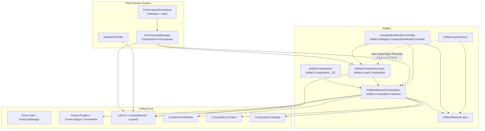

# Composition システムと PreCompose システム分析

**作成日**: 2026-04-17  
**対象リポジトリ**: ArtifactCore / Artifact  
**分析範囲**: Composition クラス体系、PreCompose 機能、依存関係

---

## 1. Composition クラス（ArtifactAbstractComposition）

### 1.1 所在ファイル

| ファイル | 役割 |
|---------|------|
| `Artifact/include/Composition/ArtifactAbstractComposition.ixx` | インターフェース定義（export module） |
| `Artifact/src/Composition/ArtifactAbstractComposition.cppm` | 実装（Pimpl パターン） |
| `Artifact/include/Composition/ArtifactComposition.ixx` | モジュールエントリ（2D/3D/Abstract を再Export） |
| `Artifact/include/Composition/ArtifactComposition2D.ixx` | 2D コンポジション実装クラス宣言 |
| `Artifact/src/Composition/ArtifactComposition2D.cpp` | 2D 実装 |
| `Artifact/include/Composition/ArtifactCompositionInitParams.ixx` | 初期化パラメータ |
| `Artifact/include/Composition/CompositionSettings.ixx` | 基本設定（名前、サイズ） |
| `ArtifactCore/include/Composition/CompositionContext.ixx` | 実行時コンテキスト（シミュレーション設定等） |

### 1.2 クラス階層

```
QObject
 └─ ArtifactAbstractComposition (abstract base)
      ├─ ArtifactComposition (2D, 実装は Artifact/src/Composition/ArtifactComposition2D.cpp)
      └─ ArtifactComposition3D (3D, 別実装)
```

### 1.3 主要メソッド一覧

#### レイヤー管理

| メソッド | 戻り値 | 説明 |
|---------|--------|------|
| `appendLayerTop(layer)` | `AppendLayerToCompositionResult` | 末尾（最前面）にレイヤー追加 |
| `appendLayerBottom(layer)` | `AppendLayerToCompositionResult` | 先頭（最背面）にレイヤー追加 |
| `insertLayerAt(layer, index)` | `void` | 指定インデックスに挿入 |
| `moveLayerToIndex(id, newIndex)` | `void` | レイヤー順序移動 |
| `removeLayer(id)` / `removeLayerById(id)` | `void` | レイヤー削除 |
| `removeAllLayers()` | `void` | 全レイヤー削除 |
| `layerCount()` | `int` | レイヤー数取得 |
| `layerById(id)` | `ArtifactAbstractLayerPtr` | ID 指定で取得 |
| `containsLayerById(id)` | `bool` | 存在確認 |
| `frontMostLayer()` | `ArtifactAbstractLayerPtr` | 最前面レイヤー |
| `backMostLayer()` | `ArtifactAbstractLayerPtr` | 最背面レイヤー |
| `bringToFront(id)` | `void` | 最前面へ移動 |
| `sendToBack(id)` | `void` | 最背面へ移動 |
| `allLayer()` | `QVector<ArtifactAbstractLayerPtr>` | 全レイヤー取得（背面→前面） |

#### タイムライン制御

| メソッド | 戻り値 | 説明 |
|---------|--------|------|
| `framePosition()` | `FramePosition` | 現在再生 head 位置 |
| `setFramePosition(position)` | `void` | 再生 head 設定 |
| `goToStartFrame()` | `void` | 先頭へ移動 |
| `goToEndFrame()` | `void` | 末尾へ移動 |
| `goToFrame(frameNumber)` | `void` | 指定フレームへ |
| `frameRange()` | `FrameRange` | コンポジション範囲（start–end）取得 |
| `setFrameRange(range)` | `void` | 範囲設定 |
| `workAreaRange()` | `FrameRange` | ワークエリア範囲 |
| `setWorkAreaRange(range)` | `void` | ワークエリア設定 |
| `frameRate()` | `FrameRate` | フレームレート取得 |
| `setFrameRate(rate)` | `void` | フレームレート設定 |

#### 再生制御

| メソッド | 戻り値 | 説明 |
|---------|--------|------|
| `isPlaying()` | `bool` | 再生中か |
| `play()` | `void` | 再生開始 |
| `pause()` | `void` | 一時停止 |
| `stop()` | `void` | 停止（先頭へ） |
| `togglePlayPause()` | `void` | 再生/停止トグル |
| `playbackSpeed()` | `float` | 再生速度取得 |
| `setPlaybackSpeed(speed)` | `void` | 再生速度設定 |
| `isLooping()` | `bool` | ループ再生か |
| `setLooping(loop)` | `void` | ループ設定 |

#### 設定・プロパティ

| メソッド | 戻り値 | 説明 |
|---------|--------|------|
| `settings()` | `CompositionSettings` | コンポジション基本設定 |
| `compositionContext()` | `CompositionContext&` | 実行時コンテキスト取得 |
| `setCompositionContext(ctx)` | `void` | コンテキスト設定 |
| `setCompositionName(name)` | `void` | 名前変更 |
| `compositionNote()` | `QString` | ノート取得 |
| `setCompositionNote(note)` | `void` | ノート設定 |
| `setCompositionSize(size)` | `void` | 解像度設定 |
| `setBackGroundColor(color)` | `void` | 背景色設定 |
| `backgroundColor()` | `FloatColor` | 背景色取得 |
| `hasVideo()` / `hasAudio()` / `isAudioOnly()` / `isVisual()` | `bool` | 内容種別判定 |

#### シリアライズ

| メソッド | 戻り値 | 説明 |
|---------|--------|------|
| `toJson()` | `QJsonDocument` | JSON 出力 |
| `fromJson(doc)` | `shared_ptr<ArtifactAbstractComposition>` | JSON から復元（静的） |

#### その他

| メソッド | 戻り値 | 説明 |
|---------|--------|------|
| `getAudio(segment, start, count, rate)` | `bool` | オーディオ取得 |
| `getThumbnail(width, height)` | `QImage` | サムネイル生成 |
| `getUsedAssets()` | `QVector<AssetID>` | 使用アセット一覧 |
| `changed()` | シグナル | 変更通知 |

---

## 2. PreCompose システム

### 2.1 所在ファイル

| ファイル | 役割 |
|---------|------|
| `ArtifactCore/include/Composition/PreCompose.ixx` | モジュール宣言・主要クラス・関数宣言 |
| `ArtifactCore/src/Composition/PreCompose.cppm` | 実装（PreComposeManager、コマンド、ユーティリティ） |

### 2.2 主要クラス・構造体

| 名前 | 種類 | 概要 |
|------|------|------|
| `PreComposeManager` | シングルトンクラス | プリコンポーズ／アンプリコンポーズ操作の中心 |
| `PreComposeManager::Impl` | 実装隠蔽 | ネスト構造・マッピング保持 |
| `PreComposeCommand` | 抽象インターフェース | Undo/Redo 対応コマンド基底 |
| `PrecomposeCommandImpl` | `PreComposeCommand` 実装 | プリコンポーズ実行コマンド |
| `UnprecomposeCommandImpl` | `PreComposeCommand` 実装 | アンプリコンポーズ実行コマンド |
| `PreComposeOptions` | 構造体 | プリコンポーズ実行オプション |
| `PreComposeResult` | 構造体 | プリコンポーズ結果（新規ID等） |
| `UnprecomposeOptions` | 構造体 | アンプリコンポーズオプション |
| `CompositionNesting` | 構造体 | コンポジションのネスト情報 |
| `NestedTimeUtils` | 名前空間 | 時間変換ユーティリティ |

### 2.3 主要メソッド一覧

#### PreComposeManager

| メソッド | 戻り値 | 説明 |
|---------|--------|------|
| `instance()` | `PreComposeManager&` | シングルトン取得 |
| `precompose(parentId, layerIds, options)` | `PreComposeResult` | 指定レイヤーをプリコンポーズ |
| `precomposeSingle(parentId, layerId, options)` | `PreComposeResult` | 単一レイヤーをプリコンポーズ |
| `unprecompose(compositionId, precompLayerId, options)` | `bool` | プリコンポーズ解除 |
| `isPrecomposeLayer(layerId)` | `bool` | プリコンポーズレイヤーか判定 |
| `getSourceCompositionId(precompLayerId)` | `CompositionID` | 元コンポジションID取得 |
| `getCompositionHierarchy(compositionId)` | `QVector<CompositionID>` | ネスト階層をルートから取得 |
| `getParentComposition(compositionId)` | `CompositionID` | 親コンポジション取得 |
| `getAllParentCompositions(compositionId)` | `QVector<CompositionID>` | 全親コンポジション取得（ルートまで） |
| `canNestComposition(parent, child)` | `bool` | 循環参照チェック |
| `setDefaultNamePrefix(prefix)` / `defaultNamePrefix()` | `void` / `QString` | デフォルト名プレフィックス |
| `setAutoNaming(enabled)` / `autoNamingEnabled()` | `void` / `bool` | 自動命名設定 |

#### PreComposeCommand（インターフェース）

| メソッド | 戻り値 | 説明 |
|---------|--------|------|
| `execute()` | `bool` | コマンド実行 |
| `undo()` | `bool` | 元に戻す |
| `redo()` | `bool` | やり直し |
| `description()` | `QString` | コマンド説明 |
| `type()` | `Type` | タイプ（Precompose / Unprecompose） |

#### 作成関数

| 関数 | 戻り値 | 説明 |
|------|--------|------|
| `createPrecomposeCommand(parentId, layerIds, options)` | `unique_ptr<PreComposeCommand>` | プリコンポーズコマンド生成 |
| `createUnprecomposeCommand(compositionId, precompLayerId, options)` | `unique_ptr<PreComposeCommand>` | アンプリコンポーズコマンド生成 |

#### NestedTimeUtils

| 関数 | 戻り値 | 説明 |
|------|--------|------|
| `parentToChildTime(parentTime, precompLayerId)` | `double` | 親→子時間へ変換 |
| `childToParentTime(childTime, precompLayerId)` | `double` | 子→親時間へ変換 |
| `convertTime(sourceTime, sourceComp, targetComp)` | `double` | 階層間時間変換（多段階） |
| `getRemappedTime(precompLayerId, parentTime)` | `double` | タイムリマップ考慮の時間取得 |

### 2.4 責務（IN/OUT）

#### PreComposeManager

| 責務 | IN（入力） | OUT（出力・状態） |
|------|------------|-------------------|
| ネスト構造管理 | 親コンポジションID、レイヤーID群、オプション | 新規コンポジションID、新規レイヤーID、ネスト階層情報 |
| プリコンポーズ実行 | 選択レイヤー、移動オプション | 新規コンポジションにレイヤー移動、元レイヤーは削除 |
| アンプリコンポーズ実行 | 対象コンポジションID、プリコンポーズレイヤーID | レイヤーを親コンポジションへ戻す、必要に応じてコンポジション削除 |
| 循環参照防止 | 親・子コンポジションID | ネスト可能性判定 |
| 時間変換提供 | レイヤーID、時間値 | 親子間の時間座標変換（未実装TODOsあり） |
| コマンド生成 | 各種パラメータ | Undo/Redo 可能なコマンドオブジェクト |

#### PreComposeManager::Impl（内部）

| 責務 | IN | OUT |
|------|----|-----|
| `nestingMap` | 親→子コンポジションの追加関係 | ネスト構造マップ |
| `layerSourceMap` | プリコンポーズレイヤーID | そのレイヤーが参照する元コンポジションID |
| `nestingInfo` | コンポジションID | `CompositionNesting` 情報（親ID、親レイヤーID、階層レベル） |

### 2.5 データ構造詳細

#### PreComposeOptions
```cpp
struct PreComposeOptions {
    QString name;               // 新規コンポジション名
    bool moveAttributes = true; // 属性（トランスフォーム等）を移動
    bool adjustDuration = true; // 継続时间調整
    bool includeEffects = true; // エフェクトを含める
    bool keepInPlace = false;   // 元の位置に残す（参照コピー）
};
```
**デフォルト**: 名前 "Pre-comp"、その他 true

#### PreComposeResult
```cpp
struct PreComposeResult {
    CompositionID newCompositionId; // 新規作成されたコンポジションID
    LayerID newLayerId;             // 親コンポジションに追加されたレイヤーID（プリコンポーズレイヤー）
    QVector<LayerID> movedLayerIds; // 移動されたレイヤーID群
    bool success = false;
    QString errorMessage;
};
```

#### CompositionNesting
```cpp
struct CompositionNesting {
    CompositionID compositionId;         // このコンポジション
    CompositionID parentCompositionId;   // 親コンポジション（ルートなら無効）
    LayerID parentLayerId;               // 親コンポジション内のレイヤーID（このコンポジションを埋め込んでいるレイヤー）
    int nestingLevel;                    // ネスト階層（ルート=0）
    bool isRoot() const { return !parentCompositionId.isNil(); }
};
```

---

## 3. 依存関係

### 3.1 モジュールdependency図（Mermaid）



### 3.2 依存方向と責任分離

| 依存元 | 依存先 | 依存タイプ | 理由 |
|--------|--------|-----------|------|
| `ArtifactAbstractComposition` | `CompositionSettings` | 所有 | コンポジション設定を保持 |
| `ArtifactAbstractComposition` | `CompositionContext` | 所有 | 実行時コンテキスト保持 |
| `ArtifactAbstractComposition` | `MultiIndexContainer` | 所有 | レイヤーリスト管理（z-order, ID, type index） |
| `ArtifactAbstractComposition` | `ArtifactAbstractLayer` | 所有・参照 | レイヤーオブジェクト保持 |
| `ArtifactAbstractComposition` | `Frame*` 系列 | 使用 | タイムライン計算 |
| `ArtifactCompositionLayer` | `ArtifactAbstractComposition` | 参照 | 埋め込み先コンポジションの参照（循環防止が必要） |
| `PreComposeManager` | `ArtifactAbstractComposition` | 使用（間接） | コンポジション作成・操作（実際の実装は未完了） |
| `PreComposeManager` | `ArtifactCompositionLayer` | 概念参照 | プリコンポーズレイヤーとして使用想定 |
| `CompositionRenderController` | `ArtifactAbstractComposition` | 使用 | 描画対象として取得 |
| `CompositionRenderController` | `ArtifactCompositionLayer` | 動的キャスト | プリコンポーズレイヤーの特殊描画処理 |
| `PreComposeCommand` 実装 | `PreComposeManager` | 使用 | 操作の実行・取り消し |

### 3.3 ArtifactCompositionRenderController との連携

`CompositionRenderController` はレイヤー描画時に `ArtifactCompositionLayer` を検出し、特殊処理を実行する（`ArtifactCompositionRenderController.cppm:904–919`）：

```cpp
if (auto *compLayer = dynamic_cast<ArtifactCompositionLayer *>(layer)) {
    if (auto childComp = compLayer->sourceComposition()) {
        const QSize childSize = childComp->settings().compositionSize();
        const int64_t childFrame = layer->currentFrame() - layer->inPoint().framePosition();
        childComp->goToFrame(childFrame);
        QImage childImage = childComp->getThumbnail(childSize.width(), childSize.height());
        if (!childImage.isNull()) {
            applySurfaceAndDraw(childImage, localRect,
                                hasRasterizerEffectsOrMasks(layer));
        }
    }
    return;
}
```

**処理の流れ**:
1. `ArtifactCompositionLayer` かどうかを `dynamic_cast` で判定
2. `sourceComposition()` で埋め込み先コンポジションを取得（`ArtifactProjectService::findComposition` 経由）
3. 現在のレイヤーフレームから子コンポジションのフレームを計算（`layer->currentFrame() - layer->inPoint()`）
4. 子コンポジションをそのフレームにシークしてサムネイル取得
5. 親レイヤー内に画像として描画

**重要**: 現在は `getThumbnail()` によるCPU レンダリングであり、GPU 加速されたネストレンダリングではない。`ArtifactPreviewPipeline` 等による本番レンダリングパスとは別。

---

## 4. レイヤー種別における Precomp の位置付け

### 4.1 LayerType 列挙

`Artifact/include/Layer/ArtifactAbstractLayer.ixx` より：

```cpp
enum class LayerType {
    Unknown = 0,
    None,
    Null,
    Solid,      // 単色レイヤー
    Image,      // 静止画像
    Adjustment, // 調整レイヤー
    Text,       // テキストレイヤー
    Shape,      // シェイプレイヤー
    Precomp = 8,    // プリコンポジション ← これ
    Audio = 9,
    Video = 10,
    Camera = 11,
    Light = 12,
    Group = 13,
    Folder = 14,
    Particle = 15,
    Clone = 16,
    SDF = 17
};
```

### 4.2 実装状況

| 項目 | 状況 |
|------|------|
| `ArtifactCompositionLayer` クラス定義 | ○ 定義済み（`Artifact/include/Layer/ArtifactCompositionLayer.ixx`） |
| レイヤーファクトリでの生成（`LayerType::Precomp`） | △ コメントアウト中（`ArtifactLayerFactory.cppm:129`: `//ptr = std::make_shared<ArtifactCompositionLayer>();`） |
| `ArtifactCompositionLayerInitParams` | ○ 存在するが `LayerType::Null` を指定（誤り？） |
| PreComposeManager の完全実装 | △ 主要ロジックはあるが、`precompose()` 内のID生成やレイヤー移動の実体が未実装/TODO多数 |
| UI ダイアログ（PrecomposeDialog） | ○ 実装済み（日本語 UI） |
| Undo/Redo コマンド | ○ `PreComposeCommand` インターフェースと実装クラスあり |

**結論**: Precomp レイヤーのクラス定義は存在するが、ファクトリ統合と `PreComposeManager` の実際のコンポジション操作部分が未完成。`PreComposeManager::precompose()` 内には `newCompId.generate()` などのコメントアウトや TODO が散見される。

### 4.3 PreCompose 操作の実際のフロウ（想定）

1. **UI 操作**: タイムラインでレイヤー選択 → `PrecomposeDialog` で設定
2. **コマンド生成**: `createPrecomposeCommand(parentId, layerIds, options)` が呼ばれる
3. **実行**: `PrecomposeCommand::execute()` → `PreComposeManager::precompose()`
4. **内部処理**:
   - 新規 `ArtifactComposition` 作成（ID 生成、初期化）
   - 選択レイヤーをそのコンポジションに移動（親子関係付け、レイヤーリスト再配置）
   - 親コンポジションに `ArtifactCompositionLayer` を追加（新規レイヤー作成、埋め込みコンポジションID設定）
   - ネスト情報を `PreComposeManager::Impl` に記録
5. **Undo**: `PreComposeCommand::undo()` → `PreComposeManager::unprecompose()` でレイヤーを親に戻す

---

## 5. 主要クラス・メソッド早見表

### 5.1 Composition（ArtifactAbstractComposition） 主要メソッド

| カテゴリ | メソッド | 説明 |
|---------|---------|------|
| 追加 | `appendLayerTop()` | レイヤーを最前面に追加 |
| 追加 | `appendLayerBottom()` | レイヤーを最背面に追加 |
| 追加 | `insertLayerAt(index)` | 指定位置に挿入 |
| 移動 | `moveLayerToIndex(id, idx)` | レイヤー順序変更 |
| 削除 | `removeLayer(id)` | レイヤー削除 |
| 削除 | `removeAllLayers()` | 全レイヤー削除 |
| 取得 | `layerById(id)` | ID で取得 |
| 取得 | `layerCount()` | 総数取得 |
| 取得 | `allLayer()` | 全レイヤー（背面→前面） |
| 移動 | `bringToFront(id)` | 最前面へ |
| 移動 | `sendToBack(id)` | 最背面へ |
| 再生頭 | `framePosition()` / `setFramePosition()` | 現在の再生位置 |
| 移動 | `goToStartFrame()` / `goToEndFrame()` / `goToFrame()` | シーク |
| 範囲 | `frameRange()` / `setFrameRange()` | コンポジション範囲 |
| 範囲 | `workAreaRange()` / `setWorkAreaRange()` | ワークエリア |
| 速度 | `frameRate()` / `setFrameRate()` | FPS |
| 再生 | `play()` / `pause()` / `stop()` / `togglePlayPause()` | 再生制御 |
| 状態 | `isPlaying()` / `playbackSpeed()` / `isLooping()` | 状態取得 |
| 設定 | `setCompositionName()` / `setCompositionSize()` | 基本設定 |
| 設定 | `setBackGroundColor()` / `backgroundColor()` | 背景色 |
| 設定 | `setCompositionContext()` | コンテキスト設定 |
| 取得 | `settings()` | `CompositionSettings` 取得 |
| 取得 | `compositionContext()` | `CompositionContext` 取得 |
| その他 | `toJson()` / `fromJson()` | シリアライズ |
| その他 | `getThumbnail()` | サムネイル画像 |
| その他 | `getAudio()` | オーディオ取得 |
| シグナル | `changed()` | 変更通知 |

### 5.2 PreComposeManager 主要メソッド

| カテゴリ | メソッド | 説明 |
|---------|---------|------|
| 実行 | `precompose(parentId, layerIds, options)` | 複数レイヤーのプリコンポーズ |
| 実行 | `precomposeSingle(parentId, layerId, options)` | 単一レイヤーのプリコンポーズ |
| 実行 | `unprecompose(compositionId, precompLayerId, options)` | プリコンポーズ解除 |
| 判定 | `isPrecomposeLayer(layerId)` | プリコンポーズレイヤーか |
| 取得 | `getSourceCompositionId(precompLayerId)` | 元コンポジションID |
| 取得 | `getCompositionHierarchy(compositionId)` | ネスト階層（ルート→自身） |
| 取得 | `getParentComposition(compositionId)` | 親コンポジション |
| 取得 | `getAllParentCompositions(compositionId)` | 全親（ルートまで） |
| 判定 | `canNestComposition(parent, child)` | ネスト可否（循環参照チェック） |
| 設定 | `setDefaultNamePrefix()` / `defaultNamePrefix()` | デフォルト名プレフィックス |
| 設定 | `setAutoNaming()` / `autoNamingEnabled()` | 自動命名 |

---

## 6. 内部データ構造詳細

### 6.1 ArtifactAbstractComposition::Impl

```cpp
class ArtifactAbstractComposition::Impl {
public:
    Impl(ArtifactAbstractComposition* owner);
    ~Impl();

    ArtifactAbstractComposition* owner_;          // 親オブジェクトへの逆ポインタ
    MultiIndexLayerContainer layerMultiIndex_;    // レイヤー複合インデックス容器
    CompositionSettings settings_;                // コンポジション設定
    CompositionContext context_;                  // 実行時コンテキスト
    FramePosition position_;                      // 現在再生位置
    FrameRange frameRange_ = FrameRange(0, 300); // コンポジション範囲
    FrameRange workAreaRange_ = FrameRange(0, 300); // ワークエリア
    FrameRate frameRate_;                         // フレームレート
    bool looping_ = false;                        // ループフラグ
    float playbackSpeed_ = 1.0f;                  // 再生速度
    CompositionID id_;                            // 固有ID
    QString compositionNote_;                     // ノート
    FloatColor backgroundColor_ = {0.47f, 0.47f, 0.47f, 1.0f};
    bool isPlaying_ = false;                      // 再生中フラグ
};
```

**`MultiIndexLayerContainer` の構造**（`ArtifactCore/include/Container/MultiIndexContainer.ixx` より）：
- `QVector<Ptr> list_` — レイヤーのz-order順リスト（インデックス0 = 最背面、末尾 = 最前面）
- `QHash<Id, Ptr> byId_` — ID による O(1) 検索
- `QMultiHash<TypeKey, Ptr> byType_` — `type_index` による型検索

### 6.2 PreComposeManager::Impl

```cpp
class PreComposeManager::Impl {
public:
    QString defaultNamePrefix = "Pre-comp";
    bool autoNaming = true;

    // ネスト構造管理
    QMap<CompositionID, QVector<CompositionID>> nestingMap;
    //   key: 親コンポジションID
    //   value: その親に直接埋め込まれている子コンポジションID列

    QMap<LayerID, CompositionID> layerSourceMap;
    //   key: プリコンポーズレイヤーのレイヤーID
    //   value: そのレイヤーが参照する元のコンポジションID

    QMap<CompositionID, CompositionNesting> nestingInfo;
    //   key: コンポジションID
    //   value: ネスト情報（親コンポジションID、親レイヤーID、階層レベル）

    // QSet<LayerID> precomposeLayers; // NOTE: コメントアウト中
};
```

**ネスト情報の伝播**:
- `getCompositionHierarchy()` は `nestingInfo` を再帰的に辿ってルートから自身までのID列を構築
- `getAllParentCompositions()` は同様に全親を収集
- `canNestComposition()` は子の全親に parent が含まれるか検査し循環参照を防止

---

## 7. 時間変換ユーティリティ（NestedTimeUtils）

### 7.1 現状実装

```cpp
namespace NestedTimeUtils {
    double parentToChildTime(double parentTime, LayerID precompLayerId) {
        // childTime = parentTime - layerInPoint
        // TODO: 実際のレイヤーからイン点を取得
        Q_UNUSED(precompLayerId);
        return parentTime; // 恒等変換（未実装）
    }
    double childToParentTime(double childTime, LayerID precompLayerId) {
        // parentTime = childTime + layerInPoint
        Q_UNUSED(precompLayerId);
        return childTime;
    }
    double convertTime(double sourceTime, CompositionID sourceComposition, CompositionID targetComposition) {
        if (sourceComposition == targetComposition) return sourceTime;
        // TODO: 階層パス計算と変換
        Q_UNUSED(sourceComposition);
        Q_UNUSED(targetComposition);
        return sourceTime;
    }
    double getRemappedTime(LayerID precompLayerId, double parentTime) {
        // TODO: timeRemap エフェクト考慮
        Q_UNUSED(precompLayerId);
        return parentTime;
    }
}
```

### 7.2 必要未実装事項

- レイヤーの `inPoint()` / `outPoint()` 取得
- タイムリマップ（Time Remap）エフェクトの取得
- 複数段階のネストを考慮した変換パスの計算
- 親→子変換： `childTime = (parentTime - layerInPoint) * childSpeed` 等
- 子→親変換： `parentTime = childTime * childSpeed + layerInPoint`

---

## 8. レンダリング連携

### 8.1 CompositionRenderController 内でのプリコンポーズレイヤー処理

**ファイル**: `Artifact/src/Widgets/Render/ArtifactCompositionRenderController.cppm:904–919`

**処理内容**:
1. `ArtifactCompositionLayer` の検出
2. `sourceComposition()` で子コンポジション取得
3. 子コンポジションの現在のフレームを計算
   ```cpp
   int64_t childFrame = layer->currentFrame() - layer->inPoint().framePosition();
   ```
4. 子コンポジションを `goToFrame(childFrame)` でシーク
5. `getThumbnail(width, height)` でCPUレンダリング結果を取得
6. `applySurfaceAndDraw()` で親レイヤー上に描画

**課題**:
- サムネイル取得は低コストだが、フレーム毎に再レンダリングされる
- GPU パイプラインとの連携がなく、パフォーマンス面で改善の余地あり
- タイムリマップ・エフェクトは子コンポジション側で反映済みか？ → `getThumbnail()` が内部で正しくレンダリングする前提

### 8.2 描画パイプライン全体における位置づけ

```
CompositionRenderController::drawLayer()
  ├─ 通常レイヤー → layer->draw(renderer)
  ├─ ArtifactCompositionLayer → 子コンポジションをサムネイル取得・描画
  ├─ テキストレイヤー → toQImage() でイメージ化→描画
  └─ その他 → fallback で layer->draw()
```

---

## 9. 依存マップ図（テキスト形式）

```
[ArtifactComposition] (Artifact)
   ↓ 所有
   ├─ MultiIndexContainer<ArtifactAbstractLayerPtr, LayerID>
   ├─ CompositionSettings
   ├─ CompositionContext
   └─ FrameRange / FrameRate / FramePosition
        ↓ 参照
        └─ [ArtifactAbstractLayer] 群

[ArtifactCompositionLayer] (Artifact)  -- 参照 --> [ArtifactAbstractComposition]
   ↓ is-a
   └─ ArtifactAbstractLayer

[PreComposeManager] (ArtifactCore)
   ↓ 使用（概念）
   ├─ ArtifactAbstractComposition（生成・操作）
   └─ ArtifactCompositionLayer（レイヤーとして挿入）
   ↓ 所有
   └─ Impl（nestingMap / layerSourceMap / nestingInfo）

[CompositionRenderController] (Artifact)
   ↓ 使用
   ├─ ArtifactAbstractComposition
   ├─ ArtifactCompositionLayer
   └─ ArtifactAbstractLayer
```

---

## 10. 未完了・注意点

| 項目 | 状態 | 備考 |
|------|------|------|
| PreComposeManager::precompose() の核心実装 | 未実装/TODO | `newCompId.generate()` やレイヤーの実際の移动・親子関係設定が未実装 |
| Precomp レイヤーのファクトリ登録 | コメントアウト | `ArtifactLayerFactory.cppm:129` |
| `layerSourceMap` と `precomposeLayers` の整合性 | 一部未使用 | `precomposeLayers` はコメントアウト、`layerSourceMap` のみ使用中 |
| NestedTimeUtils の全機能 | 未実装 | 恒等変換のみ |
| ネストレンダリングのGPU最適化 | 無し | サムネイル取得→CPU描画 |
| 循環参照の更深いチェック | 簡易 | `canNestComposition()` は直接親チェックのみ（先祖全てをチェック済み） |
| ArtifactCompositionLayerInitParams の LayerType | 不整合 | `LayerType::Null` になっているが、`Precomp` が正しいはず |

---

## 11. 参考：モジュール一覧（関連分）

### ArtifactCore
- `Composition.Context` – `CompositionContext` 構造体
- `Composition.PreCompose` – PreCompose システム（Public API）
- `Time.Code` / `TimeCodeRange` – 時間表現
- `Frame.Position` / `Frame.Range` / `Frame.Rate` – フレーム表現
- `Container.MultiIndex` – 複合インデックス容器

### Artifact
- `Artifact.Composition.Abstract` – `ArtifactAbstractComposition`
- `Artifact.Composition._2D` – `ArtifactComposition` (2D)
- `Artifact.Composition.InitParams` – `ArtifactCompositionInitParams`
- `Artifact.Composition.Settings` – `CompositionSettings`
- `Artifact.Layer.Abstract` – `ArtifactAbstractLayer`、`LayerType`
- `Artifact.Layer.Composition` – `ArtifactCompositionLayer`
- `Artifact.Layer.Factory` – `ArtifactLayerFactory`
- `Artifact.Render.CompositionRenderer` – 描画ヘルパ
- `Artifact.Widgets.CompositionRenderController` – ビューア描画制御
- `Artifact.Widgets.Dialog.PrecomposeDialog` – UI ダイアログ

---

## 12. 結論

**Composition システム**は `ArtifactAbstractComposition` を中核とし、`MultiIndexContainer` によってレイヤーを z-order＋ID＋型の複合インデックスで管理する。タイムライン、再生、設定、シリアライズ機能を包括する。

**PreCompose システム**は `PreComposeManager` シングルトンが中心だが、実際のコンポジション操作部分は未実装が多い。UI (`PrecomposeDialog`) とコマンドパターン (`PreComposeCommand`) は整備されているが、`precompose()` 内のレイヤー移動・新規コンポジション作成ロジックが未完成。`ArtifactCompositionLayer` はクラス定義があるものの、ファクトリで有効化されていない。

**依存関係**は単純で、`PreComposeManager` が `ArtifactAbstractComposition` と `ArtifactCompositionLayer` を使用する想定。`CompositionRenderController` は描画時に `ArtifactCompositionLayer` を検出し子コンポジションのサムネイルを取得する。

今後の実装 focusing 点:
1. `PreComposeManager::precompose()` の完全実装（コンポジション作成、レイヤー移動、ネスト情報更新）
2. `ArtifactLayerFactory` での `LayerType::Precomp` ハンドラの有効化
3. `NestedTimeUtils` の本格実装（in/out point 考慮の時間変換）
4. ネストレンダリングの GPU パス最適化
