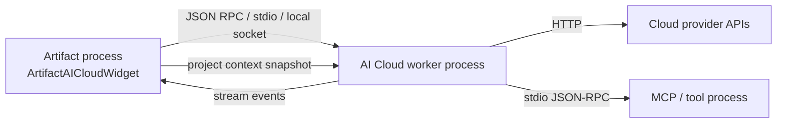

# Milestone: AI Cloud Process Split (2026-07-05)

**Status:** Draft  
**Goal:** `ArtifactAICloudWidget` を UI シェルとして薄く保ち、クラウド AI の通信・tool 実行・MCP・永続化を別プロセスへ分離する。

---

## 背景

現在の `ArtifactAICloudWidget` は、会話 UI だけでなく以下を同時に抱えている。

- provider 切り替え
- API key / base URL / model 管理
- chat streaming
- tool bridge 実行
- MCP transport の起動と診断
- transcript / log 表示
- project / selection / composition 文脈の取り込み

この構成は機能追加しやすい一方で、UI と実行系の責務が密になりすぎている。
別プロセス化すると、クラッシュ隔離、応答性、再起動容易性、将来の独立起動に効く。

---

## 目的

- UI を軽く保つ
- 通信/推論/ツール実行の失敗を UI から隔離する
- provider 差分を backend 側に閉じる
- streaming 応答を安定して扱う
- MCP / tool 実行を UI から直接触らない形にする
- 将来の独立 AI クライアント化に備える

---

## 非目的

- この段階で AI 機能を全面的に作り直すこと
- provider を抽象化しすぎて重い framework にすること
- UI をブラウザ化すること
- 既存の local AI まで同時に置き換えること
- 低レベルな render / composition 実装に手を広げること

---

## 現状の責務整理

### UI に残すもの

- prompt 入力
- transcript 表示
- send / stop / regenerate の操作
- provider / model の簡易選択
- 接続状態の表示
- エラーバナー
- tool 実行結果の可視化

### Backend に移すもの

- provider HTTP 呼び出し
- streaming token の受信
- API key / base URL / model の解決
- tool call の実行
- MCP transport の起動と管理
- retry / timeout / cancel
- 会話セッションの保存
- request/response の正規化

### Shared Contract に残すもの

- message / event の schema
- session id
- provider id
- model id
- error code
- approval state
- transcript item schema

---

## 推奨アーキテクチャ



### Process 1: Artifact UI

- `ArtifactAICloudWidget` は shell として動く
- 必要な情報を worker に渡す
- streaming event を受けて画面に反映する
- worker の dead / restart を表示する

### Process 2: AI Cloud Worker

- provider との通信を担当する
- chat session を管理する
- tool call を解釈する
- MCP transport を起動する
- 失敗理由を normalized error に変換する

### Optional Process 3: Tool/MCP Adapter

- 将来的に worker からさらに分離可能
- まずは worker 内包で十分
- 重い tool 実行だけを後で切り出せる余地を残す

---

## IPC 方針

### 最初の推奨

- JSON ベース
- request / response / event を分ける
- session id を必須にする
- version field を入れる
- 大きな payload は後で圧縮や blob 化を検討する

### 通信候補

1. `QProcess` + stdin/stdout JSON-RPC 風
2. localhost socket
3. named pipe

最初の導入は `QProcess` + stdin/stdout が扱いやすい。
UI 側に listener を作らずに済み、起動/終了の責務も見えやすい。

---

## 最小メッセージ案

### Request

```json
{
  "version": 1,
  "id": "req-001",
  "type": "chat.send",
  "sessionId": "sess-abc",
  "providerId": "openrouter",
  "modelId": "gpt-4.1",
  "payload": {
    "messages": [
      {"role": "user", "content": "hello"}
    ],
    "systemPrompt": "..."
  }
}
```

### Event

```json
{
  "version": 1,
  "type": "chat.delta",
  "sessionId": "sess-abc",
  "data": {
    "text": "partial token..."
  }
}
```

### Response

```json
{
  "version": 1,
  "id": "req-001",
  "type": "chat.final",
  "sessionId": "sess-abc",
  "ok": true
}
```

### Error

```json
{
  "version": 1,
  "id": "req-001",
  "type": "error",
  "sessionId": "sess-abc",
  "error": {
    "code": "provider_invalid_base_url",
    "message": "Base URL is invalid",
    "retryable": false
  }
}
```

---

## フェーズ

### Phase 1: Contract Split

- UI と backend の責務を文書化する
- message/event schema を固定する
- UI が直接触る backend state を絞る
- まずは in-process adapter で同じ schema を使う

**Done when:** UI から backend 実装詳細が見えなくなる

### Phase 2: In-Process Worker Adapter

- backend を同一プロセス内の service として切り出す
- 既存 widget の呼び出しを adapter 経由にする
- 例外や失敗を normalized error に寄せる

**Done when:** UI と backend の依存が片方向になる

### Phase 3: External Worker

- worker を別プロセス化する
- 起動/停止/再接続を扱う
- streaming event を UI へ返す

**Done when:** worker を落としても UI が生き残る

### Phase 4: Tool / MCP Stabilization

- tool call と MCP transport を worker 側へ閉じる
- approval state と log を event 化する
- UI は承認と結果表示に集中する

**Done when:** MCP まわりが UI から直接見えなくなる

### Phase 5: Persistence And Recovery

- session 復元
- last used provider/model 復元
- worker 再起動後の再接続
- 設定の破損時フォールバック

**Done when:** 再起動後も自然に会話を続けられる

---

## リスク

- IPC を早く固めすぎると後から変更しにくい
- streaming の粒度が粗いと体験が悪くなる
- provider 差分を UI に残すと分離効果が薄れる
- MCP/tool 実行が worker 外へ漏れると複雑さが戻る
- 秘密情報の受け渡しを雑にすると安全性が落ちる

---

## 実装順の提案

1. `ArtifactAICloudWidget` の UI 面と session 面を分ける
2. backend contract を JSON schema 的に定義する
3. in-process adapter を作る
4. worker を `QProcess` で起動する
5. streaming と error handling を固める
6. tool/MCP を worker 側へ移す

---

## 最初の切り出し単位

### 既存資産を流用する前提

この分割は新規の巨大基盤ではなく、既存の process / IPC 方式を再利用する。

- `Artifact/src/Application/ArtifactProjectBundleIpc.cppm`
  - 既に response timeout と JSON ベースの IPC 失敗処理がある
- `Artifact/src/Plugin/PluginSandbox.cppm`
  - `QProcess` ベースの外部実行と stdout/stderr 分離の実例がある
- `docs/planned/MILESTONE_EXTERNAL_RENDERER_DESIGN_2026-04-22.md`
  - 別プロセス実行の考え方と progress/bridge の分離指針がある
- `docs/planned/MILESTONE_PROJECT_INTERPROCESS_COPY_2026-06-05.md`
  - 同一マシン内の IPC を後付け fast path として扱う設計思想がある

### Phase 1 で切る境界

1. UI shell
   - `ArtifactAICloudWidget` の表示・入力・履歴・状態表示だけを残す
2. session controller
   - send / stop / regenerate / cancel の操作を一箇所にまとめる
3. worker contract
   - request / event / response の schema を定義する
4. worker adapter
   - まずは in-process で schema を通す

### まず作るべきコンポーネント

- `AICloudSessionController`
  - UI の操作を request に変換する
- `AICloudWorkerClient`
  - worker との通信と再接続を担当する
- `AICloudWorkerProtocol`
  - message/event schema とエラー型を定義する
- `AICloudWorkerBackend`
  - provider / tool / MCP 実行の実体を担当する

### 1st-pass の完成条件

- `ArtifactAICloudWidget` から provider 詳細への直接依存が減る
- worker とのやり取りが 1 つの contract に集約される
- 失敗時の表示が UI でなく contract の error code に寄る
- in-process でも外部プロセスでも同じ request/event を流せる

---

## 具体 API 案

### `AICloudSessionController`

UI から見た最初の窓口。

```cpp
struct AICloudSendRequest {
  QString sessionId;
  QString providerId;
  QString modelId;
  QString userPrompt;
  QString systemPrompt;
  QString toolTrace;
  QString baseUrl;
  QString apiKey;
};

class AICloudSessionController {
public:
  void setContextSnapshot(const AIContext& context);
  void setConnectionState(const AICloudConnectionState& state);
  void setApprovalMode(ToolApprovalMode mode);

  void send(const AICloudSendRequest& request);
  void cancel(const QString& sessionId);
  void regenerate(const QString& sessionId);
  void stop(const QString& sessionId);

  W_SIGNAL(messageReceived, const AICloudMessageEvent& event);
  W_SIGNAL(stateChanged, const AICloudSessionState& state);
};
```

### `AICloudWorkerClient`

worker との通信を隠す薄いクライアント。

```cpp
class AICloudWorkerClient : public QObject {
public:
  void start();
  void stop();
  void restart();
  bool isRunning() const;

  QString workerVersion() const;
  void sendRequest(const AICloudRequest& request);

  W_SIGNAL(eventReceived, const AICloudEvent& event);
  W_SIGNAL(requestFailed, const QString& requestId, const AICloudError& error);
  W_SIGNAL(connectionStateChanged, const AICloudWorkerState& state);
};
```

### `AICloudWorkerBackend`

worker プロセス内部の実行系。

```cpp
class AICloudWorkerBackend {
public:
  AICloudResponse handleRequest(const AICloudRequest& request);
  void cancelSession(const QString& sessionId);
  void registerApproval(const QString& sessionId, bool approved);
};
```

### `AICloudWorkerProtocol`

schema の正規化層。

```cpp
struct AICloudRequest {
  int version = 1;
  QString id;
  QString type;
  QString sessionId;
  QString providerId;
  QString modelId;
  QJsonObject payload;
};

struct AICloudEvent {
  int version = 1;
  QString type;
  QString sessionId;
  QJsonObject data;
};

struct AICloudError {
  QString code;
  QString message;
  bool retryable = false;
};
```

---

## 既存メソッドの移管先

### UI / Controller / Worker の三分割

| 関数 | UI shell | Session controller | Worker client | Worker backend | 備考 |
|---|---|---|---|---|---|
| `appendTranscriptMessage()` | ✅ |  |  |  | 純表示。UI に残す |
| `buildTranscriptText()` | ✅ |  |  |  | コピー用の表示ロジック |
| `copyTranscriptToClipboard()` | ✅ |  |  |  | clipboard 連携のみ |
| `openModelSelectionPopup()` | ✅ |  |  |  | popup UI |
| `updateModelSelectionLabel()` | ✅ |  |  |  | label 更新のみ |
| `scrollTranscriptToBottom()` | ✅ |  |  |  | UI スクロール |
| `updateSendButtonState()` | ✅ | ✅ |  |  | state を controller から受ける |
| `updateConnectionSummary()` | ✅ | ✅ |  |  | 表示は UI、値生成は controller |
| `updateToolSchemaPreview()` | ✅ |  |  | ✅ | schema の取得元は worker 側へ寄せる |
| `updateMcpPreview()` | ✅ | ✅ |  | ✅ | preview 生成は controller/worker で分担 |
| `updateTransportPreview()` | ✅ | ✅ | ✅ |  | worker connection state を描画する |
| `startChatRequest()` |  | ✅ | ✅ | ✅ | request 組み立ては controller、送信は client |
| `onSendClicked()` | ✅ | ✅ |  |  | UI イベント入口から controller へ渡す |
| `cancelCurrentSend()` | ✅ | ✅ | ✅ |  | UI state と worker cancel の両方が必要 |
| `onSendProcessFinished()` |  |  | ✅ | ✅ | JSON 解析を client へ移す |
| `tryHandleToolCallResponse()` |  | ✅ |  | ✅ | 解析は client、実行は backend |
| `refreshModelList()` |  | ✅ | ✅ | ✅ | worker に `models.list` を投げる |
| `updateModelList()` | ✅ | ✅ |  |  | UI の候補更新。データは controller 由来 |
| `populateModelList()` | ✅ | ✅ |  |  | 同上 |
| `applyModelFilter()` | ✅ |  |  |  | UI フィルタ |
| `onProviderChanged()` | ✅ | ✅ |  |  | provider state の伝搬 |
| `loadApiKey()` |  | ✅ |  |  | settings 読み込みは controller 側へ |
| `saveApiKey()` |  | ✅ |  |  | settings 保存は controller 側へ |
| `refreshMcpToolSelector()` |  | ✅ | ✅ | ✅ | schema source は worker backend |
| `applySelectedMcpTool()` |  | ✅ | ✅ | ✅ | tool 選択は controller、実体は backend |
| `appendToolExecutionLog()` | ✅ | ✅ | ✅ | ✅ | 表示とイベント記録を分ける |
| `appendMcpLog()` | ✅ | ✅ | ✅ | ✅ | 表示とイベント記録を分ける |

### 役割の分け方

- UI shell
  - widget の見た目、入力、スクロール、コピーだけ担当する
- Session controller
  - UI state を request/event に変換する
  - settings と session id をまとめる
- Worker client
  - process 起動、再接続、request 送信、event 受信を担当する
- Worker backend
  - provider 接続、tool 実行、MCP、永続化を担当する

### 注意

`ArtifactAICloudWidget` 内の見た目更新関数を全部 backend に送る必要はない。
表示だけの関数は UI に残し、データを作る関数だけを controller / worker に移す。

---

## 実ファイル構成案

### UI 側

- [Artifact/include/Widgets/AI/ArtifactAICloudWidget.ixx](X:/Dev/ArtifactStudio/Artifact/include/Widgets/AI/ArtifactAICloudWidget.ixx)
  - 既存 widget の shell 宣言
- [Artifact/src/Widgets/AI/ArtifactAICloudWidget.cppm](X:/Dev/ArtifactStudio/Artifact/src/Widgets/AI/ArtifactAICloudWidget.cppm)
  - shell の実装
- [Artifact/include/Widgets/AI/ArtifactAICloudSettingsWidget.ixx](X:/Dev/ArtifactStudio/Artifact/include/Widgets/AI/ArtifactAICloudSettingsWidget.ixx)
  - provider / key / url の設定 UI
- [Artifact/src/Widgets/AI/ArtifactAICloudSettingsWidget.cppm](X:/Dev/ArtifactStudio/Artifact/src/Widgets/AI/ArtifactAICloudSettingsWidget.cppm)
  - settings widget 実装

### Controller / client 側

- [Artifact/include/AI/Cloud/AICloudSessionController.ixx](X:/Dev/ArtifactStudio/Artifact/include/AI/Cloud/AICloudSessionController.ixx)
  - UI から worker への最初の変換点
- [Artifact/src/AI/Cloud/AICloudSessionController.cppm](X:/Dev/ArtifactStudio/Artifact/src/AI/Cloud/AICloudSessionController.cppm)
  - request assembly と session state 管理
- [Artifact/include/AI/Cloud/AICloudWorkerClient.ixx](X:/Dev/ArtifactStudio/Artifact/include/AI/Cloud/AICloudWorkerClient.ixx)
  - process 管理と protocol bridge
- [Artifact/src/AI/Cloud/AICloudWorkerClient.cppm](X:/Dev/ArtifactStudio/Artifact/src/AI/Cloud/AICloudWorkerClient.cppm)
  - QProcess / IPC 実装

### Worker 側

- [Artifact/include/AI/Cloud/AICloudWorkerProtocol.ixx](X:/Dev/ArtifactStudio/Artifact/include/AI/Cloud/AICloudWorkerProtocol.ixx)
  - request / event / error schema
- [Artifact/src/AI/Cloud/AICloudWorkerProtocol.cppm](X:/Dev/ArtifactStudio/Artifact/src/AI/Cloud/AICloudWorkerProtocol.cppm)
  - JSON encode/decode helpers
- [Artifact/include/AI/Cloud/AICloudWorkerBackend.ixx](X:/Dev/ArtifactStudio/Artifact/include/AI/Cloud/AICloudWorkerBackend.ixx)
  - provider 実行の backend contract
- [Artifact/src/AI/Cloud/AICloudWorkerBackend.cppm](X:/Dev/ArtifactStudio/Artifact/src/AI/Cloud/AICloudWorkerBackend.cppm)
  - provider / tool / MCP 実行

### 置き場所の方針

- UI 依存が強いものは `Artifact/include/Widgets/AI/` と `Artifact/src/Widgets/AI/`
- UI から独立しうるものは `Artifact/include/AI/Cloud/` と `Artifact/src/AI/Cloud/`
- 既存の `Artifact/include/Widgets/WebUI/` / `Artifact/src/Widgets/WebUI/` と同様に、役割ごとに棚を分ける

### この構成で避けること

- `AICloudWorkerClient` を widget の private member に直接埋め込みすぎること
- worker backend に Qt widget 依存を持ち込むこと
- protocol と UI 表示を同じファイルに混ぜること
- `curl.exe` の直接起動を shell 側に残すこと

---

---

## 1. `AICloudWorkerProtocol` の event/type 一覧

### Request type

| type | 目的 | 主な payload |
|---|---|---|
| `chat.send` | 会話送信 | messages, systemPrompt, toolTrace, modelId, providerId |
| `chat.cancel` | 送信中断 | sessionId, requestId |
| `chat.regenerate` | 再生成 | sessionId, promptRef |
| `chat.stop` | 応答停止 | sessionId, requestId |
| `models.list` | モデル一覧取得 | providerId, baseUrl, apiKey |
| `provider.validate` | 接続先検証 | providerId, baseUrl, apiKey, modelId |
| `tool.call` | tool 実行 | toolCall |
| `mcp.start` | MCP 起動 | program, arguments, workingDirectory |
| `mcp.stop` | MCP 停止 | sessionId |
| `session.restore` | セッション復元 | snapshot |
| `session.save` | セッション保存 | snapshot |

### Event type

| type | 目的 | 主な data |
|---|---|---|
| `session.started` | session 開始通知 | sessionId, providerId |
| `session.restored` | 復元完了 | snapshot |
| `connection.state` | 接続状態変化 | state, endpoint, modelId |
| `chat.delta` | streaming token | text, messageId |
| `chat.message` | 完成メッセージ | role, content, messageId |
| `chat.final` | 応答完了 | usage, duration, messageId |
| `chat.cancelled` | 中断完了 | reason |
| `chat.error` | 応答失敗 | error |
| `models.updated` | モデル一覧更新 | modelIds, preferredModel |
| `tool.approval.requested` | 承認要求 | tool summary |
| `tool.approval.resolved` | 承認結果 | approved, reason |
| `tool.executed` | tool 実行結果 | trace, result |
| `tool.error` | tool 実行失敗 | error |
| `mcp.state` | MCP state 変化 | running, program, args |
| `mcp.log` | MCP ログ | entry |
| `mcp.tools.list` | MCP tools list | toolNames |
| `mcp.tools.call.result` | tool call 結果 | payload |
| `diagnostic.log` | 診断ログ | message, level |
| `error` | 共通 error | code, message, retryable |

### Response type

| type | 目的 |
|---|---|
| `ack` | request 受理確認 |
| `chat.final` | chat 完了応答 |
| `models.list.result` | モデル一覧返却 |
| `provider.validate.result` | 接続検証結果 |
| `tool.call.result` | tool 呼び出し結果 |
| `mcp.start.result` | MCP 起動結果 |
| `mcp.stop.result` | MCP 停止結果 |
| `session.restore.result` | 復元結果 |
| `session.save.result` | 保存結果 |

### 共通 fields

- `version`
- `id`
- `type`
- `sessionId`
- `providerId`
- `modelId`
- `timestamp`
- `payload`
- `data`
- `error`
- `correlationId`

### 補足

- `chat.delta` は UI 側の streaming rendering 専用
- `chat.message` は assistant bubble の確定版
- `chat.final` は usage / completion metadata を持つ
- `error` は envelope として共通処理してもよい
- まずは type を少なめに始め、必要なものだけ増やす

---

## 2. `ArtifactAICloudWidget` から controller へ移す順序

### Step 1: 入力と送信の切り出し

- `onSendClicked()`
- `startChatRequest()`
- `cancelCurrentSend()`
- `onSendProcessFinished()`

まずはここだけを controller/client 経由にする。
UI 側は `promptEdit_` と transcript の更新だけ残す。

### Step 2: provider / settings の切り出し

- `onProviderChanged()`
- `loadApiKey()`
- `saveApiKey()`
- `updateConnectionSummary()`
- `updateSendButtonState()`

settings と provider state を controller に寄せる。
UI は state を描画するだけにする。

### Step 3: model list の切り出し

- `refreshModelList()`
- `updateModelList()`
- `populateModelList()`
- `applyModelFilter()`
- `updateModelSelectionLabel()`
- `openModelSelectionPopup()`

model 候補の取得は worker に寄せ、UI はフィルタと選択表示だけ残す。

### Step 4: tool / MCP の切り出し

- `tryHandleToolCallResponse()`
- `refreshMcpToolSelector()`
- `applySelectedMcpTool()`
- `updateToolSchemaPreview()`
- `updateMcpPreview()`
- `updateTransportPreview()`

ここは controller を介して worker backend へ閉じる。

### Step 5: transcript / diagnostics の整形

- `appendToolExecutionLog()`
- `appendMcpLog()`
- `appendTranscriptMessage()`
- `replaceLastAssistantMessage()`
- `scrollTranscriptToBottom()`
- `buildTranscriptText()`
- `copyTranscriptToClipboard()`

表示系は UI に残しつつ、データ源を event に置き換える。

---

## 3. 実ファイル構成の確定版

### 3.1 既存ファイルを残すもの

- [Artifact/include/Widgets/AI/ArtifactAICloudWidget.ixx](X:/Dev/ArtifactStudio/Artifact/include/Widgets/AI/ArtifactAICloudWidget.ixx)
- [Artifact/src/Widgets/AI/ArtifactAICloudWidget.cppm](X:/Dev/ArtifactStudio/Artifact/src/Widgets/AI/ArtifactAICloudWidget.cppm)
- [Artifact/include/Widgets/AI/ArtifactAICloudSettingsWidget.ixx](X:/Dev/ArtifactStudio/Artifact/include/Widgets/AI/ArtifactAICloudSettingsWidget.ixx)
- [Artifact/src/Widgets/AI/ArtifactAICloudSettingsWidget.cppm](X:/Dev/ArtifactStudio/Artifact/src/Widgets/AI/ArtifactAICloudSettingsWidget.cppm)

### 3.2 新規追加候補

- [Artifact/include/AI/Cloud/AICloudSessionController.ixx](X:/Dev/ArtifactStudio/Artifact/include/AI/Cloud/AICloudSessionController.ixx)
- [Artifact/src/AI/Cloud/AICloudSessionController.cppm](X:/Dev/ArtifactStudio/Artifact/src/AI/Cloud/AICloudSessionController.cppm)
- [Artifact/include/AI/Cloud/AICloudWorkerClient.ixx](X:/Dev/ArtifactStudio/Artifact/include/AI/Cloud/AICloudWorkerClient.ixx)
- [Artifact/src/AI/Cloud/AICloudWorkerClient.cppm](X:/Dev/ArtifactStudio/Artifact/src/AI/Cloud/AICloudWorkerClient.cppm)
- [Artifact/include/AI/Cloud/AICloudWorkerProtocol.ixx](X:/Dev/ArtifactStudio/Artifact/include/AI/Cloud/AICloudWorkerProtocol.ixx)
- [Artifact/src/AI/Cloud/AICloudWorkerProtocol.cppm](X:/Dev/ArtifactStudio/Artifact/src/AI/Cloud/AICloudWorkerProtocol.cppm)
- [Artifact/include/AI/Cloud/AICloudWorkerBackend.ixx](X:/Dev/ArtifactStudio/Artifact/include/AI/Cloud/AICloudWorkerBackend.ixx)
- [Artifact/src/AI/Cloud/AICloudWorkerBackend.cppm](X:/Dev/ArtifactStudio/Artifact/src/AI/Cloud/AICloudWorkerBackend.cppm)

### 3.3 ファイルごとの役割

- `ArtifactAICloudWidget`
  - shell、描画、入力、transcript
- `ArtifactAICloudSettingsWidget`
  - provider / key / base URL
- `AICloudSessionController`
  - UI event を request に変換
- `AICloudWorkerClient`
  - process 起動、send、receive、retry
- `AICloudWorkerProtocol`
  - message schema、encode/decode、error normalization
- `AICloudWorkerBackend`
  - provider 通信、tool execution、MCP、session persistence

### 3.4 追加を避けるもの

- UI と protocol を同一ファイルで共存させない
- worker backend に QWidget を持ち込まない
- settings widget から worker process を直接触らない
- controller を worker backend の代替にしない

---

## 1a. 具体型のたたき台

### `AICloudRequestEnvelope`

```cpp
struct AICloudRequestEnvelope {
  int version = 1;
  QString id;
  QString type;
  QString sessionId;
  QString providerId;
  QString modelId;
  QDateTime timestampUtc;
};
```

### `AICloudChatRequest`

```cpp
struct AICloudChatRequest {
  AICloudRequestEnvelope envelope;
  QString userPrompt;
  QString systemPrompt;
  QString toolTrace;
  QString baseUrl;
  QString apiKey;
  QString temperature;
  bool stream = true;
  QJsonArray messages;
  QJsonObject contextSnapshot;
};
```

### `AICloudEventEnvelope`

```cpp
struct AICloudEventEnvelope {
  int version = 1;
  QString type;
  QString sessionId;
  QString correlationId;
  QDateTime timestampUtc;
};
```

### `AICloudEventPayload`

```cpp
struct AICloudEventPayload {
  AICloudEventEnvelope envelope;
  QJsonObject data;
  AICloudError error;
};
```

### `AICloudError`

```cpp
struct AICloudError {
  QString code;
  QString message;
  bool retryable = false;
};
```

### `AICloudSessionState`

```cpp
struct AICloudSessionState {
  QString sessionId;
  QString providerId;
  QString modelId;
  bool isConnected = false;
  bool isSending = false;
  QString endpoint;
  QString lastErrorCode;
};
```

### `AICloudConnectionState`

```cpp
struct AICloudConnectionState {
  QString providerId;
  QString baseUrl;
  QString modelId;
  bool hasApiKey = false;
  bool supportsStreaming = true;
  bool supportsRemoteModels = false;
};
```

### `AICloudWorkerState`

```cpp
struct AICloudWorkerState {
  bool running = false;
  bool ready = false;
  QString processId;
  QString version;
  QString lastError;
};
```

### `AICloudSessionController` の最小 API

```cpp
class AICloudSessionController : public QObject {
  W_OBJECT(AICloudSessionController)
public:
  explicit AICloudSessionController(QObject* parent = nullptr);

  void setContextSnapshot(const ArtifactCore::AIContext& context);
  void setConnectionState(const AICloudConnectionState& state);
  void setApprovalMode(ToolApprovalMode mode);
  void setWorkerClient(AICloudWorkerClient* client);
  void setEventSink(std::function<void(const AICloudEventPayload&)> sink);
  void setStateSink(std::function<void(const AICloudSessionState&)> sink);

  void sendCurrentPrompt();
  void cancelCurrentRequest();
  void regenerateCurrentRequest();
  void requestModelList();
  void validateProvider();
};
```

### ここでの考え方

- `AICloudSessionController` は UI の薄い代行であり、AI 実行エンジンではない
- `AICloudWorkerClient` は transport 専用であり、UI 状態を知らない
- `AICloudWorkerProtocol` は JSON 変換と schema 検証だけを担当する
- `AICloudWorkerBackend` は provider/tool/MCP の実行だけに集中する
- 新しい公開 signal/slot は作らず、必要なら callback sink か polling を使う

### `ArtifactAICloudWidget::startChatRequest()` の委譲先

```cpp
void ArtifactAICloudWidget::startChatRequest(
    const QString& userPrompt,
    const QString& systemPrompt,
    const QString& toolTrace) {
  AICloudSendRequest request;
  request.sessionId = currentSessionId();
  request.providerId = currentProviderId();
  request.modelId = currentModelId();
  request.userPrompt = userPrompt;
  request.systemPrompt = systemPrompt;
  request.toolTrace = toolTrace;
  request.baseUrl = currentBaseUrl();
  request.apiKey = currentApiKey();

  controller_->sendCurrentPrompt(request);
}
```

### `ArtifactAICloudWidget` 側に残る処理

- `pendingUserPrompt_` / `pendingSystemPrompt_` / `pendingToolTrace_` の初期化
- transcript の見た目更新
- `sendButton_` の状態更新
- `requestStatusLabel_` の反映
- `scrollTranscriptToBottom()`

### `controller` 側に寄る処理

- request 組み立て
- session id の維持
- worker client への送信
- send/cancel/regenerate/stop の整合制御
- event の再配信

## 最小移行シーケンス

1. `startChatRequest()` の引数を `AICloudSendRequest` に寄せる
2. `onSendClicked()` から直送をやめて controller を経由する
3. `onSendProcessFinished()` の JSON 解釈を worker client に移す
4. `refreshModelList()` を worker の `models.list` request に変える
5. MCP/tool 実行を worker backend に閉じる
6. UI 側は event rendering のみ担当する

---

## この分割で消したいもの

- UI から `curl.exe` を直接起動する経路
- UI から provider 固有の JSON 組み立てを直書きする箇所
- UI から tool approval / execution を直接叩く箇所
- UI から MCP session を直接管理する箇所
- UI からモデル一覧の取得ロジックを直接持つ箇所

---

## 完了条件

- UI が薄い shell として動く
- worker を別プロセスにしても会話できる
- provider / model / key / base URL の差分が backend に閉じる
- tool / MCP が worker へ移る
- UI のクラッシュが worker を巻き込まない

---

## 参照

- [docs/WIDGET_MAP.md](X:/Dev/ArtifactStudio/docs/WIDGET_MAP.md)
- [docs/planned/MILESTONE_AI_CLOUD_WIDGET_DESIGN_AUDIT_2026-07-04.md](X:/Dev/ArtifactStudio/docs/planned/MILESTONE_AI_CLOUD_WIDGET_DESIGN_AUDIT_2026-07-04.md)
- [Artifact/docs/MILESTONE_AI_CLOUD_WIDGET_HARDENING_2026-04-09.md](X:/Dev/ArtifactStudio/Artifact/docs/MILESTONE_AI_CLOUD_WIDGET_HARDENING_2026-04-09.md)
- [docs/planned/MILESTONE_LOCAL_AI_SEPARATION_UI_ONLY_2026-04-23.md](X:/Dev/ArtifactStudio/docs/planned/MILESTONE_LOCAL_AI_SEPARATION_UI_ONLY_2026-04-23.md)

## 2026-07-25 実装監査

AICloudSessionController／AICloudWorkerProtocol、session／request schema、QProcess の timeout／cancel、MCP transport、tool approval／log の基盤は実装を確認した。一方、`ArtifactAICloudWidget` が現在も `curl.exe` 起動、provider request、tool／MCP 実行を直接保持しており、`AICloudWorkerClient`／`AICloudWorkerBackend` の別プロセス実装、UIクラッシュからのworker隔離、再接続・session復元の実運用は確認できない。したがって Phase 1〜2 は部分実装、Phase 3〜5 と全体完了条件は未完了・runtime未検証とする。
