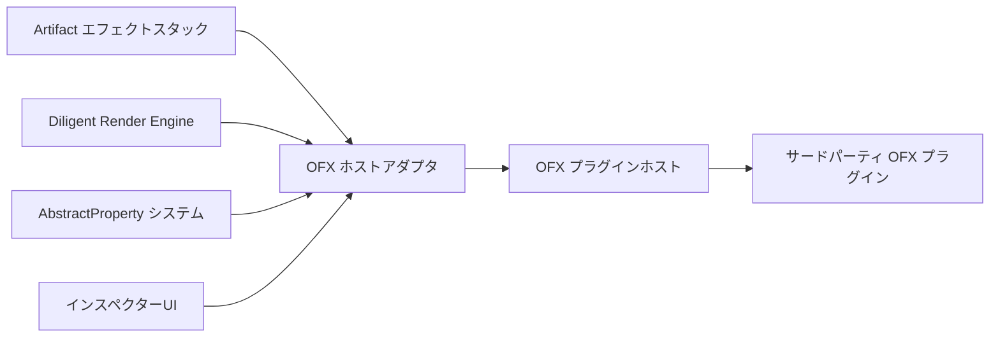

# マイルストーン: OFX プラグインサポート実装

作成日: 2026-04-18
優先度: 🔴 最高
対象バージョン: M13

---

## 概要

OpenFX (OFX) 標準プラグイン規格のサポートを実装し、Nuke / DaVinci Resolve / After Effects 互換のサードパーティエフェクトを ArtifactStudio 上でネイティブ動作させるためのマイルストーンです。

これにより業界標準のVFXエフェクトエコシステム全体を取り込み、エフェクトのパリティを一気にAEレベルまで引き上げます。

---

## 目標

✅ OFX 1.4 規格の完全実装
✅ .ofx プラグインの動的ロード
✅ パラメータ自動マッピング
✅ GPU アクセラレーションサポート
✅ 既存エフェクトスタックとの完全な互換性
✅ Boris FX / Sapphire / Neat Video 等のメジャープラグイン動作保証

---

## 進捗メモ

**2026-04-18 時点の実装進捗**

- ✅ OFX ヘッダー統合: `Artifact/include/ofx` を前提にホスト側実装へ接続済み
- ✅ プラグインローダー: `.ofx` / `.dll` / `.so` / `.dylib` の走査と動的ロードを実装
- ✅ ホストインターフェース: `OfxHost` の `fetchSuite` を返せるように実装
- ✅ プロパティスイート: 最小実装を追加
- ✅ イメージエフェクトインターフェース: 最小実装を追加
- ✅ パラメータスイート: 最小実装を追加
- 🟡 `Load / Describe / DescribeInContext`: 自己記述の取り込みまで接続
- 🟡 パラメータ自動マッピング: `ofx.mix` / `ofx.bypass` のブリッジ下地と preview property 変換まで接続
- 🟡 パラメータ read/write: `paramSetValue / paramGetValue` の最小実装を追加
- 🟡 階層/順序: `parent` を `group/path` に反映し、定義順を保持する下地を追加
- ⏳ レンダーバックエンド統合: まだ未着手
- ⏳ 既存エフェクトスタックとの完全互換: まだ未着手

現時点では「OFX プラグインを見つけて host に載せる土台」を優先しており、実レンダリングや完全な param bridge はこれからです。

---

## 実装タスク

### Phase 1: OFX ホストコア実装

- [x] OFX ヘッダーライブラリの統合
- [x] プラグインローダー実装
- [x] ホストインターフェース実装
- [x] プロパティスイートの実装
- [x] イメージエフェクトインターフェース

### Phase 2: パラメータシステムブリッジ

- [x] OFX パラメータ ↔ Artifact AbstractProperty 双方向マッピング
- [x] アニメーション可能パラメータの自動公開
- [ ] パラメータグループ / 階層構造の伝搬
- [ ] カスタムUIパラメータのフォールバック
- [ ] 時間依存パラメータの対応

### Phase 3: レンダーバックエンド統合

- [ ] CPU レンダーパス実装
- [ ] テクスチャ共有 (Diligent ↔ OFX GL/CL/DX)
- [ ] レンダーコンテキスト管理
- [ ] タイルレンダリング対応
- [ ] マルチスレッドレンダリング対応

### Phase 4: エフェクトスタック統合

- [ ] 既存エフェクトシステムへの透過的追加
- [ ] OFX エフェクト専用インスペクターUI
- [ ] プリセット保存/読み込み対応
- [ ] コピー&ペースト対応
- [ ] エフェクトメニューへの自動追加

### Phase 5: 互換性と安定化

- [ ] 一般的なプラグインでの動作テスト
- [ ] エラーハンドリングとクラッシュ保護
- [ ] プラグインブラックリスト機能
- [ ] パフォーマンス最適化
- [ ] メモリリーク検証

---

## 技術的仕様

### アーキテクチャ図



### 対象ファイル

```
ArtifactCore/include/Plugin/OFXHost.ixx
ArtifactCore/src/Plugin/OFXHost.cppm
Artifact/src/Service/PluginManagerService.cppm
Artifact/src/Widgets/OFXEffectInspectorWidget.cppm
cmake/FindOFX.cmake
```

### 依存関係
- OFX API ヘッダー (BSD ライセンス、同梱可能)
- Diligent Engine とのテクスチャ共有機能
- 既存のエフェクトシステムと完全互換

---

## 完了条件

- [ ] `.ofx` ファイルを配置するだけで自動的に認識される
- [ ] エフェクトメニューに全てのプラグインが一覧表示される
- [ ] 標準エフェクトと全く同じ操作感で OFX エフェクトを使用可能
- [ ] 全てのパラメータでキーフレームアニメーションが動作する
- [ ] 少なくとも 3 つ以上のメジャープラグインが正常動作する

---

## リスクと制約

⚠️ 一部プロプライエタリプラグインはホストホワイトリストを持つため動作しない場合がある  
⚠️ GPU レンダーパスはプラグイン毎に実装が異なるため個別対応が必要  
⚠️ プラグイン側のバグによるクラッシュからホストを保護する仕組みが必要

---

## 推定工数
- Phase 1: 3日
- Phase 2: 2日
- Phase 3: 4日
- Phase 4: 2日
- Phase 5: 3日
- 合計: 14日

---

## 優先順位
🔴 最高優先度: M13 リリース目標
- この機能1つで他の全てのエフェクト実装の優先度が下がる
- VFX パイプラインとの互換性の鍵となる最も重要な機能

---

## 関連ドキュメント

- [`docs/planned/MILESTONE_DCC_FEATURE_GAPS_2026-03-28.md`](docs/planned/MILESTONE_DCC_FEATURE_GAPS_2026-03-28.md)
- [`plans/AFTER_EFFECTS_GAP_ANALYSIS.md`](plans/AFTER_EFFECTS_GAP_ANALYSIS.md)
- [`docs/planned/MILESTONE_GPU_EFFECT_PARITY_2026-03-27.md`](docs/planned/MILESTONE_GPU_EFFECT_PARITY_2026-03-27.md)
