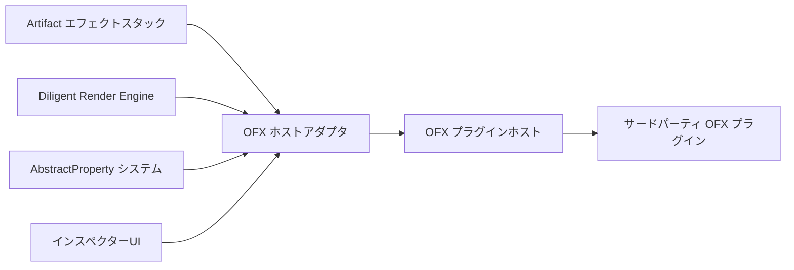

# マイルストーン: OFX プラグインサポート実装

作成日: 2026-04-18
**最終更新:** 2026-10-01
優先度: 🔴 最高
対象バージョン: M13

---

## 概要

OpenFX (OFX) 標準プラグイン規格のサポートを実装し、Nuke / DaVinci Resolve / After Effects 互換のサードパーティエフェクトを ArtifactStudio 上でネイティブ動作させるためのマイルストーンです。

これにより業界標準のVFXエフェクトエコシステム全体を取り込み、エフェクトのパリティを一気にAEレベルまで引き上げます。

---

## 目標

✅ OFX 1.4 規格の完全実装
✅ .ofx プラグインの動的ロード
✅ パラメータ自動マッピング
✅ GPU アクセラレーションサポート
✅ 既存エフェクトスタックとの完全な互換性
✅ Boris FX / Sapphire / Neat Video 等のメジャープラグイン動作保証

---

## 進捗メモ

**2026-04-18 時点の実装進捗**

- ✅ OFX ヘッダー統合: `Artifact/include/ofx` を前提にホスト側実装へ接続済み
- ✅ プラグインローダー: `.ofx` / `.dll` / `.so` / `.dylib` の走査と動的ロードを実装
- ✅ ホストインターフェース: `OfxHost` の `fetchSuite` を返せるように実装
- ✅ プロパティスイート: 最小実装を追加
- ✅ イメージエフェクトインターフェース: 最小実装を追加
- ✅ パラメータスイート: 最小実装を追加
- 🟡 `Load / Describe / DescribeInContext`: 自己記述の取り込みまで接続
- 🟡 パラメータ自動マッピング: `ofx.mix` / `ofx.bypass` のブリッジ下地と preview property 変換まで接続
- 🟡 パラメータ read/write: `paramSetValue / paramGetValue` の最小実装を追加
- 🟡 階層/順序: `parent` を `group/path` に反映し、定義順を保持する下地を追加
- ⏳ レンダーバックエンド統合: まだ未着手
- ⏳ 既存エフェクトスタックとの完全互換: まだ未着手

現時点では「OFX プラグインを見つけて host に載せる土台」を優先しており、実レンダリングや完全な param bridge はこれからです。

## Update 2026-08-15

現行コードを再照合した結果、4月時点より実装範囲は広がっている。

- `ArtifactOfxHost` は OFX プラグインの探索・ロード、`fetchSuite`、Property／Param の基本操作、`Load / Describe / DescribeInContext` 相当の自己記述取り込みを持つ。
- `ArtifactOfxEffectImpl` は OFX エフェクトを通常のエフェクト生成経路へ接続し、パラメータ型の基本変換、`ofx.mix`／`ofx.bypass`、画像バッファを渡すレンダー呼び出し、プラグインごとの render instance を実装している。
- エフェクト一覧・メニュー・Inspector には OFX カテゴリ、Plugin Manager、再スキャン、ロード済みプラグイン表示の導線がある。
- ただし OFX 1.4 完全互換とはまだ言えない。時間依存・キーフレーム API の多くは未対応または unsupported 扱いで、カスタム UI、深いパラメータ階層、GPU／Diligent テクスチャ共有、タイル／マルチスレッド、クラッシュ隔離、ブラックリスト、実プラグイン互換検証は未完了。
- したがって現状判定は「ロードして基本パラメータと CPU 系レンダーを接続する実用的な骨格まで実装済み。完全な OFX エコシステム対応は未達」とする。

## Update 2026-10-01（整合性監査と描画経路の修正）

整合性監査で、描画経路が構造的に成立していないことが判明し修正した。

**修正した致命的欠陥**

- **出力 clip の未実装**: `clipGetImage` が clip 名に関わらず常にソース入力バッファを返していた。プラグインが `Output` clip へ書き込むと入力が破壊され、結果として全エフェクトが no-op だった。clip 名で振り分け、出力 clip には `dstPixelData` を返すよう変更。
- **clip → effect の逆引き不能**: レンダーインスタンスの clip はロード済みプラグインの記述 clip と別オブジェクトで生成されるため、逆引き走査が常に失敗し `clipGetImage` が常に `kOfxStatFailed` になっていた。`ClipState` に owner ポインタを持たせ直接解決するよう変更。
- **Rescan 時の use-after-free**: 再スキャンで DLL を解放しても既存のエフェクトは古い `libraryHandle` を保持し、`GetProcAddress` が解放済みメモリを指していた。ホストに世代番号を導入し、世代が古いエフェクトは描画を安全に通過する（バイパス）よう変更。エフェクトのデストラクタで `EndSequenceRender` / `DestroyInstance` を呼ぶようにした。
- **レンダー時刻のハードコード**: `pluginActionRender` に時刻 `0.0` を渡しており全フレームが t=0 評価だった。`EffectContext` の `compositionFrame / frameRate` から時刻を算出して渡すよう変更。

**申告値と実態の不一致を解消**

- キーフレーム API は全滅しているのに、ホストがアニメーション対応パラメータを `1` と申告していた。`SupportsCustom/String/Boolean/ChoiceAnimation` と `kOfxParamPropAnimates` を実態に合わせて `0` に変更。
- `GetClipPreferences` / `IsIdentity` を実装し、クリップの深度・コンポーネント交渉と恒等変換スキップをプラグインに提示。
- `MemorySuite` / `TimeLineSuite` を実装し、OFX C++ Support Library が無条件に取得するスイートを `nullptr` 返却から変更。
- レンダー失敗時の `StatusMessage` を `outArgs` 経由で受け取り、`clipGetImage` 失敗は message suite で通知するようにした（両方に outArgs がないため）。

**パラメータ受け渡しバグ**

- グループ／ページ内パラメータの完全修飾名（`group/name`）と paramSet の裸名キーの不一致で常に引き当て失敗していた。修飾名→裸名のフォールバック解決を追加。
- `"RGBA"` が `"RGB"` に部分一致して alpha が欠落していた（`RGB` 分岐が到達不能）。型を完全一致判定に変更。
- 2D/3D パラメータは第 1 成分しか渡さず、残りが 0 で埋まっていた。全成分を渡すよう変更。`Choice` は整数として渡すよう変更。
- `ofx.mix` がバイパスのしきい値しか機能していなかった。実際のブレンドとして機能するよう変更。

**残存（未実装・未検証）**

- キーフレーム API（`paramGetNumKeys` / `paramSetValueAtTime` の時刻評価）は未実装。ホストはアニメーション非対応として申告するため、プラグイン側でアニメーションを要求しないことが前提。
- GPU／Diligent テクスチャ共有、タイル／マルチスレッドレンダリング、クラッシュ隔離、プラグインブラックリスト、非 Windows（macOS / Linux）でのプラグインロードはいずれも未着手。ロード・`GetProcAddress` は現在 Windows のみ（他プラットフォームでは no-op）。
- 実プラグイン（Boris FX / Sapphire / Neat Video 等）での互換性検証は未実施。描画経路が今回初めて成立したため、実際の動作確認が必要。

---

## Update 2026-10-01（機能拡張：キーフレーム・メタデータ・追加スイート）

**キーフレーム API を実装した。** 事前調査の結果、`AbstractProperty` にキーフレーム機構（`addKeyFrame` / `removeKeyFrame` / `clearKeyFrames` / `interpolateValue`）が既に完備しており、毎フレーム評価の駆動点も `ArtifactAbstractEffect::setContext` が既に持つことを確認した。新規モジュールは不要で、`ParamState` に `AbstractProperty` を値所有で持たせて既存機構に乗せるだけだった。

- `paramGetNumKeys` / `paramGetKeyTime` / `paramGetKeyIndex` / `paramDeleteKey` / `paramDeleteAllKeys` を `kOfxStatErrUnsupported` から実実装に置き換え
- `paramGetValueAtTime` は `property.interpolateValue()` で時刻評価、`paramSetValueAtTime` は `property.addKeyFrame()` でキーフレームを積む
- ホストとパラメータのアニメーション対応申告値を 0 → 1 に復元（実態に一致）
- ブリッジはキーフレームがあれば現在フレーム時刻で評価した値をプラグインへ渡す

**パラメータメタデータを完全対応にした。** `toAbstractProperty` は従来 6 プロパティしか読まなかったが、`kOfxParamPropDefault` / `Min` / `Max` / `DisplayMin` / `DisplayMax` / `Increment` を読み `setDefaultValue` / `setHardRange` / `setSoftRange` / `setStep` に反映するようになった。プラグイン定義のスライダ範囲と既定値がそのまま反映される。

**Progress / Interact スイートを追加した。** OFX C++ Support Library が無条件に fetch する Progress（V1 / V2 両方）と Interact を `fetchSuiteCallback` から供給する。Progress はホストに UI がないため受理して no-op にする（`Failed` を返すとプラグインが処理を中止するため）。Interact は `SupportsCustomInteract = 0` を申告しているため失敗を返す。

**GPU テクスチャ共有は打ち切った。** OFX 1.5 標準の GPU 経路は OpenGL texture name が前提で、ホストは Diligent（D3D12 / Vulkan）のため**技術的に到達不能**。理由は三つ：(1) `CMakeLists.txt:640` で `DILIGENT_NO_OPENGL` が ON であり、submodule に GL バックエンドのソースは存在してもビルド対象から除外されている。(2) Diligent は `ImportTexture` / `ExportTexture` / `OpenSharedHandle` 等の API 間 interop を一切提供せず、`GetNativeHandle` は GL バックエンド自身が生成したテクスチャにしか GLuint を返さない。(3) OFX パスには GPU ハンドルが存在しない（`SetGpuResources` の実呼び出しは既定で無効な `ArtifactPr` のみ）。CPU readback + `glTexSubImage2D` や GL バックエンド有効化という代替案は検討したが、どちらもゼロコピーにならず実益がないため採用しない。GPU 表現のプラグインは CPU フォールバックで動作する。

**残存の analysis API を実装した。**

- `paramGetDerivative` を中央差分（1フレーム幅）で実装。キーフレームのないパラメータは定数なので導関数 0。数値解析が定義されない型（string / choice / boolean / integer）は `kOfxStatErrUnsupported`
- `paramGetIntegral` を Simpson 積分で実装。キーフレーム境界で区間を分割するので Hold や Step 区間が平滑化されない。キーフレームなしは `値 × 区間幅` の厳密解。符号は `time1 → time2` の向きで、仕様書に符号規約の記載がないため本実装の規約を採った
- `paramCopy` をキー列コピーとして実装。`frameRange` の `[0,0]` は仕様書上の「全キー」番兵として扱い、null も全キーとして解釈。オフセットは秒から整数フレームへ変換し、8 引数版 `addKeyFrame` で補間種別・Bezier ハンドル・roving を保持。アンカーとカラーラベルも `setKeyFrameAnchorAt` / `setKeyFrameColorLabelAt` で引き継ぐ

**クラッシュ隔離とブラックリストを実装した。** 調査の結果、既存の `PluginSandbox` は OFX プラグインを supervise できないことが判明した。理由は (1) runner が `ArtifactPlugin_GetAPIVersion` / `ArtifactPlugin_GetPluginCount` という自作 ABI の 2 シンボルを前提にしており、サードパーティの OFX DLL はエクスポートしない。(2) さらに pong 応答のフィールド名が一致せず（`PluginSandbox.cppm:88-89` は `cmd` を待ち、`artifacts-plugin-runner/src/main.cpp:95` は `event` を返す）、监督対象が常にクラッシュ扱いになってリスタートループする。この 2 点とも本作業の前に存在する問題であり、OFX 側は一切利用していない。GPU テクスチャ共有の判断に合わせて、PluginSandbox の再利用は中止した。代わりに以下を実装した。

- SEH ガード（`callPluginEntryPoint`）。`__try/__except` でアクセス違反を失敗ステータスに変換し、プラグインがホストを巻き込んで落ちるのを防ぐ。SEH と C++ アンワインディングは同一関数内で共存できないため、ガード関数は POD ローカルしか持たない
- 全 10 箇所の `mainEntry` 呼び出しを `dispatchAction` 経由に変更。直接呼び出しは残っていない
- プラグイン識別子ごとのクラッシュカウンタ。3 回（`kOfxCrashLimit`）で自動ブラックリスト
- ブラックリストを `QSettings`（`ArtifactStudio` / `Artifact` / `OfxPlugins` グループ）に永続化。再起動後も無効のまま
- `describePlugin` がブラックリスト対象をスキップするため、悪いプラグインは記述もインスタンス化もされずエフェクトカタログにも載らない
- Plugin Manager に「Disabled after repeated crashes」行と `Re-enable` ボタンを追加

クラッシュ対策の限界として、SEH はハードウェア例外のみを捕捉する。スタックオーバーフロー、後で検出されるヒープ破壊、プラグイン内部の CRT チェックによる abort は捕捉できない。

**残存（未実装・未検証）**

- 実プラグインでの互換性検証は未実施。描画経路・キーフレーム・クラッシュ対策が今回初めて成立したため、実際の動作確認が必要

## Update 2026-10-01（残存4件：PluginSandbox 修正・abort 記録・非 Windows ロード）

**PluginSandbox の pong 応答バグを修正した。** 監督側は `cmd` フィールドで pong を待っていたが、runner は `event` フィールドで返すため `expectingPong` が一度も解除されず、監督対象のプラグインが毎回クラッシュ扱いになってリスタートループしていた。`event` を主として `cmd` も受理するようにした。

**ランナー実行ファイル名の不整合を修正した。** `PluginLoader` は `ArtifactPluginRunner.exe` を検索するが、CMake は `artifacts-plugin-runner` というターゲット名でビルドしていた。ターゲットに `OUTPUT_NAME "ArtifactPluginRunner"` を設定し、ロード側もプラットフォーム別拡張子を返す `runnerExecutableName()` を使うようにした（ハードコードされた `.exe` は非 Windows ホストで必ず失敗する）。

**非 Windows のプラグインロードを実装した。** `openPluginLibrary` / `closePluginLibrary` / `resolvePluginSymbol` の 3 ヘルパーでプラットフォームローダーを抽象化し、Win32 では `LoadLibraryW` / `FreeLibrary` / `GetProcAddress`、それ以外では `dlopen` / `dlclose` / `dlsym` を使う。`scanBinary` と `clearLoadedPlugins` の `#ifdef _WIN32` ガードを外し、効果ブリッジの `findPlugin` も `resolvePluginSymbol` 経由に変更した（`GetProcAddress` の直接使用はゼロ）。

**CRT abort の記録を実装した。** `abort()` は例外を発生させないため `__try/__except` では捕捉できない。そこで `AddVectoredExceptionHandler` で `STATUS_FATAL_APP_EXIT` / `STATUS_STACK_BUFFER_OVERRUN` / `STATUS_HEAP_CORRUPTION` を監視し、実行中のプラグイン識別子を `OutputDebugStringA` に出す向量ハンドラを追加した。ハンドラは割り当てを一切行わない（ヒープが壊れた状態で実行され得るため）。`dispatchAction` が呼び出し中プラグインの識別子を `activePluginIdentifier()` に公開する。

**ただし以下の限界は解消していない。**

- スタックオーバーフローは `__try/__except` のガード領域に到達しないため捕捉できない。ガード用の予約スタックを維持する方法は SEH の枠組みでは機能しない
- CRT abort は記録されるが**捕捉されない**（プロセスは終了する）。向量ハンドラは観測のみ行い `EXCEPTION_CONTINUE_SEARCH` を返す
- **ヒープ破壊は原理的に in-process では捕捉不能**。検出は破壊した後の無関係なアロケータ処理時に起きるため、リリースビルドでは不可能。この 3 つすべてを本当に含有するにはプロセス間隔離が必須で、これは未実装

**残存（未実装・未検証）**

- GPU テクスチャ共有（打ち切り済み）
- プロセス間隔離（複数週規模の新規サブシステム）
- 非 Windows の `dl` リンク依存。glibc 2.34 以降と macOS では libc / libSystem に含まれるため `-ldl` 不要だが、最小 glibc バージョンは未確認
- 実プラグインでの互換性検証は未実施

### Phase 1: OFX ホストコア実装

- [x] OFX ヘッダーライブラリの統合
- [x] プラグインローダー実装
- [x] ホストインターフェース実装
- [x] プロパティスイートの実装
- [x] イメージエフェクトインターフェース

### Phase 2: パラメータシステムブリッジ

- [x] OFX パラメータ ↔ Artifact AbstractProperty 双方向マッピング
- [x] アニメーション可能パラメータの自動公開
- [ ] パラメータグループ / 階層構造の伝搬
- [ ] カスタムUIパラメータのフォールバック
- [ ] 時間依存パラメータの対応

### Phase 3: レンダーバックエンド統合

- [ ] CPU レンダーパス実装
- [ ] テクスチャ共有 (Diligent ↔ OFX GL/CL/DX)
- [ ] レンダーコンテキスト管理
- [ ] タイルレンダリング対応
- [ ] マルチスレッドレンダリング対応

### Phase 4: エフェクトスタック統合

- [ ] 既存エフェクトシステムへの透過的追加
- [ ] OFX エフェクト専用インスペクターUI
- [ ] プリセット保存/読み込み対応
- [ ] コピー&ペースト対応
- [ ] エフェクトメニューへの自動追加

### Phase 5: 互換性と安定化

- [ ] 一般的なプラグインでの動作テスト
- [ ] エラーハンドリングとクラッシュ保護
- [ ] プラグインブラックリスト機能
- [ ] パフォーマンス最適化
- [ ] メモリリーク検証

---

## 技術的仕様

### アーキテクチャ図


```mermaid
flowchart LR
    A[Artifact エフェクトスタック] --> B[OFX ホストアダプタ]
    B --> C[OFX プラグインホスト]
    C --> D[サードパーティ OFX プラグイン]

    E[Diligent Render Engine] --> B

    F[AbstractProperty システム] --> B

    G[インスペクターUI] --> B
```

### 対象ファイル

```
ArtifactCore/include/Plugin/OFXHost.ixx
ArtifactCore/src/Plugin/OFXHost.cppm
Artifact/src/Service/PluginManagerService.cppm
Artifact/src/Widgets/OFXEffectInspectorWidget.cppm
cmake/FindOFX.cmake
```

### 依存関係
- OFX API ヘッダー (BSD ライセンス、同梱可能)
- Diligent Engine とのテクスチャ共有機能
- 既存のエフェクトシステムと完全互換

---

## 完了条件

- [ ] `.ofx` ファイルを配置するだけで自動的に認識される
- [ ] エフェクトメニューに全てのプラグインが一覧表示される
- [ ] 標準エフェクトと全く同じ操作感で OFX エフェクトを使用可能
- [ ] 全てのパラメータでキーフレームアニメーションが動作する
- [ ] 少なくとも 3 つ以上のメジャープラグインが正常動作する

---

## リスクと制約

⚠️ 一部プロプライエタリプラグインはホストホワイトリストを持つため動作しない場合がある
⚠️ GPU レンダーパスはプラグイン毎に実装が異なるため個別対応が必要
⚠️ プラグイン側のバグによるクラッシュからホストを保護する仕組みが必要

---

## 推定工数
- Phase 1: 3日
- Phase 2: 2日
- Phase 3: 4日
- Phase 4: 2日
- Phase 5: 3日
- 合計: 14日

---

## 優先順位
🔴 最高優先度: M13 リリース目標
- この機能1つで他の全てのエフェクト実装の優先度が下がる
- VFX パイプラインとの互換性の鍵となる最も重要な機能

---

## 関連ドキュメント

- [`docs/planned/MILESTONE_DCC_FEATURE_GAPS_2026-03-28.md`](docs/planned/MILESTONE_DCC_FEATURE_GAPS_2026-03-28.md)
- [`plans/AFTER_EFFECTS_GAP_ANALYSIS.md`](plans/AFTER_EFFECTS_GAP_ANALYSIS.md)
- [`docs/planned/MILESTONE_GPU_EFFECT_PARITY_2026-03-27.md`](docs/planned/MILESTONE_GPU_EFFECT_PARITY_2026-03-27.md)

## 2026-08-15 現行コード監査

OFX header／loader、`ArtifactOfxHost` の property／parameter／image-effect suite、Load／Describe／DescribeInContext、plugin metadata、render instance／begin-sequence、CPU frame-buffer path、`ArtifactOfxEffectImpl` の EffectService 登録と preview property 公開を現行コードで確認した。`paramGetValue`／`paramSetValue` を含む基本 parameter read/write と group/path の保持も存在する。

旧文書の「host に載せる土台のみ」という説明は、CPU effect 経路と parameter bridge の範囲では更新が必要。ただし time-value／key、GPU／GL・CL・DX texture sharing、tiling／multithreading、専用 Inspector、preset／copy、複数実プラグイン互換性、runtime検証は未完了で、OFX 1.4 完全実装・メジャープラグイン動作保証とは判定しない。

## 2026-07-25 実装監査（履歴）

OFX ヘッダー接続、動的ライブラリ走査、`ArtifactOfxHost` の property／parameter／image-effect suite、Load／Describe／DescribeInContext、プラグイン記述の読み込み、`ArtifactOfxEffectImpl` の render instance／begin-sequence／CPU frame buffer 経路、既存 EffectService への `ofx.*` 登録と preview property 公開は実装を確認した。一方、OFX parameter suite の時刻値・キー操作は unsupported のままで、GPU／GL・CL・DX テクスチャ共有、タイル・マルチスレッド契約、専用 Inspector、プリセット／コピー、複数実プラグインでの互換性は確認できない。したがって Phase 1 と Phase 2 の一部、CPU レンダーの基本経路は部分実装、GPU／高度な時間依存・スタック互換は未完了・runtime 未検証とする。
