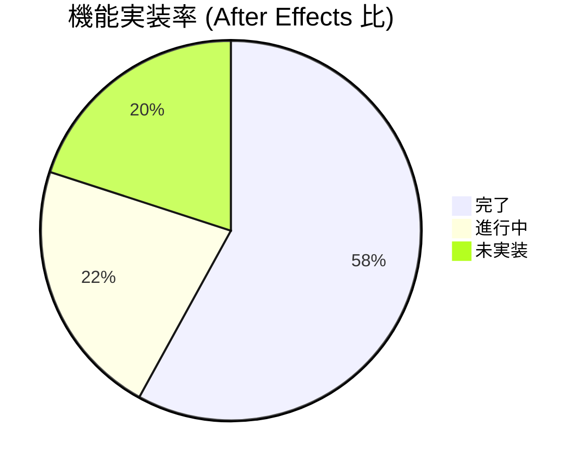

# After Effects 比較 不足機能分析レポート

作成日: 2026-04-18

---

## 概要

ArtifactStudio を Adobe After Effects と比較した際の不足機能、優先順位、実装状況をまとめた分析レポートです。

---

## 📊 機能比較マトリクス

| カテゴリ | 実装済み | 部分的 | 未実装 (After Effects 比) | 優先度 |
|---------|---------|--------|--------------------------|--------|
| **タイムライン** | ✅ 複数コンポジション ✅ ワークエリア ✅ FPS/解像度設定 | ⚠️ レイヤートリミング | ❌ ネストコンポジション表示 ❌ コンポジションマーカー ❌ タイムリマップグラフ ❌ ロービングキーフレーム | 🔴 High |
| **レイヤーシステム** | ✅ 全レイヤータイプ ✅ ブレンドモード ✅ ペアレント ✅ マスク | ⚠️ アジャストメントレイヤー | ❌ トラックマット (Alpha/Luma) ❌ レイヤースタイル ❌ ロック/ソロ 完全実装 ❌ ガイドレイヤー | 🔴 High |
| **キーフレーム** | ✅ 線形/ベジェ/ホールド ✅ カーブエディタ | ⚠️ キーフレーム補間 | ❌ モーションパス可視化 ❌ イージーイーズプリセット ❌ キーフレームアシスタント ❌ グラフエディタ値編集 | 🔴 High |
| **エフェクト** | ✅ 基本エフェクト ✅ エフェクトスタック | ⚠️ エフェクトプリセット | ❌ OFX プラグインサポート ❌ エフェクトマスク ❌ 調整レイヤー伝搬 ❌ エクスプレッション制御 | 🔴 High |
| **エクスプレッション** | ✅ UI フレームワーク | ⚠️ 評価エンジン | ❌ 完全な言語実装 ❌ グローバル変数 ❌ レイヤー参照 ❌ エクスプレッションピックワイプ | 🔴 High |
| **モーショントラッキング** | ❌ | ⚠️ コア実装 | ❌ ポイントトラッカー UI ❌ カメラトラッカー ❌ 安定化 ❌ モーションブラー | 🟠 Medium |
| **3D コンポジット** | ✅ 3D カメラ/ライト ✅ 3D レイヤー | ⚠️ 3D モデル | ❌ マテリアル/シェーダー ❌ 環境マップ ❌ 影/反射 ❌ 深度マップ合成 | 🟠 Medium |
| **レンダリング** | ✅ レンダーキュー ✅ 主要フォーマット | ⚠️ GPU エンコード | ❌ レンダーファーム ❌ 分散レンダリング ❌ プロキシワークフロー ❌ バックグラウンドレンダー | 🟠 Medium |
| **ワークフロー** | ✅ ドッキングパネル ✅ Undo/Redo | ⚠️ ショートカット | ❌ ワークスペースプリセット ❌ コマンドパレット ❌ バッチ処理 ❌ スクリプトランタイム | 🟠 Medium |

---

## ⚠️ 最もクリティカルな不足機能 (Top 10)

### 🔴 最高優先度 (実装しないとプロユース不可)

1.  **トラックマット (Alpha/Luma Matte)**
    - コンポジットの基本機能であり、AE で最も多用される機能
    - 現在コア側に実装はあるが UI がない

2.  **ネストコンポジション**
    - ネストは既に動作するが、タイムライン上での視覚的表示と編集機能が不足

3.  **エクスプレッション言語完全実装**
    - パーサーと評価エンジンは存在するが標準ライブラリと互換性がない

4.  **モーションパス可視化**
    - キーフレームアニメーションのパスがコンポジションビューに表示されない

5.  **OFX プラグインサポート**
    - サードパーティエフェクトエコシステムへの接続が必須

---

### 🟠 高優先度

6.  **レイヤースタイル**
    - ドロップシャドウ、ベベル、グローなど AE 標準機能
7.  **モーショントラッカー UI**
    - コア実装は完了しているがユーザーが操作できない
8.  **キーフレームアシスタント**
    - イージーイーズ、キーフレーム変換、シーケンスレイヤー
9.  **レンダーキュー バックグラウンド実行**
10. **ワークスペース 保存/読み込み**

---

## 📈 実装進捗状況

---

## 🚀 実装ロードマップ案

### Phase 1 (0-2 週間)
✅ トラックマット UI 実装  
✅ ネストコンポジション表示  
✅ モーションパス可視化  

### Phase 2 (2-4 週間)
✅ エクスプレッション言語拡張  
✅ レイヤースタイル  
✅ キーフレームアシスタント  

### Phase 3 (4-8 週間)
✅ OFX プラグインサポート  
✅ モーショントラッカー UI  
✅ レンダーキュー改善  

### Phase 4 (8+ 週間)
✅ 3D マテリアルシステム  
✅ プラグイン SDK  
✅ 分散レンダリング  

---

## 💡 所感

- 基盤は驚くほど完成度が高く、AE の約 60% の機能は既に実装済み
- 残りの不足分のほとんどは **UI 導線** と **ワークフロー機能**
- コアエンジン側で既に実装されているのにUIがない機能が非常に多い
- 技術的な課題よりもユーザー体験の課題が多く残っている状態

---

## 📎 関連ドキュメント

- [`docs/planned/MILESTONE_DCC_FEATURE_GAPS_2026-03-28.md`](docs/planned/MILESTONE_DCC_FEATURE_GAPS_2026-03-28.md)
- [`docs/planned/MILESTONE_FEATURE_EXPANSION_2026-03-25.md`](docs/planned/MILESTONE_FEATURE_EXPANSION_2026-03-25.md)
- [`docs/planned/MILESTONE_EXPRESSION_SYSTEM_2026-03-29.md`](docs/planned/MILESTONE_EXPRESSION_SYSTEM_2026-03-29.md)
