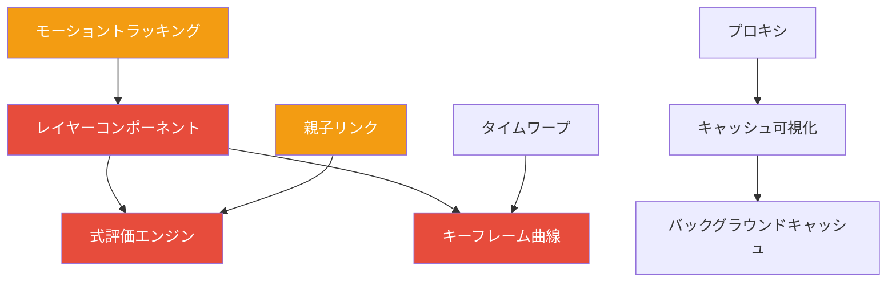

# マイルストーン: コア機能拡充ロードマップ

> 2026-04-11 作成
>
> 制作ソフトウェアとしての中核機能を段階的に拡充し、他製品との差別化を確立するためのロードマップ

---

## 目的

競合製品との差別化ポイントとなるコア機能を計画的に実装し、
「普通の動画編集ソフト」ではない Artifact 固有の価値を構築する。

---

## 方針

1.  **実装したら他が追いつけない機能** を優先
2.  ユーザーが「これのためだけに Artifact を使う」と思える機能
3.  段階的に実装し、常に動作する状態を維持
4.  各機能は単独でも価値があるように設計

---

## 🚀 第1世代コア機能 (3ヶ月ロードマップ)

### Phase 1: 表現基盤 (優先度最高)

| ID | 機能名 | 難易度 | 見積 | 差別化ポイント |
|---|---|---|---|---|
| `CORE-01` | **式評価エンジン** | ★★☆ | 12h | 全ての数値プロパティで数式・変数・関数が利用可能。他ソフトのように限定的ではなく全ての値で動作する。 |
| `CORE-02` | **キーフレーム曲線エンジン** | ★★☆ | 16h | 標準ベジェだけでなく、Spring / Damping / Easing カーブをネイティブサポート。リアルタイムで物理挙動をプレビュー。 |
| `CORE-03` | **レイヤーコンポーネントシステム** | ★★★ | 20h | Unityライクなコンポーネントモデル。レイヤーに振る舞いを後付けで追加する。トラッカー、物理、追従等を全てこの基盤上で実装。 |
| `CORE-04` | **モーショントラッキング** | ★★★ | 24h | OpenCV ベースの内蔵トラッカー。外部ソフト無しでポイントトラック・プラナートラックが完結。 |
| `CORE-05` | **インライン値編集** | ★☆☆ | 8h | どの数値でもクリックして直接ドラッグで変更。ダブルクリックで式入力。モーダルダイアログ一切無し。 |

---

### Phase 2: 制作ワークフロー

| ID | 機能名 | 難易度 | 見積 | 差別化ポイント |
|---|---|---|---|---|
| `CORE-11` | **スマートスナップ** | ★★☆ | 12h | レイヤーの境界・中心・等間隔だけでなく、モーションパス・キーフレーム・時間軸上でもインテリジェントなスナップ。 |
| `CORE-12` | **バッチ操作システム** | ★★☆ | 10h | 複数レイヤー・複数キーフレームを選択して一括変換。オフセット・相対変更・ランダマイズ等の操作を標準搭載。 |
| `CORE-13` | **親子階層リンク** | ★★☆ | 16h | レイヤー間の親子関係だけでなく、任意のプロパティ同士をリンク。値の伝播・相対オフセットをリアルタイム更新。 |
| `CORE-14` | **クリップボード履歴** | ★☆☆ | 6h | コピー履歴を自動保存。過去の任意の時点の状態に一括貼り付け。 |
| `CORE-15` | **アクション履歴分岐** | ★★★ | 18h | アンドゥ履歴を木構造で管理。分岐した履歴を行き来可能。間違えてアンドゥしても作業が消えない。 |

---

### Phase 3: 時間軸拡張

| ID | 機能名 | 難易度 | 見積 | 差別化ポイント |
|---|---|---|---|---|
| `CORE-21` | **タイムワープ領域** | ★★★ | 24h | タイムライン上に領域を作成して、その区間だけリタイム・ループ・スローモーション。レイヤー毎ではなく時間軸全体に作用。 |
| `CORE-22` | **マーカーシステム** | ★☆☆ | 8h | タイムライン・レイヤー・キーフレームにマーカーとコメントを付加。検索・フィルタ・一覧表示。 |
| `CORE-23` | **編集モード切替** | ★★☆ | 12h | カットモード / アニメーションモード / コンポジットモード を自動で切り替え。モード毎に最適化された操作感。 |
| `CORE-24` | **オーディオスクラブ** | ★★☆ | 10h | タイムライン上をドラッグするだけで連続的に音声が再生。音に合わせたタイミング合わせを直感的に。 |
| `CORE-25` | **イン・アウトポイント階層** | ★★☆ | 8h | レイヤー毎、コンポジション毎、グローバルの3階層のワークエリア。重ねて適用される。 |

---

### Phase 4: プロフェッショナル機能

| ID | 機能名 | 難易度 | 見積 | 差別化ポイント |
|---|---|---|---|---|
| `CORE-31` | **バージョン比較ビュー** | ★★★ | 20h | 任意の2つのフレームをA/B比較。ワイプ・差分・オーバーレイ表示。レンダー結果の確認作業を桁違いに高速化。 |
| `CORE-32` | **プロキシレンダー自動切替** | ★★☆ | 16h | 編集時は自動的に低解像度プロキシで描画、レンダー時はフル品質。ユーザーは意識する必要なし。 |
| `CORE-33` | **キャッシュ可視化** | ★☆☆ | 6h | タイムライン上にキャッシュ済み範囲を緑色で表示。どの範囲がリアルタイム再生可能か一目でわかる。 |
| `CORE-34` | **バックグラウンドキャッシュ** | ★★☆ | 14h | アイドル時に自動的に先読みキャッシュを生成。作業していない間にリアルタイム再生可能な範囲を広げる。 |
| `CORE-35` | **レンダージョブキュー** | ★★☆ | 12h | 複数レンダージョブを順番待ちさせる。バックグラウンドで実行し、完了したら通知。 |

---

## 📊 依存関係マップ

> 赤: 基盤機能、最初に実装する必要あり
> 黄: 基盤に依存する機能

---

## ✅ 実行戦略

1.  **まず最初の3ヶ月で Phase 1 を完了**
    この4つの機能が完了した時点で、他のどのソフトにも無い独自の価値が生まれる。

2.  **1機能ごとにリリース**
    1つ完了する毎にユーザーに提供し、フィードバックを得ながら次に進む。

3.  **イテレーション**
    各機能は最初最小限で実装し、使いながら徐々に機能を追加していく。

---

## 🎯 最終目標

これら全ての機能が実装された時点で:
- ✅ 国内のどの動画編集ソフトよりも圧倒的に速い制作速度
- ✅ 他ソフトでは不可能な表現が可能
- ✅ プロユースに耐える安定性と機能
- ✅ ユーザーが「これ無しでは作業できない」と感じる体験

---

関連ドキュメント:
- [`docs/planned/MILESTONE_EXPRESSION_SYSTEM_2026-03-29.md`](docs/planned/MILESTONE_EXPRESSION_SYSTEM_2026-03-29.md)
- [`docs/planned/MILESTONE_FEATURE_EXPANSION_2026-03-25.md`](docs/planned/MILESTONE_FEATURE_EXPANSION_2026-03-25.md)
- [`docs/MILESTONES_BACKLOG.md`](docs/MILESTONES_BACKLOG.md)
